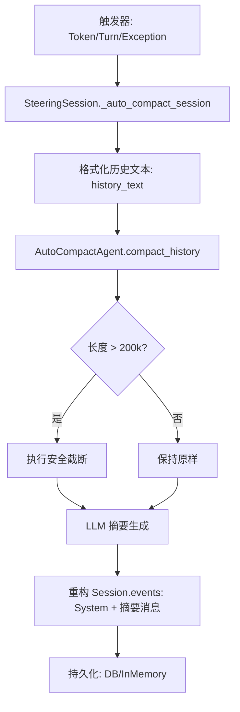

# AutoCompactAgent 压缩处理技术说明

本文档详细介绍了 `AutoCompactAgent` 的工作原理、调用链条以及在 `main_web_start_steering.py` 中的具体应用场景。

## 1. 核心原理与设计

`AutoCompactAgent` 是一个专门用于“对话上下文摘要”的子智能体（Sub-Agent）。它的核心任务是将长达数十万字符的原始对话历史，浓缩成一段保留核心信息、忽略冗余细节的简短摘要。

### 1.1 摘要生成逻辑
它通过特定的系统指令运行，要求：
1. **保留核心目标**：明确用户的意图和当前任务。
2. **记录关键步骤**：保留已完成的重要操作和决策。
3. **忽略冗余细节**：省略具体的代码块、长文本输出和重复的工具调用。
4. **保持连贯性**：确保摘要能让后续对话无缝衔接。

### 1.2 避险保护机制：200k 字符安全截断
为了防止 Compactor 自身也因为输入历史过长而崩溃（撑爆上下文），`AutoCompactAgent` 内部实现了一个名为 **`MAX_SAFE_CHARS`** 的保护卫士。

- **阈值**：200,000 字符（约合 50k - 70k tokens）。
- **策略**：当输入文本超过此限制时，执行“头尾保留”式截断：
    - **保留头部 (20%)**：通常包含系统初始化信息和任务起点。
    - **保留尾部 (30%)**：包含最新的对话上下文。
    - **丢弃中间 (50%)**：牺牲中间过程以确保模型能生成的摘要。

---

## 2. 调用链条分析

压缩过程遵循以下标准的软件调用结构：

---

## 3. 具体触发位置与场景

在 `main_web_start_steering.py` 中，压缩逻辑被部署在三个不同的“纵深防御”层次上：

### 3.1 预防层：Token 预警触发
*   **位置**：`Line 252 (in _check_and_compact_context)`
*   **原理**：基于字符数估算 Token。
*   **阈值**：当前模型 Token 上限的 **90%**。
*   **效果**：在上下文真正溢出前，主动发起温和的压缩。

### 3.2 制度层：Event 数量硬阈值
*   **位置**：`Line 328 (in run_task)`
*   **原理**：计算对话中的事件（Events）总数。
*   **阈值**：**MAX_TURNS = 700**。
*   **效果**：即使 Token 消耗不明显，过多的事件对象也会拖慢处理速度，此层级确保会话结构始终保持轻量。

### 3.3 补救层：异常兜底触发
*   **位置**：`Line 389 (in run_task)`
*   **原理**：捕获 **`ContextWindowExceededError`**。
*   **触发场景**：当由于工具输出突增等不可预测原因导致上下文瞬间溢出时。
*   **效果**：作为最后一道防线，执行紧急压缩以恢复智能体的可用性。

---

## 4. 压缩后的数据处理

压缩完成后，`SteeringSession` 会执行以下关键步骤：
1. **保留系统指令**：从原始 events 中提取开头的 `system` role 消息。
2. **注入摘要占位符**：创建一个新的 `user` role 消息，内容为 `[System] Context cleared. Summary of previous conversation: \n {summary}`。
3. **原子替换**：将 `session.events` 替换为 `[System消息] + [摘要消息]`。
4. **多端同步**：
    - 针对 `InMemorySessionService`：由于返回的是 Deepcopy，代码会通过内部字典 `self.session_service.sessions` 执行原地修改，确保内存状态同步。
    - 针对其他服务：调用 `save_session()` 写入数据库。

---

## 5. 结论

通过 `_auto_compact_session` 统一处理，智能体能够在保持长任务记忆的同时，有效规避上下文撑爆的风险。结合 `AutoCompactAgent` 内部的 200k 字符防御，整个系统具有极高的健壮性。
