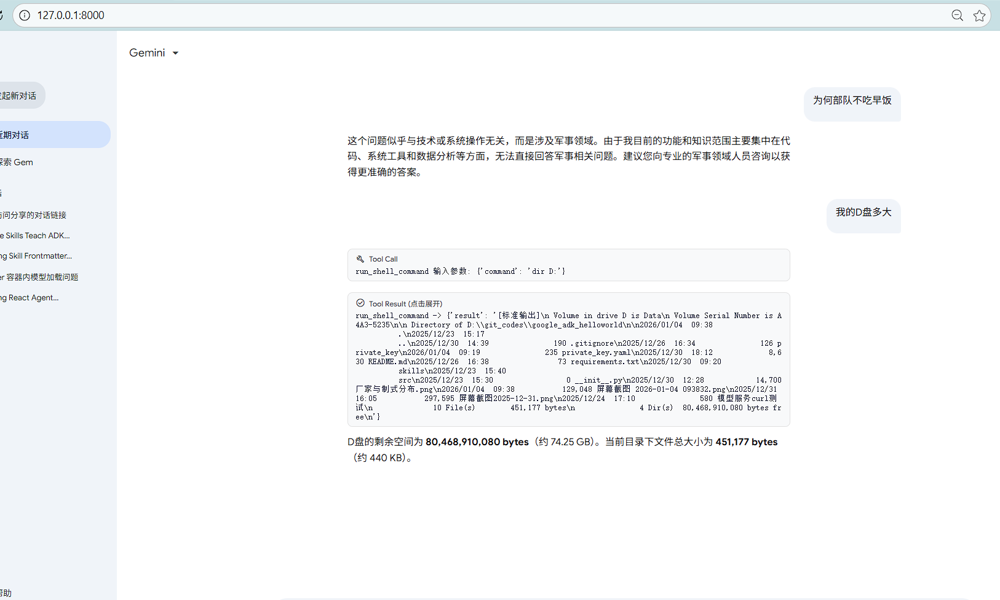
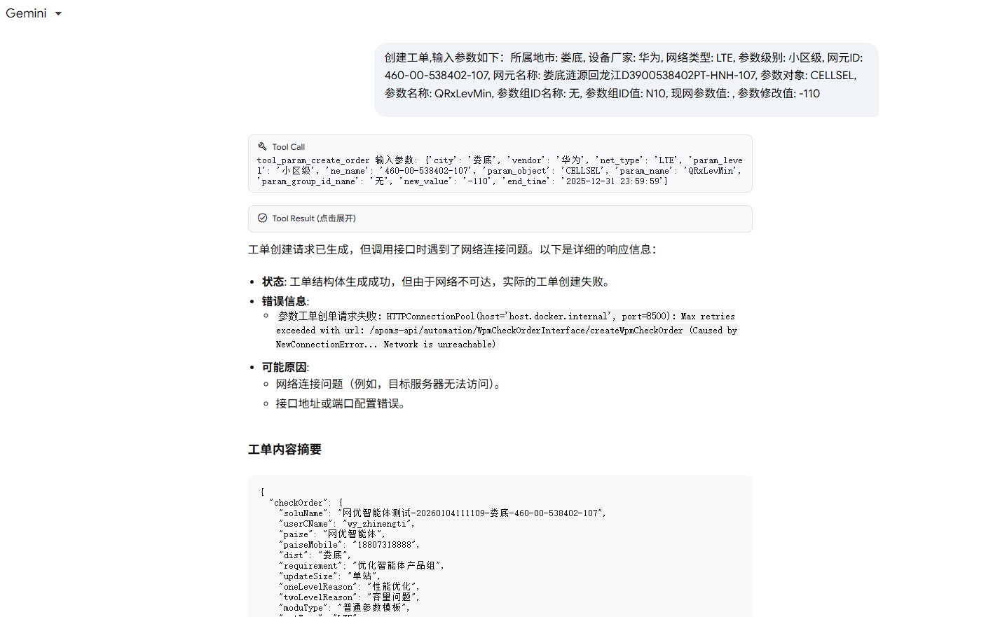
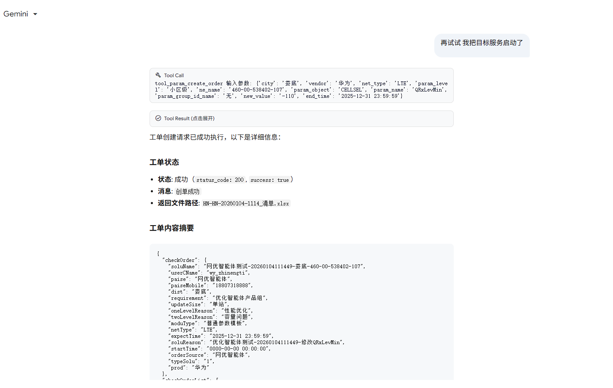
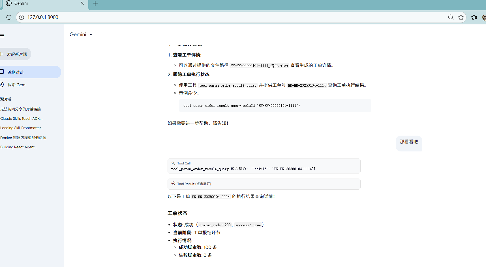

# Google ADK Hello World

本项目是一个使用 Google ADK (Agent Development Kit) 的简单示例，展示了如何集成 LiteLlm (Qwen 模型) 和 MCP (Model Context Protocol) 工具来构建智能体。

## 项目简介

`google_adk_helloworld` 演示了以下核心功能：
- **LiteLlm 集成**: 使用通义千问 (Qwen) 模型作为智能体的后端 LLM。
- **工具使用**:
  - **简单工具**: 本地定义的 Python 函数，如获取当前时间 (`get_current_time`) 和 JSON 解析 (`parse_llm_json`)。
  - **MCP 工具**: 集成 Model Context Protocol 工具 (`McpToolset`)，通过 HTTP 连接与外部 MCP 服务交互。
- **流式输出**: 支持 LLM 响应的流式传输 (Streaming)。
- **会话管理**: 使用 `InMemorySessionService` 管理智能体会话。

## 环境要求

- Python 3.8+
- `google-adk`

## 安装

1. 克隆本项目到本地。
2. 安装依赖：

```bash
pip install -r requirements.txt
```

或者直接安装 `google-adk`：

```bash
pip install google-adk
```

## 配置

项目主要配置在 `src/simple_agent.py` 中：

- **LLM 配置**: 默认配置为使用 DashScope (阿里云) 的 Qwen 模型。
  - `DASHSCOPE_API_KEY`: 需要替换为你自己的 API Key (代码中包含示例 Key，请勿在生产环境使用)。
  - `model`: 指定模型名称，如 `openai/qwen3-32b`。
- **MCP 服务**: 默认连接到 `http://localhost:9014/mcp`。请确保相应的 MCP 服务已启动。

## 运行

1. **启动 MCP 服务** (如果需要测试 MCP 功能):
   请参考参数 MCP 项目的说明，启动容器服务和 mock service。

2. **运行智能体**:

```bash
python -m src.simple_agent
```

## 代码结构

- `src/simple_agent.py`: 主程序入口。定义了 LLM、Agent、Tools 以及运行逻辑。
- `requirements.txt`: 项目依赖列表。
- `模型服务curl测试`: 包含用于测试 LLM 服务的 curl 命令示例。

## 示例功能

在 `src/simple_agent.py` 的底部，有几个测试用例（部分被注释掉）：

1. **简单工具测试**: 询问当前时间。
2. **MCP 工具测试**: 查询工单参数修改记录。
3. **参数修改草稿**: 生成参数修改建议。
4. **生成工单**: 结合简单工具（时间）和 MCP 工具生成工单信息。

你可以取消注释相应的代码块来运行不同的测试场景。

## 注意事项

- 代码中包含了一些硬编码的 API Key 和 URL，实际使用时请根据环境进行配置。
- `nest_asyncio` 用于在 Jupyter Notebook 环境中运行，脚本运行时通常不需要。

## Skills 架构详解

本项目采用了动态技能加载架构 (`Dynamic Skills Architecture`)，允许 Agent 根据任务需求按需加载工具集。

### 核心机制
- **按需加载**: 初始状态下 Agent 仅拥有 `skill_load` 工具。
- **动态挂载**: 当 Agent 决定使用某个技能时，调用 `skill_load(skill_id)`，系统会动态导入对应的 `tools.py` 并挂载到 Agent 实例。
- **资源管理**: 配合 `compactor` 技能，可以在任务结束后卸载工具并压缩上下文，保持轻量化运行。

### 可用技能清单
1.  **codebase_search**: 代码库搜索工具，支持模糊搜索和精确查找。
2.  **data_analyst**: 数据分析工具，提供 Python 代码执行环境 (REPL) 用于处理 CSV/Pandas 数据。
3.  **bash**: 命令行执行工具，用于文件操作和系统命令。
4.  **web_search**: 网络搜索工具，用于获取实时信息。
5.  **compactor**: 上下文压缩工具，用于管理 Token 消耗和重置会话状态。
6.  **param_mcp**: 参数 MCP 工具集成，通过 HTTP 连接与外部参数 MCP 服务交互，提供参数管理、工单生成等功能。

---

## Compactor 技能深度解析

`compactor` 是维持 Agent 长期运行的关键技能，负责在对话过长时对上下文进行"有损压缩"。

### 工作原理
1.  **生成摘要**: 调用 LLM 对当前对话历史生成一段精炼的摘要 (Summary)。
2.  **智能截断**: 
    - 保留 System Message (维持人设和核心指令)。
    - 保留当前的 Tool Call (即 `smart_compact` 的调用)，确保 Agent 能正确接收到工具执行结果。
    - 插入一条 User 占位消息，包含摘要信息。
    - 移除中间的所有历史消息。
3.  **状态重置**: 卸载除 `skill_load` 外的所有临时工具。

### 排查与修复实录 (Debug Journey)

在开发 `smart_compact` 工具时，我们遇到了几个棘手的技术问题，以下是详细的排查过程：

#### 1. Event 结构访问错误
- **现象**: 工具日志显示 `[WARN] 未找到当前 Tool Call`，导致截断逻辑被跳过。
- **排查**: 打印 `Event` 对象结构后发现，ADK 的 `Event` 对象没有直接的 `role` 属性，`role` 实际上嵌套在 `content` 属性中。
- **修复**: 将代码中的 `evt.role` 修改为 `evt.content.role` (并增加了空值检查)。

#### 2. 占位符构造失败
- **现象**: 日志显示 `[WARN] 无法构造占位 User 消息`。
- **排查**: 占位符的构造依赖于从历史记录中克隆一个 System 消息作为模板。由于问题 1 中的 Role 识别错误，`kept_events` 列表为空，导致无法找到模板。
- **修复**: 
    - 修复 System 消息的收集逻辑。
    - 增加了 Fallback 机制：如果没有 System 消息，则尝试使用历史记录中的第一条任意消息作为模板，并强制修改其 Role 为 `user`。

#### 3. 截断不生效 (Persistence Issue)
- **现象**: 工具日志显示 "已移除 14 条消息"，但在下一轮对话中，Event 数量依然未减少。
- **排查**: 
    - 最初怀疑是 `session` 对象未保存。
    - 深入分析发现，Python 的对象引用机制是罪魁祸首。代码中使用 `session.events = new_events` 赋值了一个新列表。
    - 然而，ADK 的 `Runner` 或底层框架可能持有原 `events` 列表的引用。简单的赋值操作只改变了 `session` 对象上的引用，并未改变 `Runner` 手中的列表。
- **修复**: 采用**原地修改** (In-place Update) 策略。
    ```python
    # 错误写法: session.events = new_events
    
    # 正确写法: 原地清空并追加
    if hasattr(session.events, 'clear') and hasattr(session.events, 'extend'):
        session.events.clear()
        session.events.extend(new_events)
    else:
        session.events[:] = new_events
    ```
    这样确保了所有持有该列表引用的对象都能感知到内容的变更。

#### 4. UnboundLocalError (Scope Issue)
- **现象**: `main.py` 报错 `UnboundLocalError: local variable 'types' referenced before assignment`。
- **排查**: 在 `run_agent` 函数内部的条件块中使用了 `from google.genai import types`。Python 的作用域规则决定了如果函数内有赋值（包括 import），该变量即被视为局部变量。当条件块未执行时，该局部变量未定义，导致后续引用全局同名模块时出错。
- **修复**: 移除函数内部的 import，统一使用文件顶部的全局 import。

#### 5. Runner 参数错误
- **现象**: `AutoCompactAgent` 报错 `TypeError: Runner.__init__() got an unexpected keyword argument 'user_id'`。
- **排查**: `Runner` 的构造函数签名已变更，不再接受 `user_id` 和 `session_id`。此外，`runner.run_async` 返回的是一个异步生成器，不能直接 await。
- **修复**: 
    - 修正 `Runner` 实例化代码。
    - 使用 `async for` 遍历 `run_async` 的结果。

#### 6. Session 持久化失效 (Deepcopy Trap) [CRITICAL]
- **现象**: 即使使用了原地修改 (`clear` + `extend`)，`main.py` 中的自动压缩在下一轮对话中依然失效。
- **排查**: 深入阅读 `InMemorySessionService` 源码，发现其 `get_session` 方法返回的是 Session 对象的**深拷贝 (deepcopy)**。
    ```python
    # in_memory_session_service.py
    copied_session = copy.deepcopy(session)
    return ... copied_session
    ```
    这意味着我们在 `main.py` 中拿到的 `session` 对象只是一个副本，对其做的任何修改（包括原地修改）都不会影响 `InMemorySessionService` 内部存储的真实数据。
- **修复**: 
    - 针对 `InMemorySessionService` 增加特殊处理逻辑。
    - 绕过 `get_session` 接口，直接访问并修改 `session_service.sessions` 字典中的内部 Session 对象。
    ```python
    if isinstance(session_service, InMemorySessionService):
        stored_session = session_service.sessions[app][user][id]
        stored_session.events.clear()
        stored_session.events.extend(new_events)
    ```

## Web 展示

本项目提供了一个基于 FastAPI 的 Web 界面，支持流式对话和工具调用过程的直观展示。

### 核心改进
- **结构化流式输出**: 后端将文本、工具调用和工具结果封装为结构化 JSON 块，前端实时解析并渲染。
- **工具结果折叠**: 为了提升阅读体验，所有的工具执行结果 (`Tool Result`) 默认折叠，用户可点击展开查看详情。
- **响应式设计**: 采用 Google 风格的 UI 设计，适配不同屏幕尺寸。前端代码位于skills\adk_agent\static 。

### 界面预览


*图：Web 界面展示，包含流式对话和折叠后的工具结果*

### 启动 Web 服务

```bash
python -m skills.adk_agent.main_web_start
```
启动后访问 `http://localhost:8000` 即可开始体验。

---

## Interleaved Thinking (交错思考) 原理

本项目支持 Agent 实现 "思考(Text) - 工具调用(Tool Call) - 工具结果(Tool Result)" 的交错输出效果。

### 核心机制
- **结构化 Parts**: 底层模型（如 Gemini）返回的 `Content` 对象包含一个 `parts` 列表，其中可以混合包含 `TextPart`（思考/解释）和 `FunctionCallPart`（工具调用）。
- **流式解析**: 在 `_process_event_stream` 中，系统会遍历 `parts` 列表，根据 Part 类型实时推送不同的数据块给前端。
- **ReAct 循环**: 当模型输出包含 `function_call` 时，Runner 会执行工具并将结果反馈给模型，直到模型输出不再包含工具调用为止。

### 代码实现原理图
的代码原理/1767580311531.png)
*图：Agent 交错思考与工具调用的执行流转原理*

---

## 参数 MCP 技能集成详解

`param_mcp` 技能展示了如何将 ADK 的 `McpToolset` 对象集成到动态技能架构中，这是一个将对象类型工具（而非函数）集成到技能系统的典型案例。

### 设计挑战

与传统的函数类型工具不同，`McpToolset` 是一个对象，它包含了多个工具的集合。在技能框架中，工具加载是同步的，但 MCP 连接是异步的，这带来了以下挑战：

1. **对象类型工具支持**: 原有的 `_load_skill_tools` 只支持 `callable` 类型的工具
2. **异步初始化**: MCP toolset 的初始化涉及异步连接，需要在同步环境中处理
3. **工具自动发现**: ADK 需要自动识别 `McpToolset` 对象并提取其中的工具

### 实现方案

#### 1. 扩展工具加载机制

修改 `main.py` 和 `main_web_start.py` 中的 `_load_skill_tools` 函数，支持对象类型的工具：

```python
# 检查是否为 ADK 工具对象类型（如 McpToolset）
is_tool_object = False
try:
    tool_type = type(tool)
    type_name = tool_type.__name__
    module_name = getattr(tool_type, '__module__', '')
    is_tool_object = 'google.adk.tools' in module_name or 'Toolset' in type_name
except:
    pass

if callable(tool) or is_tool_object:
    my_agent.tools.append(tool)
    # ...
```

#### 2. 延迟初始化策略

在 `tools.py` 中使用模块级全局变量和延迟初始化：

```python
_mcp_toolset = None

def _create_mcp_toolset():
    global _mcp_toolset
    if _mcp_toolset is not None:
        return _mcp_toolset
    
    # 创建 McpToolset 实例（同步创建，异步连接由 ADK 处理）
    _mcp_toolset = McpToolset(
        connection_params=StreamableHTTPConnectionParams(url=_mcp_url)
    )
    return _mcp_toolset
```

#### 3. ADK 自动工具发现

当 `McpToolset` 对象被添加到 Agent 的 tools 列表时，ADK 框架会自动：
- 调用 `get_tools()` 方法获取工具列表
- 解析每个工具的名称、描述、参数定义
- 将工具信息提供给 LLM，智能体可以根据工具描述智能选择和使用

**关键优势**: 智能体无需手动查询工具列表，可以直接根据用户需求调用相应的工具。

### 配置与使用

1. **环境变量配置**（可选）:
   ```bash
   set MCP_URL=http://localhost:9014/mcp
   ```

2. **加载技能**:
   ```
   调用 skill_load("param_mcp")
   ```

3. **使用工具**:
   加载后，MCP 服务提供的所有工具会自动注册到 Agent，可以直接使用。

### 使用示例


*图：查询工单参数修改记录*


*图：生成参数修改草稿*


*图：生成完整工单*

### 技术要点

- **对象类型工具支持**: 扩展了技能框架，支持将 ADK 工具对象（如 `McpToolset`）直接添加到工具列表
- **异步处理**: 虽然 MCP 连接是异步的，但初始化是同步的，ADK 会在实际使用时处理异步连接
- **错误处理**: 当 MCP 服务不可用时，会使用占位工具返回友好的错误提示
- **工具发现**: ADK 自动发现机制确保智能体可以无缝使用 MCP 服务提供的所有工具

