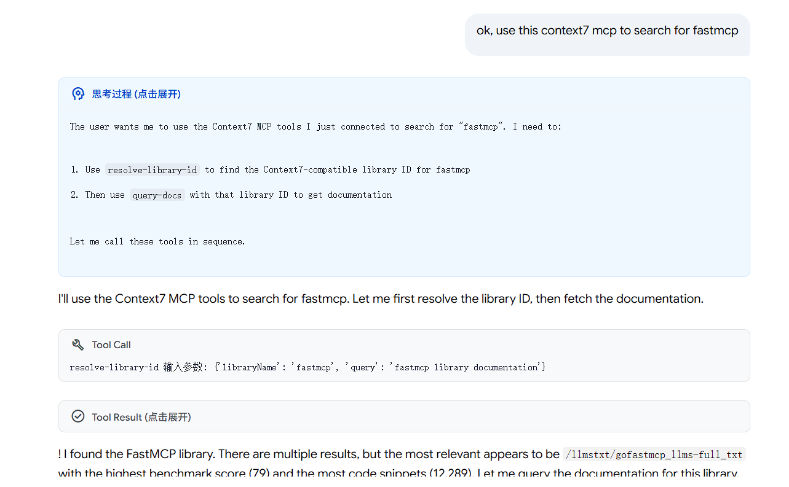
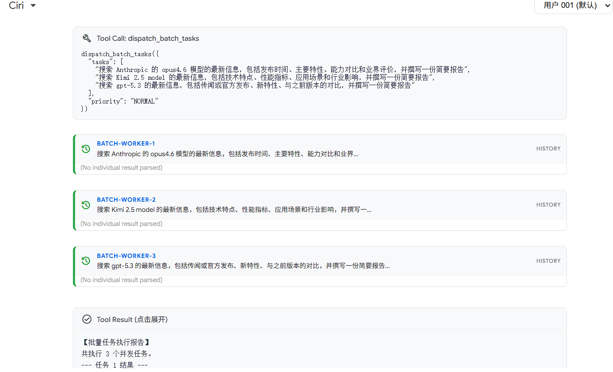

[English](README.md) | [中文](README_CN.md)

# Ciri: An AI Agent from scratch by vibe coding ⚡


> **"Vibe Coding" Reimagined.**
> 
> **Ciri** is a modern AI Agent system built entirely from scratch based on the **Google ADK (Agent Development Kit)**.
> She was created not just to be a powerful assistant, but to **demonstrate the infinite potential of Google ADK**.
> Through Ciri, you can experience next-generation Agent features like **Dynamic Skills**, **Infinite Context**, and **Scalable Swarm**.

---

## 📚 Behind the Design

The `MISC/tech_files` directory contains the complete evolution of Ciri from concept to implementation. These are the records of in-depth technical discussions with **Google Gemini 3 Pro**.

Special thanks to **Google Gemini 3 Pro** for its unprecedented **2M+ Token Context Window** and **exceptional architectural design capabilities**. It was instrumental in building this complex Swarm architecture from scratch in such a short time. These discussion logs are invaluable resources for understanding Agentic AI design patterns and are highly recommended for reading.

Also, a huge shoutout to **Antigravity** — the ultimate **Vibe Coding IDE**. Its powerful Agentic collaboration and seamless tool integration made the "from scratch" development process flow like water. In this project, Antigravity was not just an editor, but my true Pair Programmer.

---

## 📚 Implementation Deep Dive

We have prepared precise documentation in `MISC/how-to/` to help you understand the core implementation of Ciri:

*   **[Core Skills & Lazy Loading](MISC/how-to/import-skills.md)**: How we manage skills and the `get_tools` pattern.
*   **[Context Compression](MISC/how-to/autocompactor-subagent.md)**: The `AutoCompactAgent` design.
*   **[Steering & Control](MISC/how-to/steering-by-adk-callbacks.md)**: Real-time interruption using ADK callbacks.
*   **[Programmatic Tool Calling](MISC/how-to/PTC-programmatic-tool-calling.md)**: Code as orchestration.
*   **[Dex: Async Execution](MISC/how-to/dex.md)**: Handling long-running tasks.
*   **[Agent-team Architecture](MISC/how-to/agent-team.md)**: The "Fracal Agent" design.

---

## ✨ Project Vision

**Ciri** aims to showcase how to build a **modern**, **scalable**, and **"Vibe"** AI operating system using Google ADK. We hope this open-source project will help more developers understand the power of Google ADK and inspire them to explore the future of Agentic AI.

## ✨ Key Features

### 🚀 1. Agent Swarm (Cluster Intelligence)
No longer fighting alone. Ciri implements a complete **Leader-Worker** architecture:
- **Auto-Scaling**: One-click start of Leader and multiple Worker nodes via `start_demo_swarm.bat`.
- **Load Balancing**: Leader intelligently distributes tasks based on Worker busy/idle status.
- **Parallelism**: Use `dispatch_batch_tasks` to process multiple independent complex tasks in parallel (e.g., researching 5 competitors simultaneously).
- **Context Isolation**: Isolate tedious trial-and-error steps (CoT, Code Debugging) in Worker nodes; Leader only receives the final result, keeping the main context clean.

### 🧩 2. Dynamic Skills
Refuse bloat. Ciri carries **only the most basic meta-tools** at startup, loading required skills **Just-in-Time** based on task needs:
- **Hot-Pluggable**: No restart needed, dynamically mount/unmount Python toolkits at runtime.
- **On-Demand Loading**: Use and go, automatically unmount unused skills via `compactor` to save resources.
*   **Wide Support**: Covers file operations, code execution, web search, database management, etc.
*   **Extensible**: Create a `tools.py` in `skills/your_skill/`, and it's instantly available.

> **⚠️ Developer Notice**: When creating new skills, it is strongly recommended to use the `def get_tools(*args, **kwargs) -> List:` function pattern (as seen in `skills/bash/tools.py`) instead of instantiating tools globally.
> *   **Why?**: `get_tools` allows for deferred initialization, better error handling during loading, and access to runtime configuration if needed. It ensures tools are only created when the skill is actually loaded by the agent.

### 🧠 3. Infinite Context
Based on **lossy compression technology** of the `compactor` skill, allowing Ciri to have "infinite" long-term memory:
- **Smart Summary**: When context reaches a threshold (e.g., 700 turns), automatically trigger `AutoCompactAgent` to generate a refined summary.
- **Seamless Switching**: Users hardly perceive the compression process, but the Agent still remembers previous key information.
- **Token Optimization**: Always run within the LLM's optimal performance window.

### ⚡ 4. Vibe Coding UI (Modern Interface)
- **TUI (Terminal Interface)**: Geek-style command-line interface supporting streaming output and real-time status monitoring.
- **Web UI**: Google-style responsive Web interface, perfectly displaying the **Interleaved Thinking** process—you can see Ciri's complete mental journey of "Thinking -> Calling Tool -> Getting Result -> Thinking Again" in real-time.

---

---

## 📸 Demo Showcase

### 🤖 Single Agent Mode


### 👥 Agent Team Mode


You can refer to [demo_images/agent-team-demo](demo_images/agent-team-demo) for more demo images.
---

## 🛠️ Getting Started

### Requirements
- Windows / Linux / macOS
- Python 3.10+
- [Git](https://git-scm.com/)

### 1. Install Dependencies
```bash
git clone https://github.com/your-repo/google_adk_agent.git
cd google_adk_agent
pip install -r requirements.txt
```

### 2. Configure API Key
Create or modify `private_key.yaml` (or other config files) in the project root, filling in your LLM API Key (deepseek-v3.2 or stepfunc-3.5-flash or more advanced model recommended).

### 3. Start Single Agent (Standard Mode)
If you only need a single agent without the Swarm capabilities, you can run:
```bash
cmd /c set PYTHONIOENCODING=utf-8 && python -m src.adk_agent.main_web_start_steering_single_agent
```
This will start the standard Ciri agent on port 9000 (default).

### 4. Start Swarm Cluster (Recommended)
We provide a one-click startup script that automatically launches 1 Head Leader and 4 Worker nodes:

```cmd
.\start_demo_swarm.bat
```

After startup, visit **http://localhost:8000** to start experiencing.

---

## 🧩 Core Skills Deep Dive

### 1. Agent Team (Swarm Orchestrator)
The "Commander" skill of Ciri. Loading this skill gives the Agent the ability to command the entire cluster.

*   **`dispatch_task`**: Dispatch a single complex task (e.g., "Write a Snake game") to an idle Worker.
*   **`dispatch_batch_tasks`**: Parallel dispatch of multiple tasks (e.g., "Simultaneously analyze financial reports of Apple, Google, Microsoft").

**Scenario Example**:
> **User**: "Help me write an IM software, including React frontend and Python backend."
> **Leader (Ciri)**: 
> 1. Breaks down task.
> 2. Calls `dispatch_batch_tasks`:
>    - Worker 8001: "Write Python FastAPI backend websocket interface"
>    - Worker 8002: "Write React chat page component"
> 3. Collects results and reports to user.

**Video Demos**:
- [Part 1](https://www.youtube.com/watch?v=0zBrTGIcZWg&t=22s)
- [Part 2](https://www.youtube.com/watch?v=fUMOUpa8EnE)
- [Part 3](https://www.youtube.com/watch?v=vKHZRy6_53M)

**The "Agent Smith" Implementation**:

In the Google ADK Swarm, **every agent is "Agent Smith in Matrix"**.
- **Identical Capabilities**: Every node (Leader or Worker) runs the exact same code and possesses the full set of capabilities. There is no hard-coded "Master" node.
- **Decentralized Access**: You can access the Swarm through **any port** (8000, 8001, 8002, etc.). The node you connect to automatically becomes the "Leader" for that session, commanding other idle nodes as "Workers".
- **Standalone Mode**: If a node detects no other active peers in the `swarm_registry.db`, it silently falls back to working alone, ensuring reliability in any environment.

### 2. Dynamic MCP (Meta Tools)
Implements dynamic loading of Model Context Protocol (MCP). Connect to any MCP service without restarting the Agent.

*   **Connect**: `connect_mcp(url="http://localhost:9014/mcp")`
*   **Features**: Auto-detect SSE/HTTP protocols, intelligent handling of authentication Headers.


### 3. Compactor (Memory Compression)
The "Janitor" working silently in the background.
*   **Trigger Mechanism**: Based on Token count or Turn Count.
*   **Workflow**: 
    1. Pause current conversation.
    2. Start sub-Agent to summarize history.
    3. Replace history messages with `[System Summary]` + `[Last few messages]`.
    4. Resume conversation.

### 4. Dex (Async Task Execution)
Designed for long-running tasks.
*   **Function**: Run Python scripts or system commands in an independent background process.
*   **Scenario**: "Scan PDF files in the entire D drive for me" -> Agent submits task to Dex -> Immediately returns "Scan started, you can continue to ask me other questions" -> Task runs silently in the background.

---

## 🏗️ Architecture

### SteeringSession & Registry
*   **SteeringSession**: Every user session accessing via Web/TUI is managed by an independent `SteeringSession` object on the server, ensuring data isolation.
*   **Swarm Registry (`swarm_registry.db`)**: A lightweight SQLite database for service discovery. Leader and Worker register their URLs and capabilities at startup, and the Leader queries this table to perceive the cluster state.

### Directory Structure
```
google_adk_agent/
├── src/                # Core Source Code
│   ├── adk_agent/      # Agent Logic (Leader/Worker)
│   └── shared/         # Shared Libraries (DB, Utils)
├── skills/             # Skills Directory (On-Demand Loading)
│   ├── agent_team/     # Swarm Skills
│   ├── dynamic-mcp/    # MCP Dynamic Loading Skills
│   └── ...
├── image/              # Demo Images
└── start_demo_swarm.bat # Swarm Startup Script
```

---


## 🤝 Contributing
Welcome to Star, Fork, submit PRs to contribute new Skills or optimize Swarm scheduling algorithms! Let's explore the infinite possibilities of Agentic AI together.

## 📄 License
MIT License
