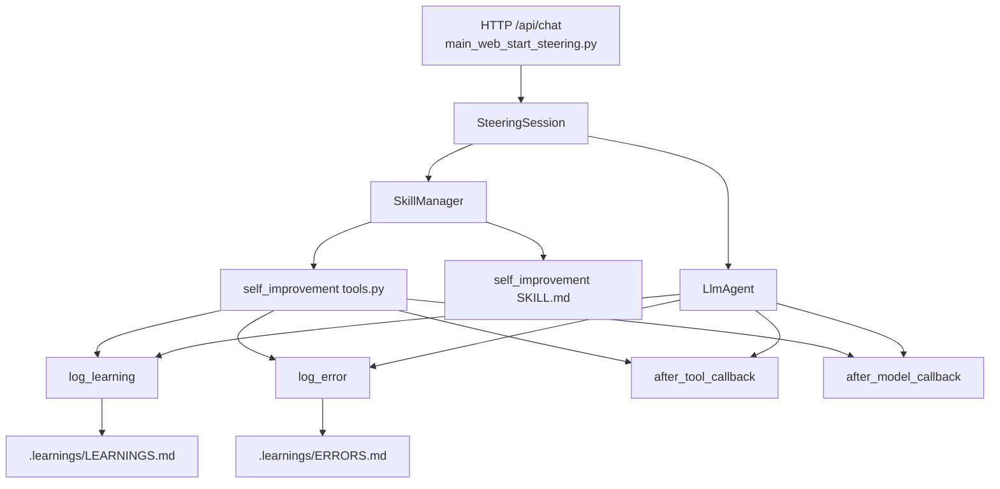
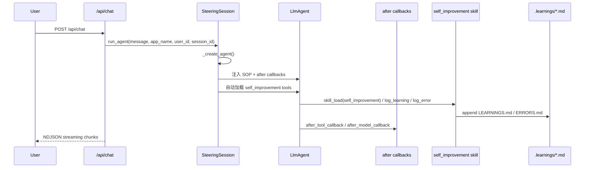

# Self-Improvement 轻量实现原理与代码分析报告

## 1. 报告目的

本文对当前项目中的 **Self-Improvement（自我进化）机制** 做一次完整的技术分析，重点回答四个问题：

- 它为什么是一个**轻量实现**，而不是一套重型自治子系统
- 它在整体架构中处于什么位置
- 它具体依赖了哪些代码接缝来完成接入
- 它如何从一次真实请求走到 `.learnings` 的持久化落盘

本文覆盖范围包括：

- `src/adk_agent/main_web_start_steering.py`
- `skills/self_improvement/SKILL.md`
- `skills/self_improvement/tools.py`
- `.learnings/LEARNINGS.md`
- `.learnings/ERRORS.md`
- 本次已完成的 E2E 自测证据链

本文面向两类读者：

1. **架构评审者**：希望快速理解这一机制为何成立、为何轻量、边界在哪里
2. **实现维护者**：希望按代码位置理解它是如何被接入、触发、落盘和验证的

---

## 2. 核心结论

结论先说在前面：

1. **当前 Self-Improvement 的实现非常轻量。**
   它没有引入新的常驻守护进程、没有增加独立调度器、没有重写主对话循环，也没有单独设计复杂的经验数据库。

2. **它的核心只依赖两类现成能力：**
   - **ADK 原生 callbacks / hook 机制**
     - `after_tool_callback`
     - `after_model_callback`
   - **标准 skill 机制**
     - `self_improvement` skill
     - `log_learning`
     - `log_error`

3. **它不是“另起炉灶”的自我进化系统，而是“寄生式增强”。**
   它挂靠在现有 `SteeringSession -> LlmAgent -> SkillManager -> tools` 体系上，只在关键接缝插入少量逻辑。

4. **它的目标不是自动做复杂知识蒸馏，而是先完成一个最小可用闭环：**
   - 让 Agent 知道“应该反思和沉淀”
   - 在工具报错后给出提醒
   - 在模型回复后打状态标记
   - 提供两个极简内置工具用于显式落盘
   - 把结果写入项目根目录 `.learnings/`

5. **本次 E2E 已验证：**
   在 `main_web_start_steering.py` 入口下，默认 `user_001/session_001` 可以成功完成：
   - 自动集成 `self_improvement`
   - 调用 `log_learning`
   - 调用 `log_error`
   - 在 `.learnings/LEARNINGS.md` 与 `.learnings/ERRORS.md` 中生成新记录

因此，这套方案的本质可以概括为：

> Self-Improvement 不是一个重型自治框架，而是一个基于 **callbacks + 内置 skill** 的轻量增强层：它尽量复用已有 Agent 运行时，只补上“错误感知、反思提醒、经验落盘”这条最小闭环。

---

## 3. 为什么说它是“轻量实现”

### 3.1 它没有新建独立运行时

Self-Improvement 并没有像 KAIROS runtime 那样引入一套新的长期运行引擎，也没有额外维护一个专属状态机。它直接依附在已有的 `SteeringSession._create_agent()` 流程中完成接入，见：

- `src/adk_agent/main_web_start_steering.py:788`
- `src/adk_agent/main_web_start_steering.py:817`
- `src/adk_agent/main_web_start_steering.py:826`
- `src/adk_agent/main_web_start_steering.py:858`

这意味着它不是新系统，而是对现有 Agent 创建流程的一层增强。

### 3.2 它没有重写主执行骨架

真正处理请求的主链路仍然是：

- `@app.post("/api/chat")` 接收请求：`src/adk_agent/main_web_start_steering.py:3018`
- `run_agent(...)` / `_run_agent_turn(...)` 驱动执行
- `Runner + LlmAgent` 负责模型与工具流转

Self-Improvement 并没有改写这套主链路，只是在 Agent 初始化时补充：

- prompt 注入
- callback 注入
- 工具自动加载

所以它的侵入面很小。

### 3.3 它没有引入复杂持久化存储

经验落盘不是写数据库、向量库或统一知识索引，而是直接写 Markdown：

- `.learnings/LEARNINGS.md`
- `.learnings/ERRORS.md`

对应实现见：

- `skills/self_improvement/tools.py:37`
- `skills/self_improvement/tools.py:111`
- `skills/self_improvement/tools.py:176`

这种做法的优点非常明确：

- 实现简单
- 可读性强
- 可直接人工审阅
- 易于纳入 git / diff / review 流程
- 不引入额外部署依赖

代价是：

- 不适合复杂检索
- 不具备结构化查询能力
- 更像“经验备忘录”而不是“知识图谱”

但对于当前目标来说，这是合理的轻量取舍。

---

## 4. 整体架构

### 4.1 架构图



### 4.2 架构分层说明

可以把这套机制拆成四层：

#### 第 1 层：请求入口层
由 `src/adk_agent/main_web_start_steering.py:3018` 的 `/api/chat` 接收请求，并把消息交给 `run_agent(...)`。

#### 第 2 层：会话与 Agent 装配层
`SteeringSession._create_agent()` 是 Self-Improvement 接入的关键位置：

- 加载 `self_improvement` 的 SOP 并注入 system prompt
- 构造 `after_tool_callback`
- 构造 `after_model_callback`
- 自动加载 `log_learning` / `log_error` 工具

这一步是整个设计的**最关键轻量接缝**。

#### 第 3 层：Self-Improvement 技能层
`skills/self_improvement/tools.py` 提供三种能力：

- 显式落盘工具：`log_learning`、`log_error`
- 隐式监控 Hook：`build_after_tool_callback`、`build_after_model_callback`

#### 第 4 层：Markdown 持久化层
将经验写入 `.learnings/`，保持低门槛、可审计、可人工维护。

---

## 5. 关键设计思想：callbacks + 内置 skill

这一设计最值得强调的地方在于：**它没有试图让“自我进化”成为一个独立 Agent，而是把它拆成两个更轻的部件。**

### 5.1 callbacks 负责“感知”和“提醒”

- `after_tool_callback`：在工具执行后检查结果中是否含有错误模式
- `after_model_callback`：在模型回复后为 session state 打一个待评估标记

这类逻辑天然适合放在 hook 层，因为它们不是业务主流程，而是“旁路观察者”。

### 5.2 内置 skill 负责“显式沉淀”

真正写经验不是由 callback 直接强制完成，而是通过工具：

- `log_learning`
- `log_error`

这就把“观察”与“落盘”解耦了：

- callback 发现信号
- skill/tool 完成写入

这种拆法很轻，也更稳：

- callback 不承担复杂 I/O 责任
- 落盘仍通过标准 tool 调用完成
- 不破坏 ADK 原有的工具语义

---

## 6. 代码实现详解

## 6.1 在 Agent 创建时注入 Self-Improvement 能力

关键代码位于：

- `src/adk_agent/main_web_start_steering.py:817-863`

这里做了三件事。

### 6.1.1 把 Self-Improvement SOP 注入系统提示词

见：`src/adk_agent/main_web_start_steering.py:817-824`

```python
si_sop = self.skill_manager.load_full_sop("self_improvement")
if si_sop:
    system_prompt += f"\n\n=== [Core Capability] Self-Improvement ===\n{si_sop}"
```

这一步的意义是：

- Agent 启动时就知道“自我进化”这件事
- 它知道什么时候应该记录 learning / error
- 它无需等待用户先显式教一遍这套方法论

也就是说，这一步解决的是 **methodology injection（方法论注入）**。

### 6.1.2 构造 after callbacks

见：`src/adk_agent/main_web_start_steering.py:826-837`

```python
from skills.self_improvement.tools import (
    build_after_tool_callback,
    build_after_model_callback,
)
_si_after_tool = build_after_tool_callback()
_si_after_model = build_after_model_callback()
```

这是第二层接入：把 self-improvement 变成一种系统级旁路观察机制。

### 6.1.3 把 callbacks 挂到 LlmAgent

见：`src/adk_agent/main_web_start_steering.py:842-854`

```python
agent = LlmAgent(
    ...
    after_tool_callback=_si_after_tool,
    after_model_callback=_si_after_model,
)
```

这一步非常关键，因为它说明 Self-Improvement 不是靠修改主执行逻辑实现的，而是完全顺着 ADK 提供的原生扩展点接入。

**这正是它“轻量”的核心证据之一。**

### 6.1.4 标准化自动加载 self_improvement 工具

见：`src/adk_agent/main_web_start_steering.py:858-863`

```python
self._load_skill_tools('self_improvement')
```

这里没有特判写一套私有工具注册机制，而是直接复用现有 skill 加载管线。也就是说，Self-Improvement 在工程接线层面被当成一个**正常 skill** 对待，而不是框架内部的硬编码特性。

这让它具备两个优点：

- 工程风格统一
- 扩展与维护成本低

---

## 6.2 Skill 层的最小实现

### 6.2.1 `SKILL.md` 只提供方法论与工具定义

见：`skills/self_improvement/SKILL.md:1-27`

这个文件非常短，只定义三类信息：

- 它是什么
- 有哪些工具
- 什么时候该记录

它没有塞入重型流程，没有复杂 SOP 编排，说明这里的设计目标很明确：

> 让模型知道“应该反思并沉淀”，但真正的执行仍通过标准工具完成。

这是一种很克制的设计。

### 6.2.2 `get_tools()` 只返回两个工具

见：`skills/self_improvement/tools.py:251-258`

```python
def get_tools(*args, **kwargs) -> List:
    _init_paths()
    return [log_learning, log_error]
```

这段代码几乎就是“最小技能定义”的样板：

- 初始化路径
- 返回工具列表

没有额外 runtime，没有包装器，没有额外对象树。

这再次体现了它的轻量性。

---

## 6.3 落盘工具：`log_learning`

实现位置：

- `skills/self_improvement/tools.py:59-120`

### 6.3.1 路径初始化

见：`skills/self_improvement/tools.py:37-49`

```python
_PROJECT_ROOT = project_root
_LEARNINGS_DIR = os.path.join(_PROJECT_ROOT, ".learnings")
os.makedirs(_LEARNINGS_DIR, exist_ok=True)
```

这里的做法非常直接：

- 把项目根目录解析出来
- 固定经验目录为 `.learnings`
- 启动时若不存在则自动创建

这保证了 skill 不依赖外部配置，也不需要额外初始化脚本。

### 6.3.2 ID 生成

见：`skills/self_improvement/tools.py:52-56`

```python
def _generate_id(prefix: str) -> str:
    date_str = datetime.datetime.now().strftime("%Y%m%d")
    rand_suffix = secrets.token_hex(2)[:3].upper()
    return f"{prefix}-{date_str}-{rand_suffix}"
```

特点：

- 人类可读
- 包含日期信息
- 足够避免短期冲突

### 6.3.3 Markdown 条目结构

`log_learning` 会把信息组织成固定模板，包括：

- ID
- Logged 时间
- Priority
- Status
- Area
- Summary
- Details
- Suggested Action
- Metadata

见：`skills/self_improvement/tools.py:87-110`

这使得 `.learnings/LEARNINGS.md` 既能机器追加，也能人工阅读。

### 6.3.4 实际写入

见：`skills/self_improvement/tools.py:111-119`

```python
with open(learnings_file, "a", encoding="utf-8") as f:
    f.write(entry)
```

这就是一次极简的 append-only 持久化。

#### 优点

- 简单可靠
- 易于调试
- 不依赖数据库 schema

#### 局限

- 并发写入保护较弱
- 结构化分析能力有限
- 长期规模变大后检索成本会提升

但从当前目标看，这是一个合理的 MVP 级实现。

---

## 6.4 落盘工具：`log_error`

实现位置：

- `skills/self_improvement/tools.py:122-184`

它与 `log_learning` 基本同构，只是记录结构更偏向错误调查：

- `tool_name`
- `error_msg`
- `context`
- `priority`
- `area`
- `related_files`

写入目标是：

- `.learnings/ERRORS.md`

见：`skills/self_improvement/tools.py:176-184`

这种设计说明当前系统把“学习经验”和“错误经验”分开保存，这是一个很好的轻量实践：

- `LEARNINGS.md` 偏 best practice / correction / convention
- `ERRORS.md` 偏失败案例 / 调查记录 / 避坑信息

这样后续无论人工阅读还是二次加工，语义都更清晰。

---

## 6.5 `after_tool_callback`：错误感知 Hook

实现位置：

- `skills/self_improvement/tools.py:195-230`

### 6.5.1 错误模式检测

见：`skills/self_improvement/tools.py:22-34` 与 `skills/self_improvement/tools.py:187-192`

它维护了一组轻量错误模式：

- `error:`
- `failed`
- `Traceback`
- `ModuleNotFoundError`
- `SyntaxError`
- `TypeError`
- 中文的“失败”“错误”等

然后通过 `detect_error_in_output(output_text)` 做字符串匹配。

这说明它当前走的是 **pattern-based detection（模式匹配）**，不是复杂分类模型。

### 6.5.2 callback 的行为

当工具输出命中错误模式时，它会尝试在工具返回结果中附加一段提醒：

- 建议把该错误记录到 `.learnings/ERRORS.md`
- 建议使用 `log_error`

见：`skills/self_improvement/tools.py:200-228`

这里要特别注意：

- 它**不是直接强制写错误日志**
- 它只是把提醒注入返回结果

这是一种很重要的轻量取舍：

> callback 只做“感知 + 提醒”，不直接做复杂业务副作用。

这样做的好处是：

- 减少误报时的错误落盘
- 不让 hook 变成隐式黑盒写入器
- 保持工具调用的显式性和可解释性

### 6.5.3 为什么说这是 hook 化增强

因为 `after_tool_callback` 天然处于“工具执行后”的接缝位置，最适合做：

- 错误观察
- 结果补充
- 下一步建议

而不需要修改每一个具体工具的实现。

这就是 callback 方案的工程价值：**低侵入、高复用、低耦合。**

---

## 6.6 `after_model_callback`：反思待办标记 Hook

实现位置：

- `skills/self_improvement/tools.py:233-248`

代码核心：

```python
if hasattr(callback_context, "state") and callback_context.state is not None:
    callback_context.state["_si_pending_eval"] = True
```

它做的事情很简单：

- 每次模型回复后
- 在 session state 中打一个 `_si_pending_eval = True`

### 6.6.1 这一步的意义

它并不直接生成 learning，也不做总结。

它只是告诉系统：

> 这一轮模型输出结束后，后续可以考虑是否需要做一次 self-improvement 评估。

这是一种非常典型的“轻状态钩子”：

- 不做重活
- 不做 I/O
- 只做一个极小的状态信号

### 6.6.2 这说明当前实现的哲学

当前实现没有试图在 after_model 时就做“自动总结、自动抽取、自动归档”的大动作，而是只打标记。这说明实现者有意把系统控制在一个较小风险边界内。

这也是它比重型自治系统更稳的原因之一。

---

## 7. 真实运行链路

### 7.1 流程图



### 7.2 从入口到执行

请求入口是：

- `src/adk_agent/main_web_start_steering.py:3018`

这里完成：

- worker busy 检查
- 锁获取
- 调用 `run_agent(...)`
- 以 `StreamingResponse` 形式返回 NDJSON

Self-Improvement 本身不关心这些 API 级细节，但这些是它得以运行的宿主环境。

### 7.3 从执行到 Agent 组装

在真正进入 Agent 工作前，`SteeringSession._create_agent()` 会：

1. 构造系统提示词
2. 注入 self-improvement SOP
3. 构造 callbacks
4. 创建 `LlmAgent`
5. 自动加载 `self_improvement` 工具

这是 Self-Improvement 的**接线中心**。

### 7.4 从 Agent 到 Skill

当模型决定调用：

- `skill_load("self_improvement")`
- `log_learning(...)`
- `log_error(...)`

这些都会经过标准工具调用路径，而不是专门私有接口。

这说明它是**顺着 Agent 原生工具语义执行的**。

---

## 8. E2E 自测证据链

## 8.1 测试目标

本次测试目标不是泛泛“服务能跑”，而是验证以下闭环：

1. `main_web_start_steering.py` 能正常启动
2. 默认 `user_001 / session_001` 可用
3. `self_improvement` 能被成功加载
4. `log_learning` / `log_error` 能被成功调用
5. `.learnings` 中会新增真实记录

## 8.2 启动验证

已实际启动：

```bash
PYTHONIOENCODING=utf-8 python -m src.adk_agent.main_web_start_steering --port 8000
```

健康检查返回：

```json
{"status":"ok","port":8000}
```

说明服务已正常启动。

## 8.3 默认 user / session 验证

默认值定义在：

- `src/adk_agent/main_web_start_steering.py:110` `DEFAULT_USER_ID = "user_001"`
- `src/adk_agent/main_web_start_steering.py:111` `DEFAULT_SESSION_ID = "session_001"`
- `src/adk_agent/main_web_start_steering.py:2989-2991`

`ChatRequest` 的默认值也明确复用了这一组常量，因此无需额外传参即可复用默认会话。

## 8.4 测试请求内容

E2E 请求要求 Agent：

1. 先调用 `self_improvement`
2. 再分别调用 `log_learning` 和 `log_error`
3. 使用默认 `user_001/session_001`

## 8.5 服务日志证据

服务日志中出现了以下关键事实：

- `Self-Improvement core integrated via standard pipeline.`
- `skill_load` 调用 `self_improvement`
- `log_learning` 实际被调用
- `log_error` 实际被调用

并返回了实际 ID：

- `LRN-20260423-0D5`
- `ERR-20260423-7D8`

## 8.6 `.learnings` 落盘验证

测试前统计：

- `LEARNINGS.md`：3 条
- `ERRORS.md`：5 条

测试后统计：

- `LEARNINGS.md`：4 条
- `ERRORS.md`：6 条

新增记录位置：

- `D:\git_codes\google_adk_helloworld_git\.learnings\LEARNINGS.md:76`
  - `## [LRN-20260423-0D5] test_workflow`
- `D:\git_codes\google_adk_helloworld_git\.learnings\ERRORS.md:142`
  - `## [ERR-20260423-7D8] test_invocation`

这证明从请求到落盘的闭环已被真实验证。

### 8.7 E2E 验证链路图

```mermaid
flowchart LR
    A[启动 steering 服务] --> B[/health 返回 ok]
    B --> C[POST /api/chat]
    C --> D[默认 user_001/session_001]
    D --> E[skill_load self_improvement]
    E --> F[调用 log_learning]
    E --> G[调用 log_error]
    F --> H[LEARNINGS.md 新增条目]
    G --> I[ERRORS.md 新增条目]
```

---

## 9. 为什么这个方案成立

## 9.1 因为它把“自我进化”拆成了最小闭环

当前实现不是试图一步到位做：

- 自动错误诊断
- 自动根因分析
- 自动经验蒸馏
- 自动经验检索推荐
- 自动策略更新

而是先做四件更基础的事：

1. **让模型知道这件事存在**（prompt / SOP）
2. **让系统能感知关键信号**（callbacks）
3. **让模型有显式写入工具**（log_learning / log_error）
4. **让结果真的能落盘**（`.learnings`）

这就是典型的“最小闭环优先”。

## 9.2 因为它把高耦合逻辑变成低耦合扩展点

如果不用 callbacks + skill，而是把自我进化逻辑硬编码进：

- 每一个工具
- 每一轮模型调用
- 主循环
- 会话持久化层

那么维护成本会明显上升。

现在的做法则是：

- 在 Agent 创建时接线一次
- 在 hook 中旁路观察
- 在 skill 中显式落盘

这是非常工程化的轻量设计。

## 9.3 因为它保留了未来升级空间

当前实现虽然轻，但后续非常容易演进。例如：

- 把 `after_model_callback` 的状态标记接入自动评估器
- 把 `.learnings` 从 Markdown 升级到结构化索引
- 把 `detect_error_in_output` 从字符串匹配升级为更强分类逻辑
- 在 prompt 中自动引用已有 `.learnings` 作为避坑上下文

也就是说，它不是死胡同，而是一个低成本起点。

---

## 10. 当前实现的边界与局限

## 10.1 当前更偏“辅助沉淀”，不是“自动进化引擎”

虽然名字叫 Self-Improvement，但从当前代码看，它更准确的定位是：

> 一个让 Agent 具备“错误感知 + 经验记录”能力的轻量增强层。

它还不是：

- 自动策略优化器
- 自动经验检索器
- 自动提示词修正器
- 自动工作流重规划系统

## 10.2 `after_tool_callback` 主要是字符串级错误感知

当前错误检测依赖错误模式字符串列表，优点是简单，缺点是：

- 可能误报
- 可能漏报
- 对复杂错误语义理解有限

不过这正是轻量实现的典型取舍。

## 10.3 Markdown append-only 方案有规模上限

随着经验条目增多，未来可能遇到：

- 人工浏览成本上升
- 检索困难
- 并发写入风险
- 条目重复

但这些问题是“系统长大之后的问题”，不是当前 MVP 阶段的首要矛盾。

---

## 11. 与重型方案对比

如果把 Self-Improvement 设计成重型系统，通常会看到：

- 专门的经验数据库
- 自动抽取与分类任务队列
- 独立的经验召回服务
- 复杂评分与去重逻辑
- 跨会话策略优化管线

而当前方案没有这些负担。它只做：

- hook 感知
- skill 显式写入
- Markdown 落盘

因此它更像：

- **工程上可快速落地的第一阶段方案**
- **在现有 ADK 体系中代价最小的增强**
- **先把“能记录”跑通，再谈“怎么更聪明”**

这也是我认为它设计上最合理的地方。

---

## 12. 总结

Self-Improvement 的当前实现，最值得肯定的不是“功能多”，而是**接入方式非常克制**。

它没有大改框架，没有发明复杂运行时，而是精准利用了现有体系中的两个接缝：

1. **callbacks / hook** —— 负责感知与提醒
2. **skill / tools** —— 负责显式沉淀与落盘

配合 `.learnings` 这个最低成本持久化目录，就完成了一条完整闭环：

- 知道应该反思
- 感知可能出错
- 提供记录工具
- 经验落到本地文件
- E2E 能真实验证

因此，当前这套设计最准确的评价不是“功能很强”，而是：

> **它以极低侵入成本，把“自我进化”从一个抽象口号，落成了一个可运行、可验证、可审阅、可继续演进的工程闭环。**

从架构角度看，这是一种非常好的第一阶段实现；从维护角度看，它也足够简单，便于后续继续增强，而不会反过来拖累主系统复杂度。
