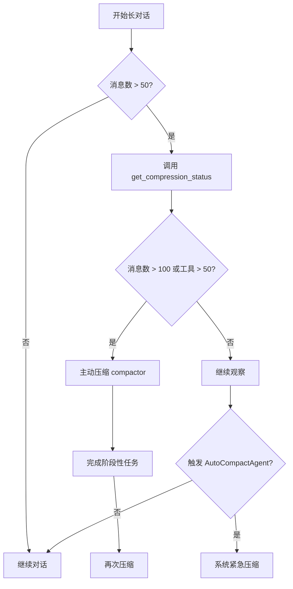

# Compactor Skill 使用说明

## 1. 概述

`compactor` skill 是一个用户级的主动上下文压缩工具，采用 **Rolling Summary（滚动摘要）** 策略，允许 Agent 在对话过长或资源占用过多时主动清理上下文，同时保留关键信息。

### 核心特性

- ✅ **主动压缩**：Agent 自主判断并执行压缩
- ✅ **摘要保留**：压缩前生成结构化摘要，避免信息丢失
- ✅ **工具清理**：自动卸载临时工具，保持 Agent 轻量化
- ✅ **状态查询**：提供压缩建议和当前状态报告

---

## 2. 与 AutoCompactAgent 的对比

### 2.1 执行层级

| 方面         | AutoCompactAgent     | compactor skill        |
| ------------ | -------------------- | ---------------------- |
| **层级**     | 系统级后台机制       | 用户级主动工具         |
| **触发方**   | 系统自动             | Agent 主动或用户请求   |
| **可见性**   | 后台执行，对用户透明 | 显式工具调用，结果可见 |
| **干预程度** | 无需人工干预         | Agent 需主动生成摘要   |

### 2.2 触发条件对比

**AutoCompactAgent** (三层防御机制):

| 层级       | 触发条件                   | 说明                     |
| ---------- | -------------------------- | ------------------------ |
| **预防层** | Token 达到 90%             | 基于字符数估算，提前预警 |
| **制度层** | Event 数量 > 700           | 防止事件对象过多拖慢处理 |
| **补救层** | ContextWindowExceededError | 最后防线，紧急压缩       |

**compactor skill** (主动判断):

| 触发条件     | 阈值     | 说明                       |
| ------------ | -------- | -------------------------- |
| 对话消息数   | > 100 轮 | 上下文过长，影响性能       |
| 已加载工具   | > 50 个  | 工具列表膨胀               |
| 任务阶段切换 | -        | 完成一个大任务，开始新任务 |
| 用户明确要求 | -        | "清理历史" / "重置状态"    |

**次级建议阈值**:
- 对话消息数 > 50 轮：状态正常，可考虑稍后压缩
- 已加载工具 > 25 个：状态正常，可考虑稍后压缩

### 2.3 功能范围对比

| 功能              | AutoCompactAgent         | compactor skill                           |
| ----------------- | ------------------------ | ----------------------------------------- |
| **生成摘要**      | ✅ 通过子 Agent 自动生成  | ✅ Agent 自己在 thinking 中生成            |
| **清空历史**      | ✅ 保留 System + 摘要消息 | ✅ 保留 System + Placeholder + CurrentCall |
| **卸载工具**      | ❌ 不涉及                 | ✅ 保留 `skill_load` + `bash`              |
| **状态查询**      | ❌ 无接口                 | ✅ `get_compression_status`                |
| **200k 字符防御** | ✅ 头尾保留 + 中间截断    | ❌ 无此机制                                |

---

## 3. 可用工具

### 3.1 `smart_compact(summary: str)`

**功能**: 智能压缩上下文，清空历史并保留摘要

**参数**:
- `summary` (必填): 对当前对话的完整摘要

**执行流程**:
1. 记录摘要内容
2. 统计压缩前的消息数量
3. 构建精简历史 (Hard Reset):
   - 保留 System 消息
   - 注入 Placeholder User 消息
   - 保留当前的 `smart_compact` 调用
4. 卸载临时工具 (保留 `skill_load` + `bash`)
5. 返回压缩结果和摘要占位符

**摘要模板** (供参考):
```markdown
## 任务目标
[用户原始请求]

## 已完成
- [关键步骤 1]
- [关键步骤 2]

## 关键发现/数据
- [文件路径/配置值/重要结论]

## 待处理
- [下一步计划]
```

### 3.2 `get_compression_status()`

**功能**: 获取当前压缩状态和建议

**返回信息**:
- 对话消息数
- 已加载工具数
- 是否建议压缩 (基于阈值判断)

**示例输出**:
```
[压缩状态分析]
   对话消息数: 85
   已加载工具数: 12

[建议]
   - 状态正常，可考虑稍后压缩
```

---

## 4. 使用场景与最佳实践

### 4.1 推荐使用场景

#### ✅ 场景 1: 阶段性任务完成
```
用户: "现在开始处理第二个需求"
Agent 思考: 第一个需求已完成，应该压缩上下文
→ 生成摘要 → 调用 smart_compact()
```

#### ✅ 场景 2: 工具列表膨胀
```
Agent 检测到已加载 60+ 个工具
→ 调用 get_compression_status() 确认
→ 压缩并卸载临时工具
```

#### ✅ 场景 3: 用户明确请求
```
用户: "清理一下历史记录"
→ 生成当前对话摘要
→ 调用 smart_compact()
```

#### ✅ 场景 4: 长对话优化
```
对话轮次超过 100 轮
→ 主动建议用户压缩
→ 获得同意后执行
```

### 4.2 不推荐的使用时机

❌ **任务未完成就压缩**: 会丢失正在进行的上下文  
❌ **频繁压缩**: 会打断对话连贯性  
❌ **无摘要压缩**: 违反 Rolling Summary 原则

### 4.3 最佳实践

1. **原子化操作**: 在 thinking 中生成摘要，然后直接调用 `smart_compact(summary="...")`，不要分步进行
2. **摘要质量**: 确保摘要包含任务目标、进展、关键数据、待办事项
3. **通知用户**: 压缩后主动告知用户之前做了什么
4. **配合 AutoCompactAgent**: 主动压缩可以避免触发系统级紧急压缩

---

## 5. 技术实现细节

### 5.1 历史截断策略

**Hard Reset** 模式:
```
原始结构:
System → User1 → Model1 → User2 → Model2 → ... → UserN → ModelN(smart_compact call)

压缩后:
System → User(Placeholder) → ModelN(smart_compact call) → Tool(Output)
```

**关键特性**:
- 保留所有 System 消息 (系统指令)
- 注入 Placeholder 消息标记上下文已清空
- 保留当前工具调用，确保 Runner 能正确追加 Output

### 5.2 工具卸载策略

**保留规则**:
- `skill_load`: 核心工具，用于加载新 skill
- `bash`: 基础工具，常用于系统操作

**卸载对象**:
- 所有通过 `skill_load` 动态加载的临时工具
- 不影响 `skill_load` 和 `bash` 的可用性

### 5.3 InMemorySessionService 兼容性

由于 `InMemorySessionService.get_session()` 返回 deepcopy，工具会主动同步内部存储:
```python
# 强制同步会话状态
stored_session = session_service.sessions[app_name][user_id][session_id]
stored_session.events[:] = new_events
```

---

## 6. 配合使用策略

### 6.1 两者关系

**AutoCompactAgent** 和 **compactor skill** 是**互补而非替代**的关系:

- **AutoCompactAgent**: 安全气囊，防止系统崩溃
- **compactor skill**: 主动维护，优化性能和状态

### 6.2 推荐工作流程



### 6.3 最优实践

1. **预防优于治疗**: 在 50-100 轮时主动压缩，避免触发 AutoCompactAgent 的 700 轮阈值
2. **阶段性清理**: 每完成一个大任务就压缩一次
3. **工具管理**: 工具数超过 25 个时开始考虑压缩
4. **依赖后台保护**: 即使不主动压缩，AutoCompactAgent 也会确保系统不崩溃

---

## 7. 示例流程

### 示例 1: 完整压缩流程

```
用户: "继续之前的代码分析任务"

Agent 思考: "对话已经 120 轮了，应该压缩一下"

Step 1 - 检查状态:
Action: get_compression_status()
Result: 
[压缩状态分析]
   对话消息数: 120
   已加载工具数: 15
[建议]
   [!] 建议立即执行压缩
   - 对话消息数 (120) 超过阈值 (100)

Step 2 - 生成摘要并压缩:
Thought: "我需要总结之前的工作"
摘要内容:
"## 任务目标
分析项目中的内存泄漏问题

## 已完成
- 使用 codebase_search 定位了 3 个可疑文件
- 使用 bash 检查了进程内存占用

## 关键发现
- memory_pool.py 第 45 行存在未释放的资源
- 问题出现在 process_data() 函数中

## 待处理
- 需要修复 memory_pool.py 中的资源泄漏"

Action: smart_compact(summary="...")
Result: 
[OK] 已重置历史 (Hard Reset)，移除 118 条消息
[OK] 已卸载 13 个临时工具，剩余 2 个
[状态] Agent 已重置为轻量化状态

Step 3 - 继续任务:
"根据之前的分析，memory_pool.py 第 45 行存在问题，
现在让我加载 codebase_search 继续处理..."
```

### 示例 2: 阶段性任务切换

```
用户: "第一个功能已经完成，现在开始做第二个功能"

Agent 思考: "应该清理上下文，为新任务腾出空间"

Action: smart_compact(summary="""
## 已完成任务
实现用户登录功能

## 关键文件
- auth/login.py (主逻辑)
- templates/login.html (前端页面)

## 测试结果
所有测试通过，功能正常
""")

Result: [OK] 已重置历史
Agent: "好的，之前的登录功能已完成并测试通过。现在开始处理第二个功能..."
```

---

## 8. 常见问题

### Q1: 什么时候应该用 compactor skill，什么时候依赖 AutoCompactAgent？

**A**: 
- **主动优化场景**: 使用 `compactor skill` (阶段性任务、工具过多)
- **紧急兜底场景**: 依赖 `AutoCompactAgent` (Token 溢出、异常)
- **最佳策略**: 主动压缩可以避免触发紧急压缩，提供更好的用户体验

### Q2: 压缩会丢失信息吗？

**A**: 不会完全丢失。通过 Rolling Summary 策略，关键信息会保留在摘要中。但具体细节（如代码块、长文本输出）会被省略。

### Q3: 压缩后能否恢复历史？

**A**: 无法恢复原始历史。压缩是不可逆操作，因此执行前务必生成高质量的摘要。

### Q4: 为什么 compactor 的阈值 (100轮/50工具) 比 AutoCompactAgent (700轮) 低得多？

**A**: 
- **compactor**: 主动优化，较低阈值可以及时清理，保持最佳性能
- **AutoCompactAgent**: 紧急兜底，较高阈值避免过度干预正常对话

两者的阈值差距正好体现了"预防-紧急"的分层设计理念。

---

## 9. 总结

`compactor skill` 是一个强大的上下文管理工具，适合在以下情况使用:

✅ 完成阶段性任务  
✅ 工具列表膨胀  
✅ 对话过长影响性能  
✅ 用户明确要求清理

**核心原则**: 压缩前必须生成高质量摘要，确保关键信息不丢失。

**最佳实践**: 配合 AutoCompactAgent 使用，主动压缩 + 后台保护 = 最佳上下文管理策略 🚀
