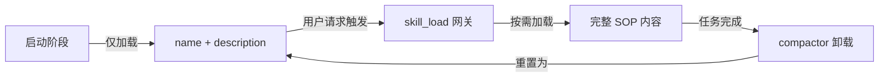

# Google ADK 智能体技能动态加载开发指南

> **项目目标**: 使用 Google Agent Development Kit (ADK) 开发支持动态技能加载/卸载的智能体，以节省 Token 并实现模块化能力管理。

---

## 一、技术栈概述

### 1.1 核心依赖

| 包名         | 用途                         | 安装命令                 |
| ------------ | ---------------------------- | ------------------------ |
| `google-adk` | Google Agent Development Kit | `pip install google-adk` |
| `pyyaml`     | YAML 解析 (Frontmatter)      | `pip install pyyaml`     |
| `pandas`     | 数据处理 (示例技能)          | `pip install pandas`     |
| `matplotlib` | 图表生成 (示例技能)          | `pip install matplotlib` |

### 1.2 环境要求

- **Python**: 3.10 或更高版本
- **API 密钥**: Google AI Studio API Key 或已启用 Vertex AI 的 Google Cloud 项目

### 1.3 核心模块导入

```python
from google.adk.agents import Agent          # 智能体核心类
from google.adk.runners import Runner         # 执行运行器
from google.adk.sessions import InMemorySessionService  # 内存会话管理
```

---

## 二、架构设计

### 2.1 项目目录结构

```
my_agent/
├── .claude/
│   └── skills/
│       ├── data_analyst/
│       │   └── SKILL.md        # 技能定义 (Frontmatter + SOP)
│       └── compactor/
│           └── SKILL.md
├── core/
│   ├── __init__.py
│   ├── manager.py              # 技能管理器 (懒加载解析)
│   └── executor.py             # 物理执行器 (代码运行/卸载)
└── main.py                     # 主入口 (事件循环/动态挂载)
```

### 2.2 核心设计理念



**关键原则**：
- **极致懒加载**: 初始化时仅提取 `name` 和 `description`，完整的 SOP 在触发时才加载
- **单一真理来源**: `SKILL.md` 文件同时包含元信息和执行指令
- **动态工具管理**: 支持运行时挂载和卸载工具函数

---

## 三、技能定义层

### 3.1 SKILL.md 文件格式

技能文件使用 **Frontmatter + Markdown** 格式：

```markdown
---
name: "技能名称"
description: "简短描述，用于路由发现"
---

# 执行 SOP 与示例

- 详细的执行步骤
- 具体的操作指令

## 示例

User: "用户请求示例"
Action: tool_function(args="...")
```

### 3.2 示例技能

#### 数据分析专家 (`.claude/skills/data_analyst/SKILL.md`)

```markdown
---
name: "数据分析专家"
description: "使用 Python/Pandas 对 CSV 数据进行统计分析并生成图表。"
---

# 执行 SOP 与示例

- 必须使用 `import pandas as pd`
- 绘图前需检查列名
- 保存图表为 `output.png`

## 示例

User: "分析数据"
Action: execute_python_code(code="...")
```

#### 上下文压缩器 (`.claude/skills/compactor/SKILL.md`)

```markdown
---
name: "上下文压缩器"
description: "当对话历史过长时，清空历史并卸载临时工具。"
---

# 压缩 SOP

- 调用 `execute_context_compact`
- 总结当前任务状态
```

---

## 四、核心实现代码

### 4.1 技能管理器 (`core/manager.py`)

负责 SKILL.md 文件的懒解析，分离 Frontmatter 和 Body。

```python
import os
import yaml

class SkillManager:
    def __init__(self, base_path="./.claude/skills"):
        self.base_path = base_path

    def _parse_file(self, skill_id):
        """内部逻辑：将文件拆分为 Meta 和 Body"""
        path = os.path.join(self.base_path, skill_id, "SKILL.md")
        if not os.path.exists(path):
            return None, None
        
        with open(path, 'r', encoding='utf-8') as f:
            content = f.read()
            
        parts = content.split('---', 2)
        if len(parts) < 3:
            return None, None
            
        meta = yaml.safe_load(parts[1])
        body = parts[2].strip()
        return meta, body

    def get_discovery_manifests(self):
        """【懒加载 - 阶段 1】仅提取 name 和 description 用于路由"""
        manifests = []
        if not os.path.exists(self.base_path):
            return "[]"
        for skill_id in os.listdir(self.base_path):
            meta, _ = self._parse_file(skill_id)
            if meta:
                # 严格只保留这两个字段，节省初始化 Token
                manifests.append({
                    "id": skill_id,
                    "name": meta.get("name"),
                    "description": meta.get("description")
                })
        return yaml.dump(manifests, allow_unicode=True)

    def load_full_sop(self, skill_id):
        """【懒加载 - 阶段 2】根据 id 读取完整的正文内容"""
        _, body = self._parse_file(skill_id)
        return body if body else "无法加载技能详情。"
```

### 4.2 物理执行器 (`core/executor.py`)

负责代码执行和会话管理。

```python
import sys
import io
import pandas as pd
import matplotlib.pyplot as plt

def execute_python_code(code: str) -> str:
    """真实 Python 执行器：捕获输出与报错"""
    clean_code = code.replace("```python", "").replace("```", "").strip()
    output_capture = io.StringIO()
    sys.stdout = output_capture
    
    loc = {"pd": pd, "plt": plt}
    try:
        exec(clean_code, globals(), loc)
        sys.stdout = sys.__stdout__
        return output_capture.getvalue() or "执行完成（无打印输出）。"
    except Exception as e:
        sys.stdout = sys.__stdout__
        return f"运行时报错: {type(e).__name__}: {str(e)}"

async def execute_context_compact(agent_instance, session_service, session_id):
    """卸载动作：清空 Session 历史，并将 Agent 工具集重置为仅含网关"""
    await session_service.clear_session(session_id)
    # 动态卸载所有通过 skill_load 挂载的工具
    agent_instance.tools = [agent_instance.tools[0]] 
    return "✅ 历史已重置。临时工具已卸载。当前状态：轻量化初始态。"
```

### 4.3 主入口 (`main.py`)

完整的事件循环与动态挂载逻辑。

```python
import asyncio
import os
import pandas as pd
from google.adk.agents import Agent
from google.adk.runners import Runner
from google.adk.sessions import InMemorySessionService
from core.manager import SkillManager
from core.executor import execute_python_code, execute_context_compact

# 1. 准备测试数据
def setup_env():
    pd.DataFrame({
        'date': ['2025-01-01'], 
        'sales_val': [100]
    }).to_csv('data.csv', index=False)
    if not os.path.exists('core/__init__.py'):
        os.makedirs('core', exist_ok=True)
        open('core/__init__.py', 'w').close()

sm = SkillManager()
session_service = InMemorySessionService()

# 2. 动态网关
async def skill_load(skill_id: str):
    """按需加载 SOP 并物理挂载工具"""
    print(f"   [SYSTEM] 激活技能体: {skill_id}")
    
    if skill_id == "compactor":
        return await execute_context_compact(my_agent, session_service, "s1")
    
    if skill_id == "data_analyst" and execute_python_code not in my_agent.tools:
        my_agent.tools.append(execute_python_code)
    
    return sm.load_full_sop(skill_id)

# 3. 初始化 Agent
my_agent = Agent(
    name="Dynamic_Expert",
    instruction=f"你是按需加载的智能体。现有技能：\n{sm.get_discovery_manifests()}\n请通过 skill_load 加载所需能力。",
    tools=[skill_load]
)

# 4. 执行循环与事件监控
async def main():
    setup_env()
    runner = Runner(agent=my_agent, session_service=session_service)
    
    # 指令故意模糊，测试其发现技能、挂载工具、报错、自我纠错的全流程
    task = "分析 data.csv 里的 Sales 平均值"
    print(f"\n🚀 任务启动: {task}")
    
    async for event in runner.run_async(user_id="u1", session_id="s1", new_message=task):
        if hasattr(event, 'content') and event.content.parts:
            part = event.content.parts[0]
            if hasattr(part, 'text') and part.text:
                print(f"-> Agent 思路: {part.text[:80]}...")
            if hasattr(part, 'function_call'):
                print(f"-> 动作: 调用 [{part.function_call.name}]")
        
        if event.is_final_response():
            print(f"\n🎯 结论: {event.content.parts[0].text}")

if __name__ == "__main__":
    asyncio.run(main())
```

---

## 五、关键机制说明

### 5.1 两阶段懒加载

| 阶段     | 函数                        | 数据                        | Token 消耗 |
| -------- | --------------------------- | --------------------------- | ---------- |
| 发现阶段 | `get_discovery_manifests()` | `id`, `name`, `description` | 极少       |
| 执行阶段 | `load_full_sop()`           | 完整 Markdown Body          | 按需       |

### 5.2 动态工具挂载

```python
# 挂载工具
if execute_python_code not in my_agent.tools:
    my_agent.tools.append(execute_python_code)

# 卸载工具 (重置为仅保留 skill_load)
agent_instance.tools = [agent_instance.tools[0]]
```

### 5.3 会话管理

- **InMemorySessionService**: 内存会话，适合开发测试
- **clear_session()**: 清空对话历史，配合工具卸载实现完整重置

---

## 六、运行与测试

### 6.1 安装依赖

```bash
# 创建虚拟环境
python -m venv .venv

# 激活 (Windows)
.venv\Scripts\activate

# 激活 (Linux/macOS)
source .venv/bin/activate

# 安装依赖
pip install google-adk pyyaml pandas matplotlib
```

### 6.2 配置 API 密钥

```bash
# 设置环境变量 (Windows PowerShell)
$env:GOOGLE_API_KEY="your-api-key"

# 设置环境变量 (Linux/macOS)
export GOOGLE_API_KEY="your-api-key"
```

### 6.3 运行示例

```bash
python main.py
```

**预期行为**：
1. Agent 发现 `data_analyst` 技能可以处理请求
2. 调用 `skill_load("data_analyst")` 加载完整 SOP
3. `execute_python_code` 工具被动态挂载
4. 执行代码时发现列名错误 (`Sales` vs `sales_val`)
5. Agent 自动纠错并重新执行

---

## 七、扩展建议

### 7.1 添加新技能

1. 在 `.claude/skills/` 下创建新目录
2. 创建 `SKILL.md` 文件，包含 Frontmatter 和 SOP
3. 在 `skill_load()` 中添加对应的工具挂载逻辑

### 7.2 持久化会话

如需持久化会话，可替换为其他 SessionService 实现：

```python
from google.adk.sessions import DatabaseSessionService
session_service = DatabaseSessionService(connection_string="...")
```

### 7.3 多模型支持

ADK 支持多种 LLM 后端：

```python
my_agent = Agent(
    name="Dynamic_Expert",
    model="gemini-2.0-flash-exp",  # 指定模型
    instruction="...",
    tools=[skill_load]
)
```

---

## 八、官方资源

| 资源              | 链接                                                                        |
| ----------------- | --------------------------------------------------------------------------- |
| ADK 官方文档      | https://google.github.io/adk-docs/                                          |
| GitHub 仓库       | https://github.com/google/adk-docs                                          |
| PyPI 包           | https://pypi.org/project/google-adk/                                        |
| Google Cloud 文档 | https://cloud.google.com/vertex-ai/generative-ai/docs/agent-development-kit |

---

> **文档版本**: 1.0  
> **最后更新**: 2025-12-29  
> **基于**: Google ADK 官方文档与最佳实践
