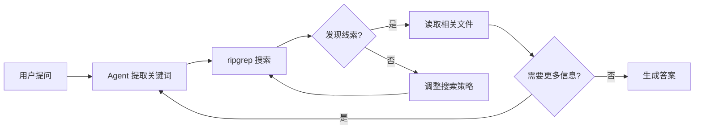

# Ripgrep Agentic RAG 开发指南

> **核心理念**: 用 ripgrep (rg) 的**确定性搜索**替代传统 RAG 的**向量语义搜索**，通过 Agent 的**多轮推理循环**实现智能检索。

---

## 一、概述

### 1.1 什么是 Agentic RAG？

传统 RAG (Retrieval-Augmented Generation) 依赖向量数据库进行语义匹配，而 **Agentic RAG** 让智能体自主控制搜索工具，通过多轮"搜索 → 发现 → 深入"的循环找到答案。



### 1.2 为什么用 ripgrep 替代向量搜索？

| 特性       | 向量搜索 (Vector Search)       | ripgrep (Lexical Search)       |
| ---------- | ------------------------------ | ------------------------------ |
| **实时性** | 需要重新计算 Embedding，有延迟 | 瞬时完成，文件改完即可搜到     |
| **精度**   | 语义相似但可能找不到确切变量名 | 精确匹配，支持复杂正则表达式   |
| **开销**   | 消耗内存、计算资源和 API 费用  | 极低开销，Rust 编写，SIMD 加速 |
| **上下文** | 只能返回 Top-K 块              | 可以返回匹配行及其前后文       |
| **更新**   | 需要重建索引                   | 无需索引，实时搜索             |

---

## 二、核心架构

### 2.1 新 RAG 公式

```
ripgrep (初步过滤) + 文件读取 (深入分析) + Long Context (大窗口理解)
```

### 2.2 工作流程

1. **关键词提取**: Agent 接收问题，智能提取可能的符号名、类名或关键词
2. **初步检索 (rg)**: 调用 ripgrep 快速定位文件和行号
3. **多轮跳转 (Reasoning)**: 读取搜索结果，发现新线索，自主发起下一次搜索
4. **长文本聚合**: 利用 LLM 的长上下文，一次性读入关键文件

### 2.3 项目结构

```
rag_agent/
├── .claude/
│   └── skills/
│       └── codebase_search/
│           ├── SKILL.md          # 搜索技能 SOP
│           └── tools.py          # ripgrep 工具实现
├── core/
│   ├── manager.py
│   └── executor.py               # 通用执行器
└── main.py
```

---

## 三、代码实现

### 3.1 Ripgrep 执行器 (`tools.py`)

```python
import subprocess
import os
from typing import Optional, List

def execute_ripgrep(
    pattern: str, 
    path: str = ".", 
    context_lines: int = 2,
    ignore_case: bool = True,
    file_type: Optional[str] = None
) -> str:
    """
    使用 ripgrep 进行高性能文本检索
    
    Args:
        pattern: 搜索模式（支持正则表达式）
        path: 搜索路径
        context_lines: 显示匹配行的上下文行数
        ignore_case: 是否忽略大小写
        file_type: 限制文件类型（如 'py', 'md'）
        
    Returns:
        搜索结果或错误信息
    """
    try:
        cmd = [
            "rg", "--color", "never", "-n",
            "-A", str(context_lines), 
            "-B", str(context_lines),
        ]
        
        if ignore_case:
            cmd.append("-i")
        if file_type:
            cmd.extend(["-t", file_type])
            
        cmd.extend([pattern, path])
        
        result = subprocess.run(
            cmd, 
            capture_output=True, 
            text=True, 
            encoding='utf-8',
            timeout=30
        )
        
        if result.returncode == 0:
            output = result.stdout
            if len(output) > 5000:
                output = output[:5000] + "\n... [结果已截断，请使用更精确的搜索条件]"
            return output if output else "匹配成功但无输出。"
        elif result.returncode == 1:
            return "⚠️ 未找到匹配内容。建议：尝试简化关键词或使用通配符。"
        else:
            return f"❌ Ripgrep 错误: {result.stderr}"
    except FileNotFoundError:
        return "❌ 错误：系统未安装 ripgrep (rg)。请先安装：https://github.com/BurntSushi/ripgrep"
    except subprocess.TimeoutExpired:
        return "❌ 搜索超时，请缩小搜索范围。"
    except Exception as e:
        return f"❌ 执行异常: {str(e)}"


def read_file_content(file_path: str, start_line: int = 1, end_line: int = None) -> str:
    """
    读取文件内容
    
    Args:
        file_path: 文件路径
        start_line: 起始行号（1-indexed）
        end_line: 结束行号（可选）
        
    Returns:
        文件内容或错误信息
    """
    try:
        with open(file_path, 'r', encoding='utf-8') as f:
            lines = f.readlines()
        
        if end_line:
            lines = lines[start_line-1:end_line]
        elif start_line > 1:
            lines = lines[start_line-1:]
        
        content = ''.join(lines)
        if len(content) > 10000:
            content = content[:10000] + "\n... [内容已截断]"
        return content
    except FileNotFoundError:
        return f"❌ 文件不存在: {file_path}"
    except Exception as e:
        return f"❌ 读取失败: {str(e)}"


def list_files(path: str = ".", pattern: str = "*", max_depth: int = 3) -> str:
    """
    列出目录下的文件
    
    Args:
        path: 目录路径
        pattern: 文件名模式
        max_depth: 最大深度
        
    Returns:
        文件列表
    """
    try:
        cmd = ["rg", "--files", "--glob", pattern, "--max-depth", str(max_depth), path]
        result = subprocess.run(cmd, capture_output=True, text=True, encoding='utf-8')
        
        if result.returncode == 0:
            files = result.stdout.strip().split('\n')
            if len(files) > 50:
                return '\n'.join(files[:50]) + f"\n... [共 {len(files)} 个文件，仅显示前 50 个]"
            return result.stdout
        return f"⚠️ 未找到匹配文件"
    except Exception as e:
        return f"❌ 列出文件失败: {str(e)}"


# 工具列表
CODEBASE_SEARCH_TOOLS = {
    "execute_ripgrep": execute_ripgrep,
    "read_file_content": read_file_content,
    "list_files": list_files,
}

def get_tools():
    return list(CODEBASE_SEARCH_TOOLS.values())
```

### 3.2 技能定义 (`SKILL.md`)

```markdown
---
name: "代码库搜索专家"
description: "通过 ripgrep 在本地文件系统中精确定位代码、配置或文档。"
---

# 执行 SOP

## 基本流程
1. **先定位**：根据用户问题，提取核心变量名或关键词，使用 `execute_ripgrep`
2. **后深入**：根据 rg 返回的文件名和行号，判断相关性
3. **读全文**：如果确定文件关键，使用 `read_file_content` 获取完整上下文
4. **迭代**：如果发现新的依赖项或引用，重复步骤 1

## 搜索策略
- **精确搜索**：已知确切名称时使用 `execute_ripgrep(pattern="function_name")`
- **模糊搜索**：不确定时使用通配符 `execute_ripgrep(pattern="pay.*handler")`
- **正则搜索**：复杂模式使用正则 `execute_ripgrep(pattern="^def.*init.*\\(")`

## 失败处理协议
1. **零结果**：不要轻易说"没找到"，尝试减少正则约束或使用近义词
2. **关键词替换**：考虑 `user` vs `account`，`start` vs `init` 等
3. **报错自愈**：收到 `regex parse error` 时，分析错误并修复 pattern
4. **最后手段**：多次搜索无果，查看 README.md 或目录结构获取线索

## 示例

**用户问题**: "系统是怎么处理支付回调的？"

**Agent 思考**: 我需要搜索 'webhook' 或 'payment_callback' 相关的代码。

**执行**:
```
Action: execute_ripgrep(pattern="payment_callback")
Observation: src/api/handler.py:45: def payment_callback(request):

Action: read_file_content(file_path="src/api/handler.py")
Observation: [文件内容，发现引用了 StripeProcessor]

Action: execute_ripgrep(pattern="class StripeProcessor")
Observation: src/services/stripe.py:10: class StripeProcessor:
```
```

---

## 四、多轮检索机制

### 4.1 ReAct 循环

Agent 通过 **Thought → Action → Observation** 循环自主决策：

```
用户提问: "项目里哪里处理了用户的 Session 过期？"

┌─────────────────────────────────────────────────────────────┐
│ Step 1: 模糊搜索                                             │
│ Thought: 我先模糊搜索关键词                                   │
│ Action:  execute_ripgrep(pattern="session.*expire")         │
│ Observation: middleware/auth.py:82: if session.is_expired() │
└─────────────────────────────────────────────────────────────┘
                              ↓
┌─────────────────────────────────────────────────────────────┐
│ Step 2: 追踪定义                                             │
│ Thought: 找到判断点，需要看 is_expired 是怎么定义的           │
│ Action:  execute_ripgrep(pattern="def is_expired")          │
│ Observation: models/session.py:15: def is_expired(self):    │
└─────────────────────────────────────────────────────────────┘
                              ↓
┌─────────────────────────────────────────────────────────────┐
│ Step 3: 读取详情                                             │
│ Thought: 读取完整的过期逻辑                                   │
│ Action:  read_file_content(file_path="models/session.py")   │
│ Observation: [完整文件内容]                                  │
└─────────────────────────────────────────────────────────────┘
                              ↓
┌─────────────────────────────────────────────────────────────┐
│ Final Answer                                                 │
│ 过期逻辑在 models/session.py 的 is_expired 函数中定义，       │
│ 通过判断 created_at 是否超过 24 小时来执行...                 │
└─────────────────────────────────────────────────────────────┘
```

### 4.2 自主关键词提取

Agent 不需要预处理关键词，它会根据问题自动推理：

- **传统 RAG**: 用户输入 → 向量化 → 匹配
- **Agentic RAG**: 用户输入 → Agent 思考可能的关键词 → 多轮搜索

**示例**:
```
用户: "为什么我的支付失败了？"

Agent 思考: 
"支付失败通常和 Stripe、Paypal、ErrorCode 或 Webhook 有关。
我应该先用 ripgrep 搜一下这些词。"

如果搜 'payment' 结果太多，Agent 会自我调整:
"结果太多了，我应该加上 'status=failed' 这种更精确的关键词再搜一次。"
```

### 4.3 自主编写正则表达式

Agent 可以根据代码结构理解生成复杂正则：

```python
# Agent 想找所有定义了异步初始化的地方
execute_ripgrep(pattern="async def .*init.*\\(", context_lines=3)

# Agent 想找特定格式的日志
execute_ripgrep(pattern="ERROR.*(Timeout|Refused)")

# Agent 想找函数调用
execute_ripgrep(pattern="stripe\\.charge\\(")
```

---

## 五、非代码场景应用

### 5.1 客服话术检索

```markdown
---
name: "客服话术检索专家"
description: "在客服知识库中快速定位处理规范和话术模板。"
---

# 执行 SOP (客服专项)

1. **多关键词搜索**：客户问"怎么退款"，搜索 `rg -e "退款" -e "返款" -e "钱.*退"`
2. **错误码定位**：客户说"错误 5021"，直接 `rg "5021"` 精确匹配
3. **带上下文**：使用 `-C 5` 显示匹配行前后 5 行，理解完整处理流程
4. **模糊匹配**：如果精确搜索无果，使用 `退.*款` 通配符
```

### 5.2 网络日志排查

```markdown
---
name: "网络日志排查专家"
description: "在海量日志中定位故障根因。"
---

# 执行 SOP (网络排查专项)

1. **特征提取**：提取故障特征如 `connection_reset`
2. **多轮筛选**：
   - 第一步：`rg "connection_reset"` 发现 IP 10.0.0.5 记录最多
   - 第二步：`rg "10.0.0.5" | rg "ERROR"` 交集过滤
3. **状态码搜索**：优先寻找 `404`, `500`, `Exception`, `Traceback`
4. **时间范围**：使用正则过滤时间段 `rg "2025-01-15 14:3[0-9]"`
```

---

## 六、搜索失败处理

### 6.1 降级策略

```
复杂正则无结果 → 简化正则 → 单关键词 → 同义词 → 目录探索
```

### 6.2 实现示例

```python
def execute_ripgrep_with_fallback(pattern: str, path: str = ".") -> str:
    """带降级逻辑的搜索"""
    result = execute_ripgrep(pattern, path)
    
    if "未找到" in result:
        # 尝试忽略大小写
        result = execute_ripgrep(pattern.lower(), path, ignore_case=True)
        
    if "未找到" in result and len(pattern) > 10:
        # 尝试只用核心关键词
        core_word = pattern.split()[0] if ' ' in pattern else pattern[:5]
        result = execute_ripgrep(core_word, path)
        
    return result
```

---

## 七、集成到 ADK Agent

### 7.1 在 `main.py` 中挂载

```python
async def skill_load(skill_id: str) -> str:
    if skill_id == "codebase_search":
        from skills.codebase_search.tools import get_tools
        for tool in get_tools():
            if tool not in my_agent.tools:
                my_agent.tools.append(tool)
        return sm.load_full_sop(skill_id)
    # ... 其他技能
```

### 7.2 Agent 指令配置

```python
my_agent = Agent(
    name="RAG_Expert",
    instruction="""你是一个基于 ripgrep 的智能检索 Agent。

工作原则：
1. 使用 execute_ripgrep 进行精确搜索，而非猜测
2. 根据搜索结果决定下一步行动
3. 发现新线索时主动追踪
4. 搜索失败时调整策略重试

可用工具：
- execute_ripgrep: 文本搜索
- read_file_content: 读取文件
- list_files: 列出目录
""",
    tools=[skill_load]
)
```

---

## 八、安装与测试

### 8.1 安装 ripgrep

```bash
# Windows (Chocolatey)
choco install ripgrep

# Windows (Scoop)
scoop install ripgrep

# macOS
brew install ripgrep

# Ubuntu/Debian
apt install ripgrep

# 验证安装
rg --version
```

### 8.2 测试搜索

```bash
# 基本搜索
rg "function_name" ./src

# 正则搜索
rg "def.*init" --type py

# 带上下文
rg -C 3 "ERROR" ./logs

# 忽略大小写
rg -i "payment"

# 限制文件类型
rg -t md "TODO"
```

---

## 九、最佳实践

### 9.1 优势场景
- ✅ 代码库搜索
- ✅ 配置文件查找
- ✅ 日志分析
- ✅ 精确匹配（错误码、IP、订单号）
- ✅ 正则模式匹配

### 9.2 局限场景
- ⚠️ 纯语义理解（需配合 LLM 扩展关键词）
- ⚠️ 多语言同义词（需要 Agent 智能扩展）

### 9.3 与向量搜索结合

```
初始检索: ripgrep (精确匹配)
    ↓
补充检索: 向量搜索 (语义扩展)
    ↓
合并结果: LLM 整合
```

---

## 十、参考资源

| 资源                  | 链接                                                       |
| --------------------- | ---------------------------------------------------------- |
| ripgrep 官方          | https://github.com/BurntSushi/ripgrep                      |
| ripgrep 用户指南      | https://github.com/BurntSushi/ripgrep/blob/master/GUIDE.md |
| Claude Code 文档      | https://docs.anthropic.com/claude/docs/claude-code         |
| ast-grep (语法树搜索) | https://github.com/ast-grep/ast-grep                       |

---

> **文档版本**: 1.0  
> **最后更新**: 2025-12-29  
> **核心思想**: 从"向量崇拜"回归"确定性搜索"，让 Agent 像程序员一样思考
