#  AI Agent 开发实战 (2026版)

> **前言**：
> 以前我们写代码是定义规则，现在我们通过指示AI来帮助我们写代码，或者直接让AI来完成任务。
> 本次分享将和大家一起学习AI Agent开发的内容，从构建简单的LLM聊天功能到2026年当下的可以写代码、操作浏览器以及能力可扩展的（貌似）全能 Agent。

## 目录
- [AI Agent 开发实战 (2026版)](#ai-agent-开发实战-2026版)
  - [目录](#目录)
  - [第1章 Agent的大脑：LLM API 与意图识别](#第1章-agent的大脑llm-api-与意图识别)
    - [1.1 基础：如何唤醒LLM (Standard Completion)](#11-基础如何唤醒llm-standard-completion)
    - [1.2 进阶：意图识别与结构化输出 (Structured Output)](#12-进阶意图识别与结构化输出-structured-output)
    - [1.3 Agent的双手：Tool Call / Function Calling](#13-agent的双手tool-call--function-calling)
    - [1.4 兼容旧时代：手动拼接 Tool Call](#14-兼容旧时代手动拼接-tool-call)
    - [1.4.1 进阶：流式输出与手动工具调用](#141-进阶流式输出与手动工具调用)
    - [1.5 极简 RAG (无向量库版)](#15-极简-rag-无向量库版)
  - [第2章 Agent的工具箱：MCP 协议 (The USB of AI)](#第2章-agent的工具箱mcp-协议-the-usb-of-ai)
    - [2.1 为何需要 MCP？](#21-为何需要-mcp)
    - [2.2 快速上手：FastMCP](#22-快速上手fastmcp)
    - [2.3 MCP Client](#23-mcp-client)
    - [2.4 终极形态：LLM + MCP (Agent雏形)](#24-终极形态llm--mcp-agent雏形)
  - [第3章 Agent的灵魂：记忆与推理 (Memory \& Reasoning)](#第3章-agent的灵魂记忆与推理-memory--reasoning)
    - [3.1 记忆：从“1秒金鱼”到“7秒金鱼”](#31-记忆从1秒金鱼到7秒金鱼)
    - [3.2 推理：ReAct (Reason + Act)](#32-推理react-reason--act)
    - [3.3 进阶能力：计划与执行 (Plan and Do)](#33-进阶能力计划与执行-plan-and-do)
    - [3.4 上下文工程 (Context Engineering, 2025)](#34-上下文工程-context-engineering-2025)
- [第4章：Agent 的职业技能 (Skills)](#第4章agent-的职业技能-skills)
  - [4.1 Skill 的本质：为上下文工程而生](#41-skill-的本质为上下文工程而生)
  - [4.2 实战案例：File Editor Skill 深度解析](#42-实战案例file-editor-skill-深度解析)
    - [4.2.1 说明书：SKILL.md (YAML 前言 + 指导)](#421-说明书skillmd-yaml-前言--指导)
    - [4.2.2 核心逻辑：tools.py (工具实现)](#422-核心逻辑toolspy-工具实现)
    - [4.2.3 适配协议：get\_tools 入口](#423-适配协议get_tools-入口)
  - [4.3 从哪里找 Skill？](#43-从哪里找-skill)
    - [4.3.1 元 Skill：Skill Creator (制造 Skill 的工具)](#431-元-skillskill-creator-制造-skill-的工具)
      - [1. 目录结构：复杂 Skill 的标准布局](#1-目录结构复杂-skill-的标准布局)
      - [2. 生命周期一：一键初始化 (init\_skill)](#2-生命周期一一键初始化-init_skill)
      - [3. 生命周期二：自动化校验 (quick\_validate)](#3-生命周期二自动化校验-quick_validate)
      - [4. 生命周期三：集成打包 (package\_skill)](#4-生命周期三集成打包-package_skill)
      - [5. 核心价值：方法论的工具化](#5-核心价值方法论的工具化)
- [第5章 Agent的骨架：Google ADK (2026生产级框架)](#第5章-agent的骨架google-adk-2026生产级框架)
  - [5.1 什么是 ADK？(Why Framework?)](#51-什么是-adkwhy-framework)
    - [5.1.1 深度对比：OpenAI Agents SDK vs Anthropic Agent SDK vs Google ADK](#511-深度对比openai-agents-sdk-vs-anthropic-agent-sdk-vs-google-adk)
  - [5.2 深入解剖：ADK 的核心概念](#52-深入解剖adk-的核心概念)
    - [5.2.1 Agent (智能体)：不仅仅是 LLM](#521-agent-智能体不仅仅是-llm)
    - [5.2.2 Tool (工具)：能力的标准化封装](#522-tool-工具能力的标准化封装)
    - [5.2.3 Event (事件)：标准化的消息流](#523-event-事件标准化的消息流)
    - [5.2.4 Session (会话)：时间线的容器](#524-session-会话时间线的容器)
    - [5.2.5 State (状态)：跨轮次的“共享内存”](#525-state-状态跨轮次的共享内存)
    - [5.2.6 Callbacks (回调)：生命周期钩子](#526-callbacks-回调生命周期钩子)
  - [5.3 团队作战：Sub-Agent (子智能体) 与分层架构](#53-团队作战sub-agent-子智能体-与分层架构)
    - [5.3.1 核心理念：AgentTool](#531-核心理念agenttool)
    - [5.3.2 两种协作模式](#532-两种协作模式)
  - [5.4 总结：利用大厂生态实现更现代化的Agent](#54-总结利用大厂生态实现更现代化的agent)
  - [subagent / 压缩 / rewind / 多模态 / callbacks(hooks,钩子 before-llm-callbacks,before-tool-callbacks,以及对应的after-xxx-callbacks) / skills( bash file\_editor skill\_load) / 外部合作接口dynamic-mcp  exa-mcp / 外部非合作接口 skill-creator 适当讲解/ 语音 / 手机连接ssh远程 / playwrite / 经验库 / 记忆 / drawio  / agent-team](#subagent--压缩--rewind--多模态--callbackshooks钩子-before-llm-callbacksbefore-tool-callbacks以及对应的after-xxx-callbacks--skills-bash-file_editor-skill_load--外部合作接口dynamic-mcp--exa-mcp--外部非合作接口-skill-creator-适当讲解-语音--手机连接ssh远程--playwrite--经验库--记忆--drawio---agent-team)
  - [5.4.1 高级特性：SubAgent / Callbacks / 压缩 / 多模态 / Skills](#541-高级特性subagent--callbacks--压缩--多模态--skills)
    - [5.4.1.1 SubAgent（子智能体）](#5411-subagent子智能体)
      - [什么是 SubAgent？](#什么是-subagent)
      - [AutoCompactAgent 实战案例](#autocompactagent-实战案例)
      - [SubAgent 的创建与注册](#subagent-的创建与注册)
      - [SubAgent 的调用与结果回传](#subagent-的调用与结果回传)
    - [5.4.1.2 Callbacks（生命周期钩子）](#5412-callbacks生命周期钩子)
      - [ADK Callbacks 体系](#adk-callbacks-体系)
      - [before\_model\_callback（LLM 调用前拦截）](#before_model_callbackllm-调用前拦截)
      - [on\_tool\_error\_callback（工具异常处理）](#on_tool_error_callback工具异常处理)
      - [实战：用户中断机制](#实战用户中断机制)
    - [5.4.1.3 上下文压缩（Context Compaction）](#5413-上下文压缩context-compaction)
      - [为什么需要上下文压缩？](#为什么需要上下文压缩)
      - [AutoCompactAgent 实现原理](#autocompactagent-实现原理)
      - [Hard Reset 机制](#hard-reset-机制)
      - [Token 超限的应急处理](#token-超限的应急处理)
    - [5.4.1.4 多模态支持（MultiModal）](#5414-多模态支持multimodal)
      - [核心原理：Part.from\_bytes() 的视觉通道机制](#核心原理partfrom_bytes-的视觉通道机制)
      - [vs Base64 字符串](#vs-base64-字符串)
      - [图片分析：analyze\_local\_image](#图片分析analyze_local_image)
      - [三大核心 Bug 的解决](#三大核心-bug-的解决)
      - [执行流程图](#执行流程图)
      - [图片展示：view\_local\_image](#图片展示view_local_image)
      - [两种工具的职责划分](#两种工具的职责划分)
      - [ToolContext 事件注入机制](#toolcontext-事件注入机制)
    - [5.4.1.5 内置 Skills](#5415-内置-skills)
      - [5.4.1.5.1 完整 Skill 结构：energy\_httpx\_sop\_creator](#54151-完整-skill-结构energy_httpx_sop_creator)
      - [5.4.1.5.2 SKILL.md 标准结构](#54152-skillmd-标准结构)
      - [5.4.1.5.3 参考模板：tools.py 规范](#54153-参考模板toolspy-规范)
      - [5.4.1.5.4 动态生成领域skill时的代码编写严格式约束](#54154-动态生成领域skill时的代码编写严格式约束)
      - [5.4.1.5.5 生命周期管理：skill-creator](#54155-生命周期管理skill-creator)
      - [5.4.1.5.6 标准思考链路演示 (Golden CoT)](#54156-标准思考链路演示-golden-cot)
      - [5.4.1.5.7 技能加载机制](#54157-技能加载机制)
      - [5.4.1.5.8 内置技能一览](#54158-内置技能一览)
      - [5.4.1.5.9 Skill 的核心价值](#54159-skill-的核心价值)
    - [5.4.1.6 记忆与经验库](#5416-记忆与经验库)
      - [两级检索：L0 广度扫描 + L2 精准深读](#两级检索l0-广度扫描--l2-精准深读)
      - [实时落盘机制](#实时落盘机制)
      - [经验提取与归档](#经验提取与归档)
    - [5.4.1.7 高级特性总结](#5417-高级特性总结)
    - [5.4.1.8 外部合作接口：Dynamic MCP](#5418-外部合作接口dynamic-mcp)
      - [什么是 MCP 协议？](#什么是-mcp-协议)
      - [Dynamic MCP Loader 概述](#dynamic-mcp-loader-概述)
      - [connect\_mcp 工具详解](#connect_mcp-工具详解)
      - [典型使用场景](#典型使用场景)
      - [工作原理](#工作原理)
    - [5.4.1.9 外部非合作接口：Skill Creator](#5419-外部非合作接口skill-creator)
      - [非合作接口 vs 合作接口](#非合作接口-vs-合作接口)
      - [Skill Creator 元技能](#skill-creator-元技能)
      - [复杂 Skill 的标准布局](#复杂-skill-的标准布局)
      - [生命周期管理](#生命周期管理)
      - [核心价值：方法论的工具化](#核心价值方法论的工具化)
    - [5.4.2 语音接入](#542-语音接入)
      - [sherpa\_onnx 集成](#sherpa_onnx-集成)
      - [语音交互流程](#语音交互流程)
      - [使用场景](#使用场景)
    - [5.4.3 Playwright 浏览器自动化](#543-playwright-浏览器自动化)
      - [Playwright-CLI Skill](#playwright-cli-skill)
      - [典型使用场景](#典型使用场景-1)
      - [工作原理](#工作原理-1)
    - [5.4.4 Agent-Team Swarm 集群协作](#544-agent-team-swarm-集群协作)
      - [Swarm 架构概述](#swarm-架构概述)
      - [决策指南](#决策指南)
      - [dispatch\_task（任务分发）](#dispatch_task任务分发)
      - [dispatch\_batch\_tasks（并发分发）](#dispatch_batch_tasks并发分发)
      - [sync\_task\_context（三模式查询）](#sync_task_context三模式查询)
      - [hold\_meeting（群体会议）](#hold_meeting群体会议)
      - [服务发现与心跳](#服务发现与心跳)
      - [Swarm 协作架构](#swarm-协作架构)
      - [自愈机制](#自愈机制)
    - [5.4.5 Agent-Team Swarm 2.0：去中心化拉模型架构](#545-agent-team-swarm-20去中心化拉模型架构)
      - [5.4.5.1 两种架构对比：推 vs 拉](#5451-两种架构对比推-vs-拉)
      - [5.4.5.2 核心模块架构](#5452-核心模块架构)
      - [5.4.5.3 任务队列系统](#5453-任务队列系统)
      - [5.4.5.4 Worker 自抢领循环](#5454-worker-自抢领循环)
      - [5.4.5.5 去中心化工具集](#5455-去中心化工具集)
      - [5.4.5.6 任务规划器：DAG 与 Wave 执行](#5456-任务规划器dag-与-wave-执行)
      - [5.4.5.7 文件安全守卫](#5457-文件安全守卫)
      - [5.4.5.8 协调目录与环境变量](#5458-协调目录与环境变量)
      - [5.4.5.9 完整执行流程图](#5459-完整执行流程图)
      - [5.4.5.10 去中心化 vs 中心化对比总结](#54510-去中心化-vs-中心化对比总结)

---

## 第1章 Agent的大脑：LLM API 与意图识别

**核心概念**： Agent的第一步不是“做”，而是“听懂”。

### 1.1 基础：如何唤醒LLM (Standard Completion)

最原始的调用，文本进，文本出。我们需要先学会如何与 LLM 进行最基本的对话。

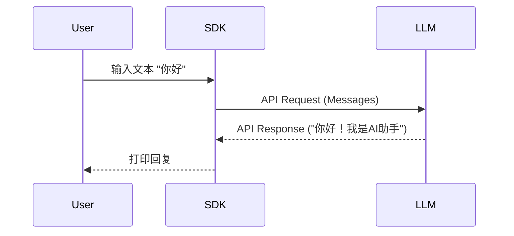

🔗 **代码演示**：
- [1_1_basic_completion.py](./codes/chapter1/1_1_basic_completion.py)
  - 演示了使用 OpenAI SDK 进行最简单的对话。

---

### 1.2 进阶：意图识别与结构化输出 (Structured Output)

大模型最强的地方不在于聊天，而在于它能把自然语言通过“理解”转化为程序能读懂的 JSON。

**场景**： 用户说“帮我查一下昨天北京的天气”，LLM 不应该直接回复天气（因为它不知道），而应该告诉程序去查外部接口获取真实的值，
需要根据用户的输入填入外部接口需要的入参形式，例如 `{"location": "北京", "date": "2026-02-09"}`，然后程序调用外部接口获取真实的天气信息。

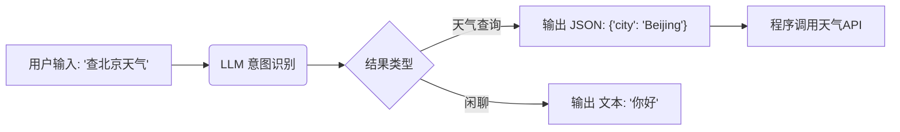

🔗 **代码演示**：
- [1_2_structured_output.py](./codes/chapter1/1_2_structured_output.py)
  - 使用 Pydantic 定义数据结构，强制 LLM 输出符合规范的 JSON。

---

### 1.3 Agent的双手：Tool Call / Function Calling

**历史背景**： OpenAI 于 2023 年中旬引入，从“让 LLM 拼凑 JSON”进化为“原生支持函数调用”。
**原理**： LLM 不执行函数，它只“想”要调用函数，真正的执行在本地（Local Execution）。

**为什么 OpenAI 的 Function Calling 效果更好？** 因为它不是让模型把函数调用硬塞进普通对话文本里，而是在返回体里设计了专门的结构化字段来承载调用意图。典型响应里，`content` 与 `tool_calls` 是分开的：当模型决定调用工具时，参数会落在 `tool_calls` 字段中，而不是混在自然语言里；同时还会配合 `finish_reason: "tool_calls"` 这类明确标记。这样做的好处是：客户端无需用正则或字符串解析去“猜”模型是不是要调函数，解析更稳定；而且 `tool_calls` 是数组，天然支持一次返回多个工具调用。换句话说，OpenAI 的进步不只是 API 多了个字段，而是“**结构化输出格式 + 针对函数调用场景的专项微调**”一起让工具调用从 prompt 技巧变成了原生能力。

下面这张图 可以看出 tool 执行的部分被划分为user的操作而非LLM，因为这属于LLM之外的输出内容。

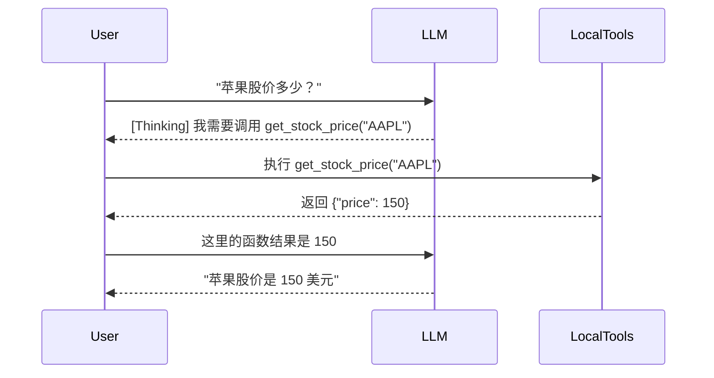

🔗 **代码演示**：
- [1_3_tool_calling.py](./codes/chapter1/1_3_tool_calling.py)
  - 原生支持的 Tool Call 完整流程演示。

---

### 1.4 兼容旧时代：手动拼接 Tool Call

**场景**： 如果模型不支持原生 Tool Call，如何让它拥有双手？通过 System Prompt 约定一种特殊的 JSON 格式。

🔗 **代码演示**：
- [1_4_manual_tool_call.py](./codes/chapter1/1_4_manual_tool_call.py)
  - 通过 Prompt Engineering 实现“伪”Tool Call。

---

### 1.4.1 进阶：流式输出与手动工具调用
在实际应用中，用户不喜欢等待一个完整的 JSON 生成后再看到结果。我们需要结合**流式输出 (Streaming)** 和**手动工具调用**。

**策略**：
1.  流式打印原始响应。
2.  在后台拼接完整内容。
3.  如果检测到 JSON 工具调用，则截获、执行、并再次流式输出最终结果。

🔗 **代码演示**：
- [1_4_1_manual_tool_call_stream.py](./codes/chapter1/1_4_1_manual_tool_call_stream.py)

### 1.5 极简 RAG (无向量库版)

**本质**： RAG = 检索 (Retrieval) + 增强 (Augmented)。

我们将使用 Numpy 做本地相似度计算，展示 RAG 的核心逻辑。

<div align="center">

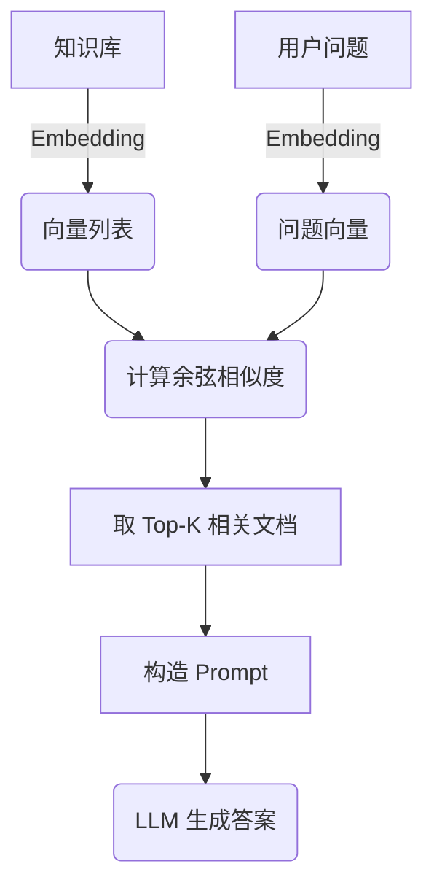

</div>

🔗 **代码演示**：
- [1_5_simple_rag.py](./codes/chapter1/1_5_simple_rag.py)
  - 手写余弦相似度，从零实现 RAG。

---

## 第2章 Agent的工具箱：MCP 协议 (The USB of AI)

**核心概念**： 2024年底 Anthropic 提出的 MCP (Model Context Protocol) 解决了“工具孤岛”问题。

### 2.1 为何需要 MCP？

**比喻**： 以前每个 Agent 都要自己写驱动程序（Tool definition）。MCP 就像 USB 协议，只要你的工具（鼠标/键盘）符合 USB 标准，插到任何电脑（LLM）上都能用。

<div align="center">

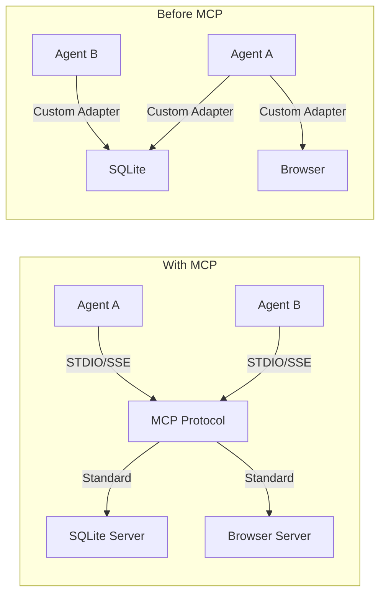

</div>

### 2.2 快速上手：FastMCP

使用 `fastmcp` 库，我们可以像写 Flask 接口一样极速构建一个 MCP Server。

🔗 **代码演示**：
- [2_2_fastmcp_server.py](./codes/chapter2/2_2_fastmcp_server.py)
  - 一个包含“查询天气”和“计算BMI”工具的 MCP Server。
  
### 2.3 MCP Client

有了 Server，我们需要一个 Client 来连接它。在实际应用中，Client 通常是 Claude Desktop 或者是你的 Agent 主程序。

🔗 **代码演示**：
- [2_3_mcp_client.py](./codes/chapter2/2_3_mcp_client.py)
  - 演示如何通过 Python 代码连接并调用本地的 MCP Server。

---

### 2.4 终极形态：LLM + MCP (Agent雏形)

前面的 2.3 只是 Python 脚本在调用工具。真正的 Agent 需要让 **LLM 自己决定**何时调用 MCP 工具。

**逻辑流**：
1.  **Discovery (Discover)**: **MCP Client** (脚本) 向 **MCP Server** 查询可用工具列表。
2.  **Thinking (Think)**: **User** 提问，**MCP Client** 将问题与工具定义提交给 **LLM**。**LLM** 判断需要调用 `get_weather`。
3.  **Execution (Act)**: **MCP Client** 根据 **LLM** 的指令，请求 **MCP Server** 执行具体工具。
4.  **Response (Observe)**: **MCP Server** 执行并返回结果，**MCP Client** 将结果传回 **LLM** 进行润色，最终回复给 **User**。

<div align="center">

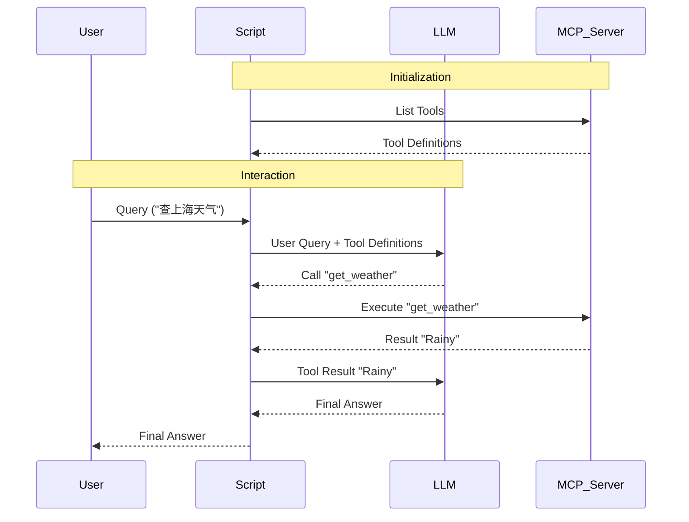

</div>

🔗 **代码演示**：
- [2_4_llm_mcp_integration.py](./codes/chapter2/2_4_llm_mcp_integration.py)
  - 实现了上述完整的闭环，你的 Agent 从此拥有了无限扩展的能力。

---

## 第3章 Agent的灵魂：记忆与推理 (Memory & Reasoning)

如果说 Tool Calling 给了 Agent 双手，MCP 给了它工具箱，那么 **Memory (记忆)** 和 **Reasoning (推理)** 则是赋予了在这个世界中持续生存和解决复杂问题的能力。

### 3.1 记忆：从“1秒金鱼”到“7秒金鱼”

LLM 本质是**无状态 (Stateless)** 的。每一轮对话对它来说都是全新的。我们要做的，就是在本地维护一个 **History List**。

<div align="center">

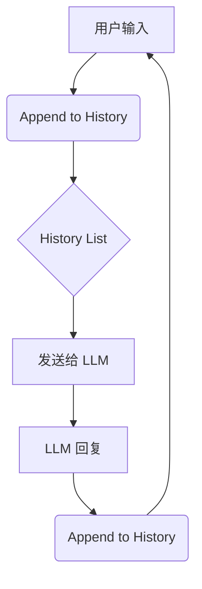

</div>

🔗 **代码演示**：
- [3_1_chat_with_history.py](./codes/chapter3/3_1_chat_with_history.py)
  - 一个最基础的带有记忆的聊天机器人，支持流式输出。

---

### 3.2 推理：ReAct (Reason + Act)

面对复杂问题（例如：“马斯克的年龄乘以3是多少？”），一次性回答往往会出错。**ReAct** 框架让 Agent 学会“自言自语”，把大任务拆解为小步骤。

**核心循环**：
1.  **Thought**: 我应该做什么？
2.  **Action**: 调用什么工具？
3.  **Observation**: 工具返回了什么？
4.  ... (重复) ...
5.  **Final Answer**: 最终答案。

<div align="center">

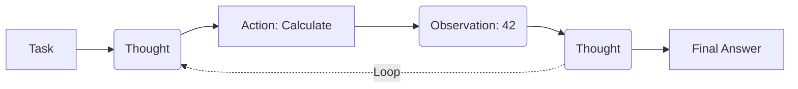

</div>

🔗 **代码演示**：
- [3_2_react_agent.py](./codes/chapter3/3_2_react_agent.py)
  - **手动实现**一个 ReAct Loop，看清 Agent 思考的每一个步骤。

---


---

### 3.3 进阶能力：计划与执行 (Plan and Do)

ReAct 虽然强大，但它是"短视"的——只看眼前的一步。对于复杂任务（比如写整个游戏），我们需要一种更宏观的模式：**Plan and Execute**。

既然我们拥有了即强大的 LLM，我们不需要复杂的 LangChain 框架也能实现它！

**核心逻辑**：
1.  **Planner (规划师)**: 接收大目标，生成 Step-by-Step 的计划清单。
2.  **Executor (执行者)**: 这里通过循环，一步步执行 Planner 给出的步骤。

这种模式充分利用了强模型（如 GPT-5, Claude 4.6 等）的规划能力，让 Agent 更有条理，一些code agent也是利用这种模式 先做编码计划再动手写代码。

<div align="center">

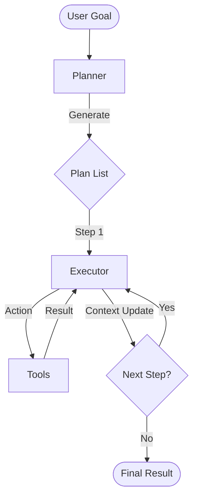

</div>

🔗 **代码演示**：
- [3_3_plan_and_execute.py](./codes/chapter3/3_3_plan_and_execute.py)
  - 展示了如何用两个 Prompt (Planner Prompt + Executor Prompt) 配合 Python 循环，构建一个可以解决长链条任务的 Agent。(仅作过程展示)

---

### 3.4 上下文工程 (Context Engineering, 2025)

> *"Prompt Engineering is dead. Long live Context Engineering."* — Andrej Karpathy (Idea)

在 LLM 发展的早期（2023），我们痴迷于 **Prompt Engineering**（提示词工程），研究"怎么问"才能让模型更聪明。我们学习各种咒语，比如 "Take a deep breath", "Think step by step"。

到了 2025 年，随着模型智商的普及，焦点已经转移到了 **Context Engineering**（上下文工程），即研究"喂什么"。

**为什么需要上下文工程？**

1.  **Prompt 是脆弱的，Context 是鲁棒的**：
    你在这个模型上调教好的 Prompt，换个模型可能就失效了。但如果你能在 Context 中提供**高质量的示例代码**、**准确的相关文档**、**清晰的历史记忆**，任何模型都能表现得更好。这也常被称为 "In-Context Learning"。

2.  **有限的注意力**：
    虽然现在的模型（如 Gemini 3 Pro）拥有巨大的上下文窗口（1M+ tokens），但这并不意味着我们可以无脑塞入所有垃圾信息。
    -   **Context Pollution (上下文污染)**：无关信息会分散模型注意力，导致"幻觉"或逻辑混乱。
    -   **Needle In A Haystack (大海捞针)**：关键信息埋得越深，被忽略的概率越大。

**核心实践：如何做 Context Engineering？**

一些前人的实践经验：

*   **动态过滤**：只放入与当前任务最相关的 3 个工具定义，而不是全部 100 个。
*   **记忆压缩**：将 10 轮前的对话总结为摘要，而不是保留原始对话。
*   **示例增强**：在 Prompt 中动态插入一个与当前任务相似的 successfully solved example（Few-Shot）。
*   **文档切片**：不喂整本手册，只喂检索到的相关章节。

**总结**：
未来的 Agent 开发，核心不在于写出多么精妙的 Prompt，而在于构建科学合理的**上下文工程**，能实时地把**最正确的信息**塞进**有限的窗口**里。

---

# 第4章：Agent 的职业技能 (Skills)

如果说 LLM 是大脑，Tool 是手，那么 **Skill (技能)** 就是 Agent 的**职业资格证书**。

## 4.1 Skill 的本质：为上下文工程而生

Anthropic 在 Claude Desktop 中引入 "Skills" 概念（或者叫 "Computer Use" 的打包方式），其核心原因正是我们在 3.4 节讨论的 **Context Engineering**。

试想，如果你有一个全能 Agent，我们要教它 1000 个工具：Excel处理、PDF阅读、网页抓取、数据库查询...
如果把这 1000 个工具的定义（Schema）一次性全部塞进 System Prompt：
1.  **Context 爆炸**：Token 瞬间耗尽，甚至还没开始对话。
2.  **注意力分散**：模型在浩如烟海的工具中迷失，不知道该用哪个。

**Skill 的解决方案**：
Skill 本质上是一个**自包含的上下文包 (Context Package)**。
它通常包含：
-   `SKILL.md`: 技能说明书（Prompt 片段）。
-   `tools/`: 该技能专属的工具脚本。

**Context Engineering 的极致实践**：
Agent 运行时，默认是一个"白板"。只有当用户说 "帮我分析这周的销售报表" 时，Agent 才会：
1.  **识别意图**：需要 Excel 分析技能。
2.  **动态加载 (Load)**：将 `Excel Skill` 的 prompt 和 tools 注入到当前的 Context Window。
3.  **执行任务**。
4.  **动态卸载 (Unload)**：任务完成后，清理 Context，防止污染。

> **Skill = Group of Tools + Instructions + Resources (Load/Unload on demand)**

**总结**：
通过将能力打包成 "Skill"，我们将“上下文窗口限制”从一个缺陷转变为一个特性——它强制我们保持模块化和专注。

---

## 4.2 实战案例：File Editor Skill 深度解析

为了更好地理解 Skill 的构造，我们以 `file_editor` 为例。这是一个典型的“文件编辑”技能，它让 Agent 拥有了读写本地文件的专业能力。

一个标准的 Skill 目录结构如下：
```text
skills/file_editor/
├── SKILL.md      # 技能说明书 (Prompt & Metadata)
└── tools.py      # 工具逻辑实现 (Python Code)
```

### 4.2.1 说明书：SKILL.md (YAML 前言 + 指导)

🔗 **代码参考**：[SKILL.md](../skills/file_editor/SKILL.md)


`SKILL.md` 是 Skill 的“简历”，它通过 YAML 前言定义元数据，并通过 Markdown 内容指导 Agent 如何使用该技能。

```markdown
---
name: file_editor
description: tools for reading, writing, and manipulating files
---

# File Editor Skill
该技能为文件系统操作提供工具。

## 核心能力
- 读取文件内容 (Read)
- 写入/创建文件 (Write/Create)
- 列出目录内容 (List)
- 文件存在性检查
```

*   **name**: Skill 的唯一标识符。
*   **description**: 对该技能的简短描述，帮助 Agent 的“大脑”判断何时加载该 Skill。

### 4.2.2 核心逻辑：tools.py (工具实现)

🔗 **代码参考**：[tools.py](../skills/file_editor/tools.py)


`tools.py` 包含了真实的 Python 代码，它通过定义的函数（Tools）与操作系统交互。

在 `file_editor/tools.py` 中，最核心的函数是 `file_editor`：

```python
async def file_editor(
    command: Literal["view", "create", "str_replace", "insert"],
    path: str,
    file_text: Optional[str] = None,
    # ... 其他参数
) -> str:
    """
    强大的文件读取与编辑工具
    - view: 查看内容
    - create: 创建文件
    - str_replace: 精确字符串替换
    - insert: 指定行插入
    """
    # 内部逻辑处理逻辑...
```

### 4.2.3 适配协议：get_tools 入口

为了让 Agent 能够动态加载这些工具，`tools.py` 的末尾必须符合加载协议，每个Agent在加载时略有不同，但目的都是让Agent能读取到这些skills的内容以及文件位置：

```python
# 适配加载协议，返回该 Skill 提供的工具列表
def get_tools(*args, **kwargs) -> List:
    return [file_editor]
```

通过这种结构，Agent 可以在需要时，动态地将 `file_editor` 的说明书塞进上下文，并将 `file_editor` 函数挂载到自己的“双手”上。

---

## 4.3 从哪里找 Skill？

Skill (MCP Server) 的生态正在快速爆发。除了自己动手写，你也可以从以下社区和官方渠道寻找现成的“职业包”：

1.  **Anthropic 官方 Skills 仓库**：
    [github.com/anthropics/skills](https://github.com/anthropics/skills/tree/main/skills)
    包含官方出品的通用 Skill，如 `computeruse`, `memory`, `web-search` 等。

2.  **Skills Marketplace**：
    [skillsmp.com](https://skillsmp.com/)
    Skill 市场，提供丰富的第三方 Skill 索引。

3.  **Skills.sh**：
    [skills.sh](https://skills.sh/)
    另一个专注于 Skill 分享与发现的平台。

### 4.3.1 元 Skill：Skill Creator (制造 Skill 的工具)

[Skill Creator](../tutorial/skills-main/skills/skill-creator/SKILL.md) 展现了一个复杂 Skill 的标准布局。

在众多 Skill 中，有一个非常特殊的“元技能”——**Skill Creator**。它的作用不是解决某个具体的业务问题，而是**教 Agent 如何制造和检查新的 Skill**。

#### 1. 目录结构：复杂 Skill 的标准布局
`skill-creator` 展示了 Anthropic 推荐的生产级 Skill 布局：
```text
skill-creator/
├── SKILL.md          # 核心：定义了 Skill 的制作原则与 Metadata
├── scripts/          # 自动化：提供生命周期管理脚本 (Init, Validate, Package)
├── references/       # 参考：存放最佳实践、工作流 (workflows.md) 和模式
└── assets/           # 资产：存放示例数据或静态资源
```

#### 2. 生命周期一：一键初始化 (init_skill)
项目的“制造”从 [init_skill.py](../tutorial/skills-main/skills/skill-creator/scripts/init_skill.py) 开始。
*   **功能**：它不仅是创建一个目录，而是强制执行**脚手架模式**。它会自动生成带有 TODO 标记的 `SKILL.md`，并预建好 `scripts/` 和 `references/` 目录。
*   **原理**：通过 Python 的 `pathlib` 动态构建目录树，并注入标准的 YAML 前言模板（name, description, license）。

#### 3. 生命周期二：自动化校验 (quick_validate)
制造完成后，必须经过“检查”。[quick_validate.py](../tutorial/skills-main/skills/skill-creator/scripts/quick_validate.py) 扮演了质检员的角色。
*   **校验核心**：
    -   **元数据完整性**：检查 `SKILL.md` 是否包含必填的 `name` 和 `description` 字段。
    -   **安全性检查**：验证 frontmatter 中是否存在未定义的非法字段，防止配置注入。
    -   **长度合规性**：检查描述信息是否过于冗长（Context Engineering 的核心要求）。
*   **实现原理**：利用 `pyyaml` 解析 frontmatter，结合正则表达式提取文本，实现对“说明书”的静态扫描。

#### 4. 生命周期三：集成打包 (package_skill)
最后的“交付”环节由 [package_skill.py](../tutorial/skills-main/skills/skill-creator/scripts/package_skill.py) 完成。
*   **逻辑流**：它在打包前会自动触发 `quick_validate`。只有校验通过的 Skill 才会被压缩成 `.skill` (zip 格式) 文件，确保分发的每一个包都是符合规范的。

#### 5. 核心价值：方法论的工具化
`skill-creator` 的精髓在于它把 **Context Engineering (上下文工程)** 的方法论固化为了一个可被 Agent 调用的资产。这意味着 Agent 不再是盲目地写代码，而是在一套成熟的方法论指导下进行“自我进化”。

---

# 第5章 Agent的骨架：Google ADK (2026生产级框架)

**前言**：

前四章我们像“原始人”一样手搓了 Agent 的所有部件。

到了 2026 年，为了构建稳定、可观测、可扩展的商业级应用，我们需要一套标准化的“骨架”。

Google Agent Development Kit (ADK) 就是这套骨架，它将 Agent 开发从“脚本编写”提升到了“系统工程”的高度。

## 5.1 什么是 ADK？(Why Framework?)

在手写 Agent 时，我们经常面临这些痛点：

1. **状态混乱**：全局变量满天飞，很难分清哪个变量属于哪个用户。  
2. **调试困难**：LLM 到底在哪一步出错了？是 Prompt 没拼对，还是工具参数传错了？  
3. **扩展性差**：想在所有工具调用前加一个“安全检查”，需要修改每一个函数。

Google ADK (Agent Development Kit) 提供了一套标准化的原语（Primitives）来解决这些问题。它不仅是一个库，更是一套**设计模式**。

### 5.1.1 深度对比：OpenAI Agents SDK vs Anthropic Agent SDK vs Google ADK

2026 年的 Agent 开发领域已形成“三足鼎立”之势。根据最新发布（2025底），Anthropic 也推出了正式的 Agent SDK（原 Claude Code SDK），这使得三家的定位差异更加微妙。

| 维度                  | OpenAI Agents SDK                                                | Anthropic Agent SDK                                                                                                   | Google ADK                                                                          |
| :-------------------- | :--------------------------------------------------------------- | :-------------------------------------------------------------------------------------------------------------------- | :---------------------------------------------------------------------------------- |
| **定位**              | **通用型框架**<br>Swarm 的转正版本，强调简单易用。               | **能力型库 (Library)**<br>直接暴露 Claude Code 的核心引擎，专注于编码与操作。                                         | **企业级框架 & 运行时**<br>不仅是框架，还包含云端托管标准。                         |
| **特长 (Superpower)** | **多智能体协作**<br>内置 Handoffs 机制，擅长处理多角色对话。     | **文件系统与终端**<br>原生集成了 Bash, Edit, Read 工具。它**“活在文件系统里”**，通过 CLAUDE.md 和 SKILL.md 定义能力。 | **全链路托管**<br>原生支持 Google Agent Engine，解决高并发、鉴权、日志等“脏活”。    |
| **状态管理**          | **数据库驱动**<br>支持 SQLAlchemy/SQLite，适合存结构化会话数据。 | **文件驱动**<br>配置和记忆主要依赖项目根目录下的 Markdown 文件，非常适合 DevOps/Coding 场景。                         | **服务化驱动**<br>高度抽象的 SessionService，支持 Memory/Redis/Firestore 一键切换。 |
| **部署难度**          | **自理 (Self-Hosted)**<br>需要自己打包 Docker 并部署 Web 服务。  | **本地/容器 (Local/Container)**<br>因为它强依赖文件系统和 Shell，通常部署在开发机或 CI/CD 容器中。                    | **原生托管 (Managed)**<br>一键部署到 Google Cloud，无需操心底层架构。               |

**核心洞察：**

*   **OpenAI (通用派)**：
    现在的 OpenAI Agents SDK 是一个非常标准的 Python 框架，适合构建聊天机器人、客服助手等通用应用。它的数据库支持让它很容易集成到现有的 Web 应用中。

*   **Anthropic (硬核派)**：
    Anthropic 的 Agent SDK 非常独特。它不像是一个用来聊天的 SDK，更像是一个用来干活的 SDK。它默认就通过 claude_agent_sdk 赋予了 Agent 读写代码、执行命令的能力。
    *   *适用场景*：你需要写一个 Agent 自动去 GitHub 拉代码、修 Bug、然后提交 PR。这是它的绝对统治区。

*   **Google ADK (企业派)**：
    ADK 的优势依然在于**“云端一体化”**。当你的 Agent 需要服务 10 万用户，需要接入企业 SSO，需要审计日志时，ADK + Agent Engine 是最快落地的方案。

**结论**：

*   从零开始写一个 Agent？选 **OpenAI** 或 **Google ADK**。
*   在 ClaudeCode 的基础上写一个能改代码/运维服务器的 Agent？选 **Anthropic Agent SDK**。
*   写一个企业级 SaaS 应用？可以选 **Google ADK**。

## 5.2 深入解剖：ADK 的核心概念

ADK 的世界由几个核心原语构成。在深入数据流之前，我们必须先理解舞台上的两位主角：**Agent** 和 **Tool**。

### 5.2.1 Agent (智能体)：不仅仅是 LLM

在 ADK 中，Agent 是执行任务的基本单元。特别值得注意的是，ADK 将 Agent 分为两类，这极大地扩展了“智能体”的定义：

1. **LlmAgent (推理型)**：  
   * 这是我们熟悉的 Agent，通过 Prompt 驱动 LLM 进行思考和推理。  
   * *用途*：处理模糊指令、意图识别、复杂对话。  
2. **Workflow Agent (流程型)**：  
   * **不依赖 LLM**，而是通过确定性的代码逻辑控制执行流。  
   * **SequentialAgent**：按顺序执行子 Agent (A -> B -> C)。  
   * **ParallelAgent**：并发执行子 Agent。  
   * **LoopAgent**：循环执行直到满足条件。  
   * *用途*：构建稳定、可控的 SOP (标准作业程序)。

### 5.2.2 Tool (工具)：能力的标准化封装

ADK 统一了所有“能力”的接口。Tool 不再只是一个 Python 函数，它是 Agent 与外部世界交互的唯一触点。

* **FunctionTool**：最基础的工具，封装本地 Python 函数或 API 调用。  
* **AgentTool (神来之笔)**：**将另一个 Agent 封装成一个 Tool**。  
  * 这意味着：主 Agent 可以像调用计算器一样调用另一个“写诗 Agent”。  
  * 这是实现 **多智能体分层架构 (Hierarchical Multi-Agent)** 的关键机制。

理解了主角（Agent）和道具（Tool）之后，我们来看让它们动起来的机制：**Event**、**Session**、**State** 和 **Callbacks**。

### 5.2.3 Event (事件)：标准化的消息流

在 ADK 中，**一切皆事件**。

用户的输入、LLM 的思考、工具的调用、系统的报错，全部被封装为不可变的 **Event** 对象。

以前我们打印日志看过程，现在我们通过监听 Event 来掌控全局。

**Event 的生命周期流：**

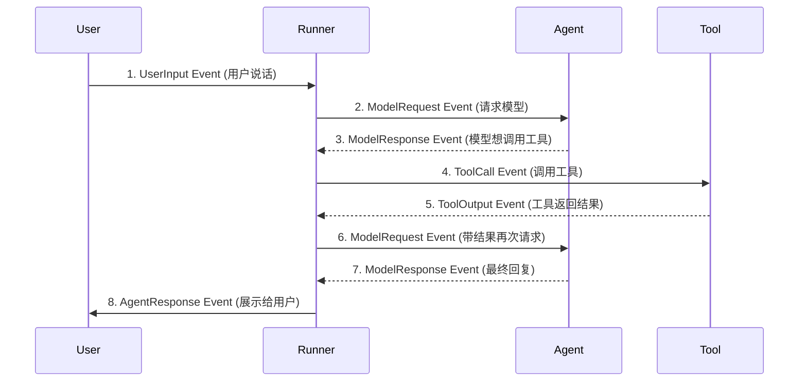

**为什么这很重要？**

* **可回溯性 (Time Travel)**：你可以重放整个 Event 序列，完美复现 Bug。
* **UI 渲染**：前端不需要理解复杂的逻辑，只需要针对不同的 Event 类型（如 ToolCall 显示加载中，AgentResponse 显示文本）进行渲染。

🔗 **代码演示**：
- [5_1_event_lifecycle.py](./codes/chapter5/5_1_event_lifecycle.py)
  - 演示 Event 生命周期的完整流转：user_input → model_request → model_response → tool_call → tool_output → agent_response
  - 展示 Event 的不可变性、可追溯性和可重放性

### 5.2.4 Session (会话)：时间线的容器

在第 3.1 节我们用简单的列表（List）来存历史记录，这在复杂的生产环境中是不够的。

ADK 的 **Session** 是一个动态的容器，它代表了 Agent 与用户交互的完整生命周期。

它主要负责：

1. **Identity (身份识别)**：区分现在是 User A 还是 User B 在说话。  
2. **History Management (历史管理)**：自动记录并截断过长的对话历史（Context Window Management），不用你手动去 list.pop()。

### 5.2.5 State (状态)：跨轮次的“共享内存”

这是区别脚本与应用的**关键**。

**State** 是附着在 Session 上的一块 KV 存储（字典）。你可以把它想象成 Agent 和所有工具都能看到的**“共享黑板”**。

**解决了什么问题？**

在传统开发中，如果你想让 Tool A 的结果传给 Tool B，或者记住用户 3 轮前说的“我叫小明”，你需要复杂的 Prompt 工程或全局变量。

在 ADK 中，你只需要读写 State。

**核心特征：**

* **持久性**：即使用户关闭了网页，下次回来，State 依然在（取决于存储后端）。  
* **可观测性**：Agent 的每一次“思考”都可以读写 State。

**代码实战：用 State 实现“多轮点餐”**

```python
from google.adk.sessions import Session

# 定义一个工具，它不直接返回文本，而是修改状态  
def set_coffee_type(session: Session, coffee_type: str):  
    """记录用户想要的咖啡类型"""  
    session.state['order_step'] = 'size_selection' # 更新流程进度  
    session.state['coffee'] = coffee_type          # 记住咖啡名  
    return f"好的，已记录 {coffee_type}。"

# 定义另一个工具，读取之前的状态  
def confirm_order(session: Session):  
    """确认订单"""  
    # 直接从 State 获取，不需要用户在这一轮重复说一遍  
    coffee = session.state.get('coffee')  
    if not coffee:  
        return "您还没选咖啡呢。"  
    return f"正在为您制作：{coffee}"

# --- 在 Agent 运行过程中 ---  
# Round 1: 用户说 "我要一杯拿铁"  
# Agent 调用 set_coffee_type("Latte") -> State 变更为 {'coffee': 'Latte'}

# Round 2: 用户说 "确认下单"  
# Agent 调用 confirm_order() -> 读取 State 中的 'Latte' -> 返回 "正在为您制作：Latte"
```

**生产级提示**：ADK 支持 InMemorySessionService (开发用) 和 DatabaseSessionService (生产用，支持 pg/sqlite等)。

🔗 **代码演示**：
- [5_2_session_and_state.py](./codes/chapter5/5_2_session_and_state.py)
  - **对比实验 A**：无 State 时，工具函数无法记住之前的数据
  - **对比实验 B**：有 State 时，通过 Session.state 共享数据
  - **对比实验 C**：Session 隔离性，不同用户数据互不干扰
  - **对比实验 D**：完整工作流，State 在多步骤间流转

### 5.2.6 Callbacks (回调)：生命周期钩子

这是 ADK 最强大的功能之一。**Callbacks** 允许你在 Agent 生命周期的特定节点“插入”自定义代码。

**常见的 Hook 点 (Hooks)：**

* before_model: 在发送给 LLM 之前（例如：临时修改 Prompt，注入实时时间）。  
* after_model: 在 LLM 返回之后（例如：计算 Token 消耗，检测有害内容）。  
* before_tool: 在工具执行前（例如：权限校验，确认用户是否有权删除文件）。  
* on_error: 全局异常捕获。

**场景演示：防止 Agent 泄露隐私 (PII Guardrail)**

假设我们不希望 Agent 把用户的手机号发给第三方模型，我们可以写一个 before_model 回调：

```python
from google.adk.types import ModelContext

def pii_guardrail(context: ModelContext):  
    """在发送给模型前，自动抹除手机号"""  
    original_text = context.llm_request.text  
      
    # 简单的正则替换逻辑  
    if has_phone_number(original_text):  
        print("⚠️ 检测到隐私数据，正在脱敏...")  
        safe_text = mask_phone_number(original_text)  
          
        # 修改请求内容，模型将只看到脱敏后的文本  
        context.llm_request.text = safe_text

# 注册回调  
my_agent = LlmAgent(  
    model="gemini-2.0-flash",  
    callbacks=[pii_guardrail]  # 注入回调  
)
```

**Callback 的价值**：它实现了**业务逻辑**（Agent 怎么思考）与**治理逻辑**（安全、日志、计费）的解耦。你可以在不修改 Agent 核心代码的情况下，为它增加额外的控制层。

## 5.3 团队作战：Sub-Agent (子智能体) 与分层架构

当任务变得极其复杂（例如“写一个游戏并测试”），一个 Agent 往往会顾此失彼。

ADK 引入了 **Sub-Agent** 的概念，让我们能像组建公司一样组建 Agent 团队：**Manager (经理)** 负责分派，**Specialist (专家)** 负责干活。

### 5.3.1 核心理念：AgentTool

ADK 的设计哲学是：**Agent 也可以是 Tool**。

通过 AgentTool 包装器，我们可以把一个完整的 Agent 变成另一个 Agent 手中的“函数”。

```python
from google.adk.agents import LlmAgent  
from google.adk.tools import AgentTool

# 1. 定义一个只会写 Python 的专家 (Sub-Agent)  
coder_agent = LlmAgent(  
    name="python_expert",  
    instruction="你是一个 Python 专家，只负责输出高质量代码，不闲聊。",  
    model="gemini-3-pro-preview"  
)

# 2. 将专家包装成工具  
# 这会让主 Agent 看到一个名为 'delegate_to_python_expert' 的工具  
coder_tool = AgentTool(  
    agent=coder_agent,   
    description="当需要编写复杂 Python 代码时使用此工具"  
)

# 3. 定义主经理 (Manager Agent)  
manager = LlmAgent(  
    name="project_manager",  
    instruction="你负责统筹项目。如果需要写代码，请委派给专家。",  
    tools=[coder_tool]  # <--- 注入 Sub-Agent  
)
```

**运行逻辑**：

1. 用户对 Manager 说：“帮我写个贪吃蛇。”  
2. Manager 思考：“我需要写代码。” -> 调用 delegate_to_python_expert 工具。  
3. ADK 自动唤醒 coder_agent，开启一个新的子 Session。  
4. coder_agent 完成代码编写，返回结果。  
5. Manager 收到结果，向用户汇报。

### 5.3.2 两种协作模式

除了 LLM 自动调度的模式，ADK 还支持确定性的工作流：

1. **Router 模式 (动态路由)**：  
   使用 LlmAgent 作为总控，根据用户意图，动态选择调用哪个 Sub-Agent（如上例）。适合处理不确定性的用户请求。  
2. **Pipeline 模式 (流水线)**：  
   使用 SequentialAgent。无需 LLM 思考，强制规定 A 做完给 B，B 做完给 C。  
   * *场景*：翻译 -> 润色 -> 格式化。这比纯 LLM 调用更稳定、更省钱。

```python
from google.adk.agents import SequentialAgent

pipeline = SequentialAgent(  
    name="translation_pipeline",  
    agents=[translator_agent, editor_agent, formatter_agent]  
)
```

## 5.4 总结：利用大厂生态实现更现代化的Agent

通过本章，我们的视角从“实现功能”转向了“架构设计”。

| 特性         | 手搓 Agent (Python Script) | Google ADK Agent                           |
| :----------- | :------------------------- | :----------------------------------------- |
| **状态管理** | 全局变量 / 函数参数传递    | **Session State** (隔离且持久化)           |
| **流程控制** | print() 调试 / if-else     | **Events** (标准化事件流)                  |
| **扩展机制** | 修改源代码                 | **Callbacks** (钩子，插件式拦截)           |
| **多 Agent** | 极其复杂的手动调度         | **AgentTool / SequentialAgent** (开箱即用) |

选择生态繁荣与时俱进的Agent SDK，相当于站在巨人的脚板上（并没有肩膀那么高但是至少能与时俱进了）。接下来，我们将进入实战环节，基于skills的理念，尝试用google ADK 做一个的能动态扩展能力的原型Agent。 

## subagent / 压缩 / rewind / 多模态 / callbacks(hooks,钩子 before-llm-callbacks,before-tool-callbacks,以及对应的after-xxx-callbacks) / skills( bash file_editor skill_load) / 外部合作接口dynamic-mcp  exa-mcp / 外部非合作接口 skill-creator 适当讲解/ 语音 / 手机连接ssh远程 / playwrite / 经验库 / 记忆 / drawio  / agent-team

总之就是 AI harness 脚手架工程（除了LLM api与外部可插拔的tool之外 其余的部分沉淀下来 比如持久化 agent team机制 ）

---

## 5.4.1 高级特性：SubAgent / Callbacks / 压缩 / 多模态 / Skills

> 本节将深入解析 Ciri 项目中基于 Google ADK 实现的高级特性，包括子智能体、生命周期钩子、上下文压缩、多模态支持以及内置 Skills 系统。

### 5.4.1.1 SubAgent（子智能体）

#### 什么是 SubAgent？

在 ADK 中，**SubAgent（子智能体）** 是指在主 Agent 内部运行的专门化 LlmAgent。与主 Agent 共享 Session，但拥有独立的指令系统（System Prompt）和工具集。

**典型应用场景**：
- 对话摘要生成（AutoCompactAgent）
- 复杂任务分解与专项处理
- 多角色协作（如 Code Review Agent、Test Agent）

#### AutoCompactAgent 实战案例

Ciri 项目中的 `AutoCompactAgent` 是最典型的 SubAgent 应用，用于解决上下文窗口膨胀问题。

🔗 **代码参考**：[auto_compact_agent.py](../src/adk_agent/auto_compact_agent.py)

```python
from typing import Optional
from google.adk.agents import LlmAgent
from google.adk.models.lite_llm import LiteLlm
from google.adk.sessions import InMemorySessionService
from google.adk.runners import Runner
from src.adk_agent.config import AgentConfig

class AutoCompactAgent(LlmAgent):
    """
    专门负责生成对话摘要的 Sub-Agent。
    继承自 LlmAgent，可作为 Main Agent 的子 Agent 运行。
    """
    
    def __init__(self, config: Optional[AgentConfig] = None):
        if config is None:
            config = AgentConfig()
        
        # 复用主 Agent 的模型配置
        llm_model = LiteLlm(
            model=config.model,
            api_key=config.api_key,
            api_base=config.api_base,
            extra_body=config.extra_body
        )
        
        # 专门的摘要指令
        system_prompt = """你是一个专业的对话摘要专家。你的任务是阅读以下对话历史，并生成一个精炼的摘要。

请遵循以下规则：
1. **保留核心目标**：明确用户的意图和当前任务。
2. **记录关键步骤**：保留已完成的重要操作和决策。
3. **忽略冗余细节**：省略具体的代码块、长文本输出。
4. **保持上下文连贯**：确保摘要能让另一个 Agent 接手任务。
5. **格式清晰**：使用简洁的段落或列表。
"""
        
        super().__init__(
            name="auto_compactor",
            model=llm_model,
            instruction=system_prompt,
            tools=[]  # 纯摘要任务，不需要工具
        )
```

#### SubAgent 的创建与注册

在 Ciri 中，SubAgent 通过 `sub_agents` 参数注册到主 Agent：

🔗 **代码参考**：[main_web_start_steering.py#L379-L391](../src/adk_agent/main_web_start_steering.py#L379-L391)

```python
def _create_agent(self) -> LlmAgent:
    """创建会话专属的 LlmAgent 实例"""
    
    # ⚠️ 关键：每个会话创建自己的 compactor_agent 实例
    # 不能共享全局的 compactor_agent，因为 sub_agent 只能有一个 parent
    session_compactor = AutoCompactAgent(self.config)
    
    agent = LlmAgent(
        name=self.config.name,
        model=llm_model,
        instruction=system_prompt,
        tools=[self.skill_load],
        sub_agents=[session_compactor],  # ← 注册 SubAgent
        on_tool_error_callback=handle_tool_error,
        before_model_callback=self.interruption_guard,
        before_tool_callback=self.interruption_guard
    )
```

#### SubAgent 的调用与结果回传

SubAgent 通过 ADK 的 `Runner` 执行一次性任务：

```python
async def compact_history(self, history_text: str) -> str:
    """执行摘要生成任务"""
    
    # [SAFETY] 超大文本截断保护
    MAX_SAFE_CHARS = 200000 
    if len(history_text) > MAX_SAFE_CHARS:
        # 保留前 20% 和后 30%，中间用占位符
        keep_head = int(MAX_SAFE_CHARS * 0.2)
        keep_tail = int(MAX_SAFE_CHARS * 0.3)
        history_text = (
            history_text[:keep_head] + 
            f"\n\n... [中间 {len(history_text) - keep_head - keep_tail} 字符已省略] ...\n\n" + 
            history_text[-keep_tail:]
        )
    
    # 创建临时 Session 用于摘要任务
    temp_session_service = InMemorySessionService()
    temp_session = await temp_session_service.create_session(
        app_name="compactor_service",
        user_id="system",
        session_id="temp_compact_task"
    )
    
    # 使用 Runner 执行 SubAgent
    runner = Runner(
        agent=self,
        session_service=temp_session_service,
        app_name="compactor_service"
    )
    
    from google.genai import types
    prompt_content = types.Content(
        role='user', 
        parts=[types.Part(text=f"请为以下对话历史生成摘要：\n\n{history_text}")]
    )
    
    response_text = ""
    try:
        async for event in runner.run_async(
            user_id="system",
            session_id="temp_compact_task",
            new_message=prompt_content
        ):
            if hasattr(event, 'is_final_response') and event.is_final_response():
                if event.content and event.content.parts:
                    response_text = event.content.parts[0].text
    
    except Exception as e:
        print(f"[AutoCompactAgent] Error: {e}")
        response_text = "Error generating summary."
        
    return response_text
```

**执行流程**：

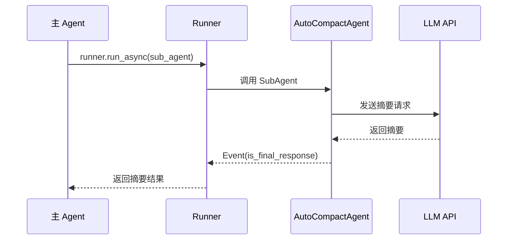

### 5.4.1.2 Callbacks（生命周期钩子）

#### ADK Callbacks 体系

ADK 提供了完整的生命周期钩子体系，允许在 Agent 执行的关键节点插入自定义逻辑：

| 回调类型                 | 执行时机   | 典型用途              |
| ------------------------ | ---------- | --------------------- |
| `before_model_callback`  | LLM 调用前 | Prompt 注入、中断检测 |
| `after_model_callback`   | LLM 返回后 | Token 统计、内容过滤  |
| `before_tool_callback`   | 工具执行前 | 参数校验、权限检查    |
| `after_tool_callback`    | 工具执行后 | 结果处理、日志记录    |
| `on_tool_error_callback` | 工具异常时 | 错误处理、降级策略    |

#### before_model_callback（LLM 调用前拦截）

Ciri 使用 `before_model_callback` 实现用户中断机制：

```python
def interruption_guard(self, *args, **kwargs):
    """中断卫士（实例方法，直接访问 self.queue）"""
    if self.queue and not self.queue.empty():
        try:
            signal = self.queue.get_nowait()
            if signal == "CANCEL":
                print(f"🛑 [AOP拦截] 检测到中断信号! Target: {self.key}")
                
                # 清空队列
                while not self.queue.empty(): 
                    self.queue.get_nowait()
                
                raise UserInterruption("User requested to stop operation.")
        except asyncio.QueueEmpty:
            pass
    
    return None  # 返回 None 表示继续执行
```

#### on_tool_error_callback（工具异常处理）

```python
def handle_tool_error(tool, args, tool_context, error):
    """统一工具错误处理"""
    return {
        "error": f"Tool failed: {str(error)}", 
        "status": "failed"
    }

# 在创建 Agent 时注册
agent = LlmAgent(
    name=self.config.name,
    model=llm_model,
    instruction=system_prompt,
    tools=[...],
    on_tool_error_callback=handle_tool_error,  # ← 错误处理
    before_model_callback=self.interruption_guard,  # ← 中断检测
    before_tool_callback=self.interruption_guard
)
```

#### 实战：用户中断机制

🔗 **代码参考**：[main_web_start_steering.py#L1155-L1166](../src/adk_agent/main_web_start_steering.py#L1155-L1166)

```python
# 在主循环中监听取消信号
if pending_cancel_get and pending_cancel_get in done:
    cancel_signal = pending_cancel_get.result()
    pending_cancel_get = asyncio.create_task(self.queue.get())
    
    if cancel_signal == "CANCEL":
        print(f"[Node-{node_config.port}] 🛑 收到前端取消信号！")
        
        # 取消正在运行的 Runner 任务
        if not pending_runner_get.done(): 
            pending_runner_get.cancel()
        if not pending_stream_get.done(): 
            pending_stream_get.cancel()
        driver_task.cancel()
        
        raise UserInterruption("Task cancelled by user.")
```

**中断处理流程**：

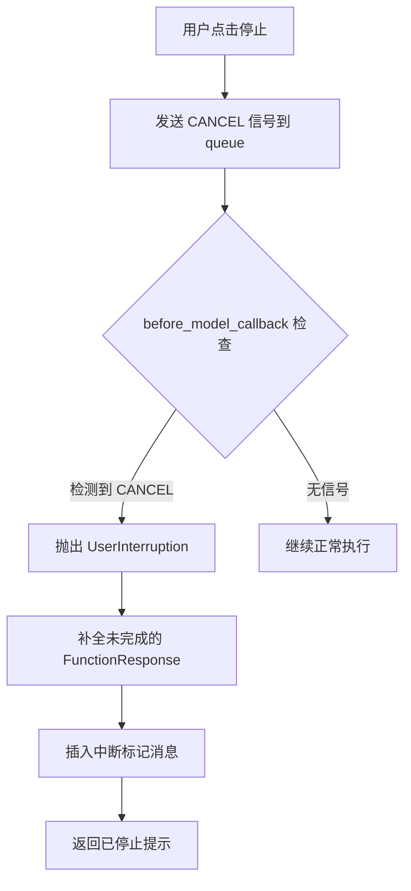

### 5.4.1.3 上下文压缩（Context Compaction）

#### 为什么需要上下文压缩？

当对话轮次增多时，LLM 的上下文窗口会逐渐被历史消息填满：
- **Context 爆炸**：Token 消耗加速
- **性能下降**：模型处理长上下文变慢
- **成本上升**：每个请求的 Token 成本增加

#### AutoCompactAgent 实现原理

🔗 **代码参考**：[main_web_start_steering.py#L1636-L1650](../src/adk_agent/main_web_start_steering.py#L1636-L1650)

```python
# 调用 AutoCompactAgent 生成摘要
summary = "（自动摘要失败）"
compactor = None

# 从 agent 的 sub_agents 中获取 compactor
if self.agent.sub_agents:
    from src.adk_agent.auto_compact_agent import AutoCompactAgent
    for sub in self.agent.sub_agents:
        if isinstance(sub, AutoCompactAgent):
            compactor = sub
            break

if compactor:
    print("[系统] 正在调用 AutoCompactAgent 生成摘要...")
    summary = await compactor.compact_history(history_text)
    print(f"[系统] 摘要生成成功: {summary}")
```

#### Hard Reset 机制

压缩后执行 Hard Reset，保留关键信息同时清空历史：

```python
# 收集 System 消息
system_events = []
for evt in session.events:
    role = evt.content.role if hasattr(evt.content, 'role') else 'unknown'
    if role == 'system':
        system_events.append(evt)
    else:
        break

# 构造包含摘要的占位消息
placeholder_user_evt = copy.deepcopy(template_evt)
placeholder_user_evt.content.role = 'user'
placeholder_user_evt.content.parts = [
    types.Part(text=f"[System] Context cleared. Summary:\n{summary}")
]
placeholder_user_evt.author = "AutoCompactAgent"

# 执行 Hard Reset
new_events = system_events + [placeholder_user_evt]
session.events.clear()
session.events.extend(new_events)
```

#### Token 超限的应急处理

```python
async def _check_and_compact_context(self, session, limit_token_count: int):
    """检查并压缩上下文 (基于Token)"""
    
    # 粗略估算 Token（性能优先）
    total_chars = 0
    for evt in session.events:
        if evt.content and evt.content.parts:
            for part in evt.content.parts:
                if part.text:
                    total_chars += len(part.text)
    
    estimated_tokens = total_chars // 3  # 保守估计
    threshold = limit_token_count * 0.9  # 90% 阈值
    
    if estimated_tokens > threshold:
        print(f"[系统] Context Token 预警: {estimated_tokens} > {threshold}")
        await self._auto_compact_session(session)
```

### 5.4.1.4 多模态支持（MultiModal）

#### 核心原理：Part.from_bytes() 的视觉通道机制

**关键设计**：Ciri 使用 Google GenAI SDK 的 `Part.from_bytes()` 方法，图片数据通过 **Vision Token 通道**而非文本 Context。

**数据流验证**（来源：ai.google.dev 官方文档）：

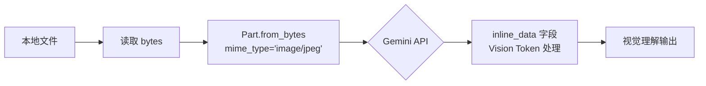

**Google 官方示例**：

```python
from google import genai
from google.genai import types

with open('path/to/image.jpg', 'rb') as f:
    image_bytes = f.read()

response = client.models.generate_content(
    model='gemini-3-flash-preview',
    contents=[
        types.Part.from_bytes(
            data=image_bytes,
            mime_type='image/jpeg',  # ← 决定走视觉通道
        ),
        'Caption this image.'
    ]
)
```

**API 层实际传输结构**：

```json
{
  "contents": [{
    "parts": [{
      "inline_data": {
        "mime_type": "image/jpeg",
        "data": "<base64 encoded bytes>"
      }
    }]
  }]
}
```

**mime_type 决定处理方式**：

| mime_type                                            | Gemini 处理  | Token 计费   |
| ---------------------------------------------------- | ------------ | ------------ |
| `image/jpeg`, `image/png`, `image/webp`, `image/gif` | **视觉理解** | Vision Token |
| `audio/wav`, `audio/mp3`                             | 音频理解     | Audio Token  |
| `video/mp4`                                          | 视频理解     | Video Token  |
| `application/pdf`                                    | 文档理解     | Vision Token |

#### vs Base64 字符串

| 方式                  | 传输格式           | Context Token    | 处理方式                        |
| --------------------- | ------------------ | ---------------- | ------------------------------- |
| ❌ Base64 文本嵌入     | 塞进 `text` 字段   | **巨大**         | 纯文本，模型"读"字面量          |
| ✅ `Part.from_bytes()` | `inline_data` 字段 | **Vision Token** | 原生视觉理解 需要模型支持多模态 |

```python
# ❌ 错误：把 base64 当文本发给模型
b64 = base64.b64encode(data).decode()
text += f"\n"  # 模型"读"字符串，无视觉理解

# ✅ 正确：Part.from_bytes + mime_type = 原生视觉
image_part = types.Part.from_bytes(data=data, mime_type='image/jpeg')
# Gemini 自动识别为图片，走 Vision 通道
```

#### 图片分析：analyze_local_image

Ciri 通过 `analyze_local_image` 工具赋予 Agent "看懂"图片的能力：

🔗 **代码参考**：[file_editor/tools.py#L334-L421](../skills/file_editor/tools.py#L334-L421)

```python
from google.adk.events.event import Event
from google.genai import types as genai_types
from google.adk.tools.tool_context import ToolContext

async def analyze_local_image(path: str, tool_context: ToolContext = None) -> str:
    """
    [Vision Tool] 让 Agent 看懂并分析图片内容。
    场景：用户说"图里有什么"、"检查图片是否画错了"。
    """
    
    # 1. 加载图片数据（原生格式）
    if path.startswith("http://") or path.startswith("https://"):
        # 网络图片：使用 from_uri
        image_part = genai_types.Part.from_uri(
            file_uri=path, 
            mime_type="image/jpeg"
        )
    else:
        # 本地图片：使用 from_bytes（关键：不转 base64！）
        with open(p, "rb") as f:
            image_data = f.read()
        image_part = genai_types.Part.from_bytes(
            data=image_data, 
            mime_type=mime_type
        )
    
    # 2. 防止重复注入（检查历史）
    for event in tool_context.session.events:
        if event.author == "user" and event.content and event.content.parts:
            for part in event.content.parts:
                if part.text and f"image from {path}" in part.text:
                    return f"The image {path} is already in the conversation history."
    
    # 3. 构造 Injection Event（强视觉标记）
    image_event = Event(
        author="user",
        invocation_id=tool_context._invocation_context.invocation_id,
        content=genai_types.Content(
            role="user",
            parts=[
                genai_types.Part.from_text(
                    text=f"### [USER_ATTACHMENT: IMAGE] ###\n"
                          f"I am providing the image file from: {path}\n\n"
                          f"[IMAGE_CONTENT_START]"
                ),
                image_part,  # ← 二进制 Part，不占用文本 Context
                genai_types.Part.from_text(
                    text="[IMAGE_CONTENT_END]\n\n"
                          f"Please examine it carefully and provide analysis."
                )
            ]
        )
    )
    
    # 4. 持久化到数据库（必须通过 session_service）
    await tool_context._invocation_context.session_service.append_event(
        tool_context.session, image_event
    )
    
    # 5. 调整事件顺序（满足 LLM 协议）
    # 目标序列：User → User(Image) → Assistant(Call) → Tool(Response)
    tool_call_idx = -1
    for i, event in enumerate(tool_context.session.events):
        if tool_context.function_call_id and any(
            fc.id == tool_context.function_call_id 
            for fc in event.get_function_calls()
        ):
            tool_call_idx = i
            break
    
    if tool_call_idx != -1 and tool_context.session.events[-1] == image_event:
        ev = tool_context.session.events.pop()
        tool_context.session.events.insert(tool_call_idx, ev)
    
    return f"SUCCESS: Image PERSISTED. Please analyze the image above."
```

#### 三大核心 Bug 的解决

🔗 **技术复盘**：[analyze_image_skill的bug修复.md](../MISC/how-to/analyze_image_skill的bug修复/analyze_image_skill的bug修复.md)

| Bug                     | 问题                                        | 解决方案                                       |
| ----------------------- | ------------------------------------------- | ---------------------------------------------- |
| **Bug A: 持久化失效**   | 直接修改内存列表，刷新后丢失                | 使用 `session_service.append_event()` 官方接口 |
| **Bug B: 协议校验违规** | User(Image) 插在 FunctionCall/Response 之间 | 调整事件顺序到 FunctionCall 之前 （小trick）   |
| **Bug C: 模型幻觉**     | 模型可能"看不见"图片                        | 强视觉标记 `[IMAGE_CONTENT_START/END]` 引导    |

#### 执行流程图

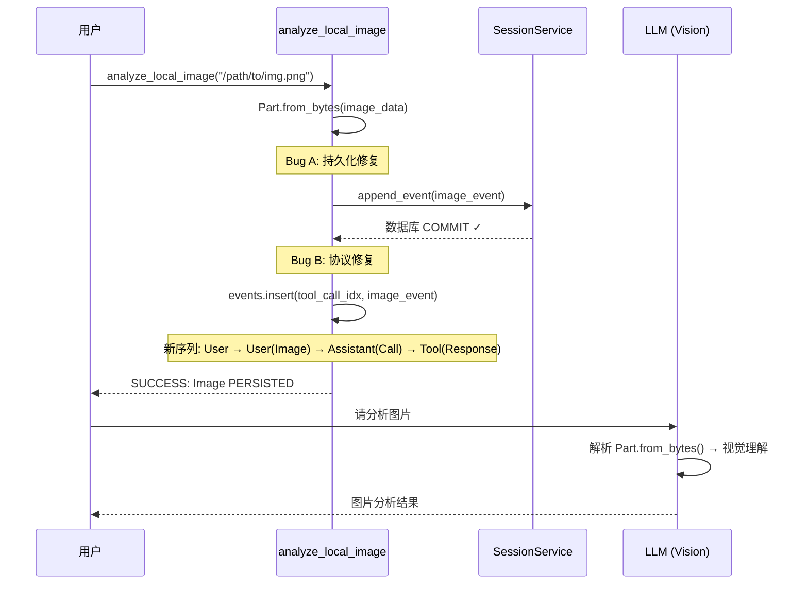

#### 图片展示：view_local_image

与 `analyze_local_image` 不同，`view_local_image` **仅用于向用户展示**，不让 Agent 分析：

```python
async def view_local_image(path: str) -> str:
    """
    [UI Tool] 仅用于向用户展示图片。
    场景：用户说"给我看看图"、"显示结果"。
    
    行为：生成前端可渲染的 Markdown 链接。
    注意：此工具不会让 Agent 看到图片内容。
    """
    
    # 网络图片直接返回 Markdown
    if path.startswith("http://") or path.startswith("https://"):
        return f""
    
    # 本地图片返回 API 端点（支持路径编码）
    from urllib.parse import quote
    encoded_path = quote(path)
    return f""
```

#### 两种工具的职责划分

| 工具                  | 目的     | Agent 能否"看"到     | 使用场景                     |
| --------------------- | -------- | -------------------- | ---------------------------- |
| `analyze_local_image` | 视觉理解 | ✅ 能（Vision Token） | "图里有什么"、"分析数据趋势" |
| `view_local_image`    | UI 展示  | ❌ 不能               | "给我看看图"、"显示结果"     |

#### ToolContext 事件注入机制

多模态能力的核心是通过 `ToolContext` 访问 Session Service：

```python
# ToolContext 提供的关键能力
session_service = tool_context._invocation_context.session_service
session = tool_context.session

# 1. 持久化事件（数据库层）
await session_service.append_event(session, image_event)

# 2. 内存操作（协议层）
tool_context.session.events.insert(position, image_event)

# 3. 获取调用上下文（用于事件顺序调整）
invocation_id = tool_context._invocation_context.invocation_id
function_call_id = tool_context.function_call_id
```

### 5.4.1.5 内置 Skills

> 本节通过 **energy_httpx_sop_creator** 这个完整的生产级 Skill 示例，深入解析 Skill 的标准结构、编写规范和工作流程。

#### 5.4.1.5.1 完整 Skill 结构：energy_httpx_sop_creator

`energy_httpx_sop_creator` 是一个专门用于构建"抓包后访问接口"架构的 Skill，是 Ciri 项目中复杂 Skill 的典型代表。

🔗 **代码参考**：[energy_httpx_sop_creator/SKILL.md](../skills/energy_httpx_sop_creator/SKILL.md)

**目录结构**：

```
energy_httpx_sop_creator/
├── SKILL.md              # 技能说明书 + SOP 工作流
├── tools.py              # 工具实现（通过 skill-creator 生成）
└── skill-creator/        # 内置的 Skill 制造工具
    ├── SKILL.md
    └── scripts/
        ├── init_skill.py      # 一键初始化
        ├── quick_validate.py   # 自动化校验
        └── package_skill.py    # 集成打包
```

#### 5.4.1.5.2 SKILL.md 标准结构

一个完整的 `SKILL.md` 包含以下核心章节：

**1. YAML 元数据（必须）**

```yaml
---
name: energy_httpx_sop_creator
description: HTTPX 直连版节能 SOP 工作流生成专家。用于一键检索无线节能 API 资产库，专门构建和生成具备"半剥离混合抓包 (CDP Token + HTTPX 透传)"架构的大模型防震荡工具技能。
---
```

**2. 角色定义**

```markdown
## 1. 角色定义

你现在处于 **"Energy Saving HTTPX SOP Creator（特种网络研发工程师）"** 模式。
你的核心职责是：针对网络抖动、VPN 代理极不稳定、浏览器处于休眠降权等严苛场景，
根据用户的自然语言需求，从本地的 API 资产库中检索接口，编写、测试并生成可复用的 Python 业务代码。
```

**3. 可用资产**

```markdown
## 2. 可用资产

- **API 资产库**: `d:\git_codes\...\energy_saving_api_策略管理部分.json`
  - 包含了所有抓取到的策略管理部分业务接口。
```

**4. 核心技术实现规范**

```markdown
## 3. 核心技术实现规范 (Core Implementation Requirements)

### 3.1 鉴权机制：半剥离混合抓包 (Token Extract + Backend HTTP)
- **第一步：秒提 Token (Lightweight CDP)**：使用 Playwright 刺入本机 9222 端口，
  执行简单的 `window.sessionStorage.getItem('token')`。
- **第二步：光速断连释放**：只要拿到 Token，马上断开连接，绝不申请焦点。

### 3.2 纯原生发包 (Python httpx)
- 所有业务载荷的拼装全部降维回到纯 Python 层面。
- 使用 `httpx.AsyncClient` 携带 Token 对后端系统发起 POST 请求。
```

**5. 黄金参考模板**

```markdown
## 4. 黄金参考模板 (Golden Reference Template)

你在编写所有未来的新业务时，**必须且只能**参考以下模板作为 `tools.py` 的绝对主干！
```

**6. 执行工作流 (SOP)**

```markdown
## 5. 执行工作流 (Workflow)

你必须**严格按照以下步骤循环执行**，不可跳过沙盒测试阶段：

### Step 1: 渐进式检索 (Retrieve & Understand)
- 精准定位 API 接口

### Step 2: 初始化标准技能工程 (Initialize Skill Project)
- 调用 `init_skill.py` 创建脚手架
- 在 `tools.py` 中编写业务代码

### Step 3: 模块化沙盒测试 (Evals & Improve) 【强制环节】
- 在 `scripts/test_run.py` 中隔离测试
- 禁止将测试代码混入 `tools.py` 尾部

### Step 4: 繁育与固化 (Refine & Validate)
- 清理废料、重构描述文件
- 调用 `package_skill.py` 打包校验
```

#### 5.4.1.5.3 参考模板：tools.py 规范

🔗 **代码参考**：[energy_httpx_sop_creator/SKILL.md#L38-L129](../skills/energy_httpx_sop_creator/SKILL.md#L38-L129)

```python
# ==========================================
# 业务 Skill：以 httpx 为首的底层代理模式
# ==========================================
import httpx
from playwright.async_api import async_playwright, Error as PlaywrightError
from typing import Dict, Any, List

async def fetch_target_busi_action_httpx(param1: str, param2: int) -> Dict[str, Any]:
    """
    底层摒弃浏览器发包，利用 Python httpx 发起的业务查询。
    """
    TARGET_HOST = "192.168.188.1"
    TARGET_URL = "http://192.168.188.1:8080/ips/back/YOUR_API_ENDPOINT"
    
    live_token = None
    
    # 【步骤一】：通过 CDP 仅仅只做极简的 Token 提取
    async with async_playwright() as p:
        browser = None
        try:
            browser = await p.chromium.connect_over_cdp("http://127.0.0.1:9222")
            context = browser.contexts[0]
            
            target_page = None
            for page_obj in context.pages:
                if TARGET_HOST in page_obj.url:
                    target_page = page_obj
                    break
            
            if not target_page:
                return {"error": f"未找到包含 {TARGET_HOST} 的标签页"}
            
            # 【核心】极简 Token 提取
            js_code = """
            () => {
                const rawStorage = window.sessionStorage.getItem('powersaving-access_token');
                if (!rawStorage) return null;
                const parsed = JSON.parse(rawStorage);
                return parsed ? parsed.content : null;
            }
            """
            live_token = await target_page.evaluate(js_code)
            
        except Exception as e:
            return {"error": f"提取 Token 时遭遇 CDP 异常：{str(e)}"}
        finally:
            if browser:
                await browser.close()  # 【关键】拿完即走，不留痕迹

    # 【步骤二】：脱离浏览器上下文，使用稳定的 HTTPX Python 发包
    payload = {"yourKey1": param1, "yourKey2": param2}
    headers = {
        "accept": "application/json, text/plain, */*",
        "authorization": f"Bearer {live_token}",
        "content-type": "application/json"
    }

    try:
        async with httpx.AsyncClient(verify=False, timeout=30.0) as client:
            resp = await client.post(TARGET_URL, json=payload, headers=headers)
            if resp.status_code != 200:
                return {"error": f"后台发包遭遇 HTTP {resp.status_code} 异常"}
            return resp.json()
    except Exception as http_e:
        return {"error": f"后台 httpx 代理发包失败：{str(http_e)}"}


# ==========================================
# 统一导出入口（必须包含且随时更新）
# ==========================================
def get_tools(*args, **kwargs) -> List:
    return [
        fetch_target_busi_action_httpx
    ]
```

#### 5.4.1.5.4 动态生成领域skill时的代码编写严格式约束

**红线警告**：

| 约束类型       | 规则                              | 原因                                          |
| -------------- | --------------------------------- | --------------------------------------------- |
| 🚫 危险删除命令 | 严禁执行 `del`、`rm` 等命令       | 防止误删系统文件                              |
| 🚫 Emoji 禁止   | 严禁在代码中输出 Emoji            | 防止触发 Windows CMD GBK `UnicodeEncodeError` |
| ✅ 专用编辑工具 | 必须使用 `file_editor` 等专用工具 | 避免 Windows 转义地狱                         |
| ✅ 沙盒隔离     | 测试脚本必须放在 `scripts/` 目录  | 禁止污染 `tools.py`                           |

#### 5.4.1.5.5 生命周期管理：skill-creator

`energy_httpx_sop_creator` 内置了完整的 Skill 制造生命周期：

**1. 一键初始化 (init_skill)**

```bash
cmd /c set PYTHONIOENCODING=utf-8 && python \
  d:/git_codes/.../skill-creator/scripts/init_skill.py \
  your_new_skill_name \
  --path d:/git_codes/.../skills
```

生成的目录结构：

```
your_new_skill_name/
├── SKILL.md          # 预置 YAML 模板 + TODO 占位符
├── scripts/          # 测试脚本目录
├── references/        # API 参考文档目录
└── assets/           # 静态资源目录
```

**2. 自动化校验 (quick_validate)**

```bash
# 校验内容
- 元数据完整性：检查 YAML 必填字段
- 安全性检查：检测非法字段（如 `exec`, `__import__`）
- 长度合规性：description < 200 字符
```

**3. 集成打包 (package_skill)**

```bash
cmd /c set PYTHONIOENCODING=utf-8 && python \
  d:/.../skill-creator/scripts/package_skill.py \
  d:/.../skills/your_new_skill_name
```

**打包流程**：

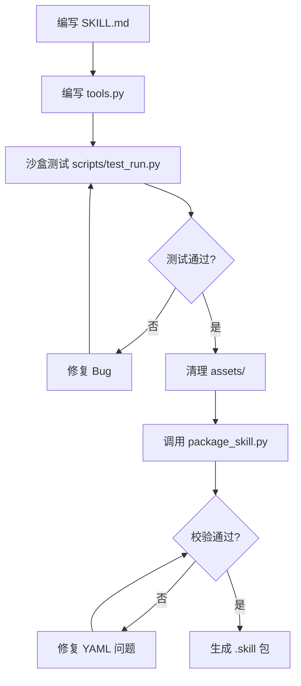

#### 5.4.1.5.6 标准思考链路演示 (Golden CoT)

```markdown
## 6. 标准思考链路演示 (Golden CoT Execution Example)

> [用户输入]: "写一个基站白名单新增复合 Skill"

**Thought 1**: 用户需要一个复合操作：查询基站 -> 提取 CGI -> 加入白名单。
  **Action 1**: 搜索 `energy_saving_api_...json` 定位接口。
  **Observation 1**: 获取到 `/cell-managed/query` 和 `/engblacklist/add`。

**Thought 2**: 接口齐了。调用官方脚本初始化标准目录体系。
  **Action 2**: 运行 `init_skill.py power-saving-assistant`
  **Observation 2**: 生成目录骨架

**Thought 3**: 在 `tools.py` 编写代码，严格遵循"半剥离混合抓包"原则。
  **Action 3**: 写入 httpx + CDP Token 提取代码
  **Observation 3**: 测试报错 `cgiList cannot be empty`

**Thought 4**: 审视堆栈，发现字段名错误。修复 Bug 再次测试。
  **Action 4**: `r.get('cgi')` 替代 `r.get('id')`
  **Observation 4**: ✅ 测试通过！返回 200

**Thought 5**: 清理废料，打包校验。
  **Action 5**: 运行 `package_skill.py`
  **Observation 5**: ✅ "Successfully packaged skill"
```

#### 5.4.1.5.7 技能加载机制

`skill_load` 是 Ciri 的核心元工具，允许 Agent 在运行时动态加载 Skill：

🔗 **代码参考**：[main_web_start_steering.py#L443-L534](../src/adk_agent/main_web_start_steering.py#L443-L534)

```python
async def skill_load(self, skill_id: str) -> str:
    """动态加载技能工具"""
    print(f"[{self.key}] 激活技能: {skill_id}")
    
    if not self.skill_manager.skill_exists(skill_id):
        return f"[ERROR] 技能 '{skill_id}' 不存在。"
    
    self._load_skill_tools(skill_id)
    return f"""[OK] 技能 '{skill_id}' 已加载。
Instructions:
{self.skill_manager.load_full_sop(skill_id)}"""

def _load_skill_tools(self, skill_id: str):
    """加载技能工具到当前 agent"""
    import importlib.util
    
    tool_file = os.path.join(self.config.skills_path, skill_id, "tools.py")
    
    if os.path.exists(tool_file):
        spec = importlib.util.spec_from_file_location(f"skills.{skill_id}", tool_file)
        module = importlib.util.module_from_spec(spec)
        spec.loader.exec_module(module)
        
        if hasattr(module, 'get_tools'):
            # 依赖注入
            tools = module.get_tools(
                self.agent, 
                self.session_service, 
                {"app_name": self.app_name, "user_id": self.user_id, "session_id": self.session_id},
                status_reporter=self.report_swarm_event,
                interruption_queue=self.queue
            )
            
            # 去重并注册
            existing_names = {t.__name__ for t in self.agent.tools}
            for tool in tools:
                if tool.__name__ not in existing_names:
                    self.agent.tools.append(tool)
```

#### 5.4.1.5.8 内置技能一览

| Skill                 | 触发场景         | 核心功能                    |
| --------------------- | ---------------- | --------------------------- |
| `skill_load`          | 用户请求加载技能 | 动态加载外部 Skill          |
| `bash`                | 执行系统命令     | 异步 Shell + 中断支持       |
| `file_editor`         | 文件读写编辑     | 字符串替换、行插入          |
| `analyze_local_image` | 图片视觉理解     | Vision Token 通道           |
| `view_local_image`    | 图片展示         | Markdown 链接生成           |
| `agent_team`          | 集群协作         | dispatch_task、hold_meeting |
| `dynamic-mcp`         | MCP 动态连接     | 运行时挂载 MCP 服务         |
| `compactor`           | 上下文压缩       | AutoCompactAgent            |

#### 5.4.1.5.9 Skill 的核心价值

| 维度                    | 价值                         |
| ----------------------- | ---------------------------- |
| **Context Engineering** | 按需加载，避免 Token 爆炸    |
| **模块化**              | 独立开发、独立测试、独立部署 |
| **可复用**              | 一处编写，处处运行           |
| **可进化**              | 通过 skill-creator 持续完善  |
| **安全隔离**            | 沙盒测试 + 打包校验          |

### 5.4.1.6 记忆与经验库

#### 两级检索：L0 广度扫描 + L2 精准深读

Ciri 通过 `memory_retrieval_system` 技能实现对抗上下文限制的持久记忆：

🔗 **代码参考**：[memory_retrieval_system/SKILL.md](../skills/memory_retrieval_system/SKILL.md)

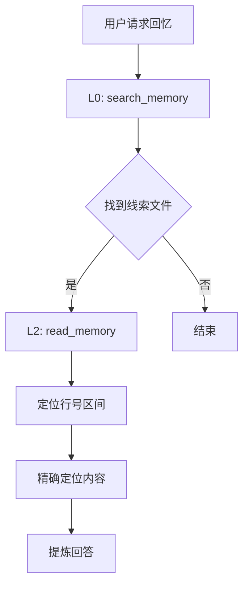

**L0 广度扫描**：
```python
# 底层封装 ripgrep，返回紧凑索引而非全文
def search_memory(pattern: str, user_id: str, month: str = None, max_results: int = 50) -> str:
    """
    返回格式：聚合索引
    2024-05-15_TestApp_ses88.md:[ 145, 148, 150 ]: ...
    """
```

**L2 精准深读**：
```python
def read_memory(file_path: str, start_line: int, end_line: int, user_id: str) -> str:
    """
    精确定位文件行区间
    内置 300 行截断保护 + 15000 字符硬截断
    """
```

#### 实时落盘机制

🔗 **代码参考**：[main_web_start_steering.py#L1420-L1499](../src/adk_agent/main_web_start_steering.py#L1420-L1499)

```python
async def _archive_turn_to_memory(self, user_task: str, events_snapshot: list):
    """
    实时流式落盘 (黑匣子机制)
    纯 Append-Only 模式，保留最完整的原生记录
    """
    
    # 按三元组隔离存储
    memory_dir = os.path.join(
        _PROJECT_ROOT, 
        "memory_archive", 
        self.user_id, 
        month_str
    )
    
    # 写入 Markdown 档案
    with open(filepath, 'a', encoding='utf-8') as f:
        f.write(f"<user time=\"{time_str}\">\n{user_task}\n</user>\n\n")
        
        for evt in events_snapshot:
            if evt.partial:  # 跳过流式碎片
                continue
            # 写入 Agent 动作...
```

#### 经验提取与归档

```python
async def _extract_and_publish_experience(self, events_snapshot: list):
    """
    分析对话轨迹，提取有价值的学习经验
    """
    
    # 1. 数据清洗
    tool_call_history = []
    has_env_error = False
    
    for evt in events_snapshot:
        if evt.part.function_call:
            tool_call_history.append({
                "name": fc.name, 
                "args": str(fc.args)
            })
        if "traceback" in str(resp).lower():
            has_env_error = True
    
    # 2. 启发式判定
    is_struggling = has_env_error or len(set(call_names)) < len(call_names)
    
    if is_struggling:
        # 3. LLM 提炼经验
        summary = await litellm.acompletion(...)
        
        # 4. 分类归档到经验池
        await self._archive_experience(summary)
```

### 5.4.1.7 高级特性总结

| 特性          | 实现方式                      | 核心价值     |
| ------------- | ----------------------------- | ------------ |
| **SubAgent**  | 继承 LlmAgent + Runner 执行   | 专业化分工   |
| **Callbacks** | before/after_model/tool       | 生命周期拦截 |
| **压缩**      | AutoCompactAgent + Hard Reset | 无限上下文   |
| **多模态**    | ToolContext 事件注入          | 看图说话     |
| **Skills**    | get_tools 懒加载模式          | 按需扩展     |
| **记忆**      | L0-L2 两级检索                | 持久化经验   |

这些高级特性共同构成了 Ciri 的**AI Harness 脚手架工程**，让 Agent 能够：
- 🧠 **持续学习**：通过记忆库记住过去
- ⚡ **自我修复**：通过压缩保持轻量
- 🔧 **按需扩展**：通过 Skills 动态武装
- 🛡️ **安全可控**：通过 Callbacks 拦截风险

---

### 5.4.1.8 外部合作接口：Dynamic MCP

#### 什么是 MCP 协议？

MCP (Model Context Protocol) 是 Anthropic 提出的"AI 工具 USB 接口"标准。正如 USB 让鼠标、键盘可以插到任何电脑上，MCP 让任何 MCP Server 的工具可以连接任何 MCP Client（LLM Agent）。

**核心价值**：解决"工具孤岛"问题 - 每个 Agent 不再需要为每个服务单独写适配器。

#### Dynamic MCP Loader 概述

Dynamic MCP Loader 是一个**元工具**（Meta-Tool），赋予 Agent **"自主扩张能力"**：

🔗 **代码参考**：[dynamic-mcp/SKILL.md](../skills/dynamic-mcp/SKILL.md)

**核心功能**：
- 运行时动态加载 MCP 服务，无需重启
- 支持远程 HTTP/SSE 连接和本地进程启动
- 智能 API Key 认证（自动检测 Context7 等服务）

#### connect_mcp 工具详解

🔗 **代码参考**：[dynamic-mcp/tools.py](../skills/dynamic-mcp/tools.py)

```python
async def connect_mcp(
    mode: Literal["remote", "local"],
    source: str,
    args: Optional[List[str]] = None,
    env_vars: Optional[Dict[str, str]] = None,
    api_key: Optional[str] = None
) -> str:
    """
    [全能加载器] 连接远程 MCP 服务或启动本地 MCP 进程。
    """
    
    # 分支 A: 远程 HTTP/SSE 模式
    if mode == "remote":
        # 1. 远程去重检查
        for tool in agent.tools:
            if isinstance(tool, McpToolset):
                if tool.connection_params.url == target_url:
                    return "无需重复连接..."
        
        # 2. 配置认证 Header
        headers = {
            "Accept": "application/json, text/event-stream",
            "Content-Type": "application/json"
        }
        
        if api_key:
            if "context7.com" in target_url:
                headers["CONTEXT7_API_KEY"] = api_key
            else:
                headers["Authorization"] = f"Bearer {api_key}"
        
        connection_params = StreamableHTTPConnectionParams(
            url=target_url,
            headers=headers
        )
    
    # 分支 B: 本地 Process 模式
    elif mode == "local":
        # 安全校验
        if command not in ALLOWED_LOCAL_COMMANDS:
            return f"[Security] 命令不在白名单中..."
        
        connection_params = StdioServerParameters(
            command=command,
            args=args,
            env=final_env
        )
    
    # 统一执行挂载
    new_toolset = McpToolset(connection_params=connection_params)
    success, message = await _verify_mcp_connection(new_toolset)
    
    if success:
        agent.tools.append(new_toolset)  # ← 关键：添加到 agent.tools
        return f"✅ 已加载 {len(tools)} 个工具"
```

#### 典型使用场景

**场景 1：连接 Context7 文档服务**

```
用户: "用 context7 查一下 fastmcp 库的最新版本"

Step 1: 搜索连接方式
web_search("context7 mcp server url")
→ Context7 MCP at https://mcp.context7.com/mcp

Step 2: 动态加载
connect_mcp(
    mode="remote",
    source="https://mcp.context7.com/mcp",
    api_key="ctx7sk-xxxxx"
)

Step 3: 使用新工具
resolve_library_id(library_name="fastmcp")
query_docs(library_id="/...", query="latest version")
```

**场景 2：启动本地 Git MCP 服务器**

```python
connect_mcp(
    mode="local",
    source="npx",
    args=["-y", "@modelcontextprotocol/server-git"],
    env_vars={"GIT_TOKEN": "ghp_xxx"}
)
```

#### 工作原理

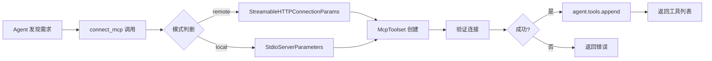

**关键设计**：
1. **去重机制**：避免重复连接同一服务
2. **安全白名单**：本地模式仅允许 `npx`, `node`, `python` 等安全命令
3. **智能认证**：自动检测服务类型并使用正确的 Header
4. **动态挂载**：直接修改 `agent.tools` 列表，无需重启

### 5.4.1.9 外部非合作接口：Skill Creator

#### 非合作接口 vs 合作接口

| 类型           | 特点                         | 示例                                  |
| -------------- | ---------------------------- | ------------------------------------- |
| **合作接口**   | MCP 协议，支持工具动态发现   | dynamic-mcp, exa-mcp                  |
| **非合作接口** | 无协议支持，需要手动定义工具 | skill-creator, wireless_energy_saving |

#### Skill Creator 元技能

Skill Creator 是一个**教 Agent 如何制造和检查新 Skill** 的元技能：

🔗 **代码参考**：[skill-creator/SKILL.md](../tutorial/skills-main/skills/skill-creator/SKILL.md)

**核心价值**：将**上下文工程的方法论**固化为可被 Agent 调用的资产。

#### 复杂 Skill 的标准布局

```text
skill-creator/
├── SKILL.md          # 核心：定义 Skill 的制作原则与 Metadata
├── scripts/          # 自动化：生命周期管理脚本
│   ├── init_skill.py       # 一键初始化
│   ├── quick_validate.py   # 自动化校验
│   └── package_skill.py   # 集成打包
├── references/       # 参考：最佳实践、工作流
└── assets/          # 资产：示例数据
```

#### 生命周期管理

**1. 一键初始化 (init_skill)**

```python
# init_skill.py 的核心逻辑
def init_skill(skill_name: str, skill_dir: Path):
    """创建带标准结构的 Skill 目录"""
    
    # 自动生成 SKILL.md 模板
    skill_md = f"""---
name: "{skill_name}"
description: "技能描述（1-2句话）"
---

# {skill_name} Skill

## 概述
...

## 工具列表
...

## 使用示例
...
"""
    
    # 创建目录结构
    skill_dir.mkdir(parents=True, exist_ok=True)
    (skill_dir / "SKILL.md").write_text(skill_md)
    (skill_dir / "scripts").mkdir()
    (skill_dir / "references").mkdir()
```

**2. 自动化校验 (quick_validate)**

```python
def quick_validate(skill_dir: Path) -> dict:
    """校验 Skill 质量"""
    
    results = {
        "metadata_complete": False,
        "no_illegal_fields": True,
        "description_length_ok": True,
        "has_tool_implementation": False
    }
    
    # 校验 frontmatter
    with open(skill_dir / "SKILL.md") as f:
        content = f.read()
        meta = yaml.safe_load(content.split('---')[1])
    
    results["metadata_complete"] = (
        "name" in meta and "description" in meta
    )
    results["description_length_ok"] = len(meta["description"]) < 200
    
    # 安全检查
    illegal_fields = ["exec", "__import__", "eval"]
    for field in illegal_fields:
        if field in content:
            results["no_illegal_fields"] = False
    
    return results
```

**3. 集成打包 (package_skill)**

```python
def package_skill(skill_dir: Path) -> Path:
    """打包 Skill 为 .skill 文件"""
    
    # 打包前先校验
    results = quick_validate(skill_dir)
    if not all(results.values()):
        raise ValueError(f"校验失败: {results}")
    
    # 打包为 zip
    output_path = skill_dir.parent / f"{skill_dir.name}.skill"
    with zipfile.ZipFile(output_path, 'w') as zf:
        for file in skill_dir.rglob("*"):
            if file.is_file():
                zf.write(file, file.relative_to(skill_dir.parent))
    
    return output_path
```

#### 核心价值：方法论的工具化

Skill Creator 的精髓在于它把 **Context Engineering** 的方法论固化：

1. **结构化约束**：通过 YAML frontmatter 强制元数据规范
2. **安全校验**：防止配置注入等安全问题
3. **长度合规**：确保 description 简洁（Context Engineering 要求）
4. **一键部署**：打包后可直接分发给其他 Agent

---

### 5.4.2 语音接入

#### sherpa_onnx 集成

Ciri 通过 `sherpa_onnx` 实现本地语音识别：

🔗 **代码参考**：[main_web_start_steering.py#L39](../src/adk_agent/main_web_start_steering.py#L39)

```python
import sherpa_onnx

# 初始化语音识别器
def init_asr():
    """初始化 ASR (Automatic Speech Recognition)"""
    
    # 配置参数
    model_config = {
        "model": "silero-vad",  # 语音活动检测
        "nemo": "citrinet",     # 语音识别模型
    }
    
    recognizer = sherpa_onnx.OnlineRecognizer(
        **model_config
    )
    
    return recognizer

async def speech_to_text(audio_data: bytes) -> str:
    """
    将语音转换为文本
    
    Args:
        audio_data: 原始音频字节流 (PCM/WAV)
    
    Returns:
        识别的文本内容
    """
    
    recognizer = init_asr()
    
    # 处理音频流
    samples = np.frombuffer(audio_data, dtype=np.int16)
    
    # 逐帧识别
    text_parts = []
    while recognizer.is_ready():
        recognizer.accept_waveform(samples)
        if recognizer.is_endpoint():
            result = recognizer.get_result()
            if result:
                text_parts.append(result)
            recognizer.reset()
    
    return "".join(text_parts)
```

#### 语音交互流程

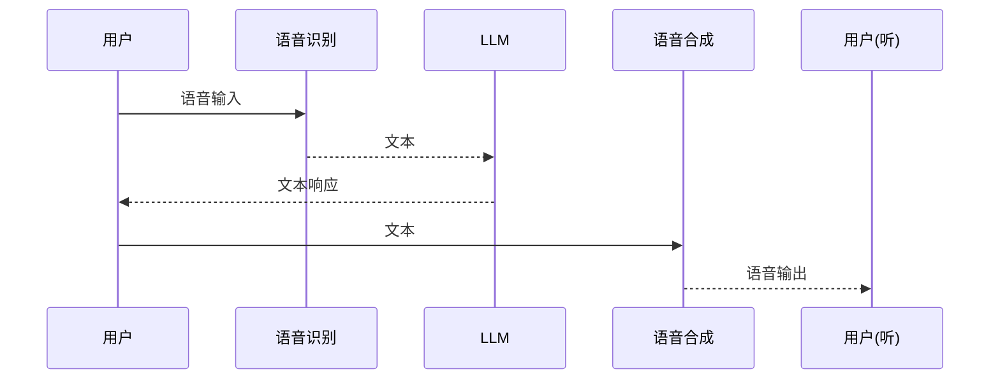

#### 使用场景

1. **语音命令**：用户说"帮我写一个排序函数"
2. **语音反馈**：Agent 响应后，用户语音确认"可以，这样就行"
3. **多模态输入**：同时发送语音和截图，Agent 综合理解

---

### 5.4.3 Playwright 浏览器自动化

#### Playwright-CLI Skill

Playwright-CLI 赋予 Agent 浏览器操作能力：

🔗 **代码参考**：[playwright-cli/SKILL.md](../skills/playwright-cli/SKILL.md)

**核心功能**：
- 打开网页、点击元素、填写表单
- 截图、提取内容
- 执行 JavaScript
- 持久化浏览器会话

#### 典型使用场景

```python
# 打开网页
browse_to(url="https://example.com")

# 截图
take_screenshot(path="/tmp/screenshot.png")

# 点击元素
click(selector="#login-button")

# 填写表单
fill(selector="input[name='email']", value="user@example.com")

# 提取内容
extract_text(selector=".result")

# 执行 JavaScript
execute_js(code="return document.title")
```

#### 工作原理

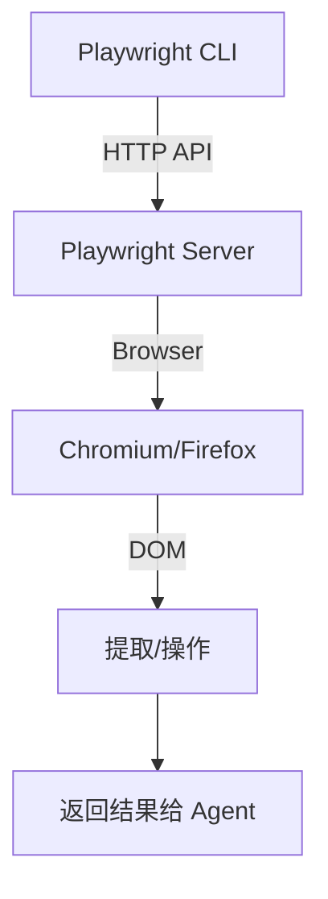

**关键特性**：
1. **持久化会话**：同一个浏览器实例可执行多步操作
2. **无头模式**：服务器环境下无需图形界面
3. **JavaScript 执行**：支持动态网页交互


### 5.4.4 Agent-Team Swarm 集群协作

#### Swarm 架构概述

Agent Team 是 Ciri 的**集群协作系统**，让单个 Agent 具备指挥多个 Worker 的能力：

🔗 **代码参考**：[agent_team/SKILL.md](../skills/agent_team/SKILL.md)

**核心理念**："Agent Smith" - 每个节点运行相同代码，通过上下文动态决定角色。

#### 决策指南

| 意图                      | 动作     | 工具                |
| ------------------------- | -------- | ------------------- |
| **Read** (获取信息)       | 就地读取 | `sync_task_context` |
| **Write/Act** (执行任务)  | 分发任务 | `dispatch_task`     |
| **Discussion** (多人讨论) | 召开会议 | `hold_meeting`      |

#### dispatch_task（任务分发）

🔗 **代码参考**：[agent_team/tools.py#L149-L197](../skills/agent_team/tools.py#L149-L197)

```python
async def dispatch_task(
    task_instruction: str, 
    context_info: str = "",
    target_port: int = None,
    sub_session_id: str = None,
    priority: str = "NORMAL"
) -> str:
    """
    【集群指挥官核心工具】将任务分发给 Swarm 集群中的其他智能体。
    """
    
    # 1. 获取所有活跃 Worker
    active_workers = _get_active_workers()
    
    # 2. 自动负载均衡
    if target_port is None:
        # 选择最空闲的节点
        selected = min(active_workers, key=lambda w: w['busy_score'])
    else:
        selected = find_worker_by_port(target_port)
    
    # 3. 构建 HTTP 请求
    async with httpx.AsyncClient() as client:
        response = await client.post(
            f"http://localhost:{selected.port}/run_task",
            json={
                "task": task_instruction,
                "context": context_info,
                "session_id": sub_session_id or str(uuid.uuid4()),
                "priority": priority
            },
            timeout=30.0
        )
    
    return response.json()
```

#### dispatch_batch_tasks（并发分发）

```python
# 高效：并发分发
dispatch_batch_tasks(tasks=[
    "查 A 公司股价",
    "查 B 公司财报",
    "查 C 公司竞品"
])

# 低效：串行分发（耗时 3x）
dispatch_task("查 A 公司股价")  # 等待
dispatch_task("查 B 公司财报")  # 等待
dispatch_task("查 C 公司竞品")  # 等待
```

#### sync_task_context（三模式查询）

```python
# 模式 1: 广播发现
sync_task_context(reason="查看所有任务")

# 模式 2: 定向查询
sync_task_context(
    reason="查看8000和8001的任务",
    target_ports=[8000, 8001]
)

# 模式 3: 精准查看
sync_task_context(
    reason="查看子任务详情",
    target_ports=8001,
    session_id="abc123"
)
```

#### hold_meeting（群体会议）

```python
# 基础用法：3 人讨论，最多 5 轮
hold_meeting(topic="新爬虫系统应该用 Python 还是 Go")

# 大规模：5 人参会，快速收敛
hold_meeting(
    topic="Q2 产品路线图评审",
    participant_count=5,
    max_rounds=3
)
```

#### 服务发现与心跳

🔗 **代码参考**：[agent_team/tools.py#L56-L98](../skills/agent_team/tools.py#L56-L98)

```python
def _get_active_workers() -> List[dict]:
    """
    [Dynamic Elasticity] 从 SQLite 注册表获取活跃的 Worker 节点。
    """
    HEARTBEAT_TIMEOUT = 15.0
    current_time = time.time()
    
    with sqlite3.connect(REGISTRY_DB, timeout=5.0) as conn:
        cursor = conn.cursor()
        cursor.execute(
            "SELECT port, url, last_seen FROM nodes WHERE status='active'"
        )
        
        workers = []
        for row in cursor.fetchall():
            # 心跳超时检测
            if current_time - row['last_seen'] > HEARTBEAT_TIMEOUT:
                continue
            # 自我排除（不派给自己）
            if row['port'] == CURRENT_NODE_PORT:
                continue
            workers.append({"port": row['port'], "url": row['url']})
        
        return workers
```

#### Swarm 协作架构

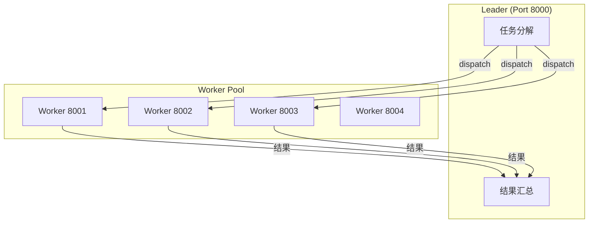

#### 自愈机制

```mermaid
flowchart LR
    A[注册节点] --> B[心跳守护]
    B --> C{节点存活?}
    C -->|是| D[继续服务]
    C -->|否| E[移除注册表]
    E --> F[自动重分配任务]
```

**关键机制**：
1. **15 秒心跳超时**：节点无心跳则自动移除
2. **惰性清理**：发现僵尸节点时自动清理
3. **任务恢复**：Leader 记录未完成任务，可重新分发

### 5.4.5 Agent-Team Swarm 2.0：去中心化拉模型架构

> 本节介绍 **Agent-Team Swarm 2.0**，基于 `agent_team_to_be_update` 技能的去中心化自协调架构。相比传统推模式（PUSH），拉模型（Pulled Coordination）完美规避了 HTTP 指派超载爆破（503 Busy）引起的丢包回退问题。

#### 5.4.5.1 两种架构对比：推 vs 拉

🔗 **代码参考**：[agent_team_to_be_update/SKILL.md](../skills/agent_team_to_be_update/SKILL.md)

| 维度         | 传统推模式 (PUSH)              | 去中心化拉模式 (PULL)                |
| ------------ | ------------------------------ | ------------------------------------ |
| **任务分配** | Leader 直接 HTTP 发送到 Worker | Leader 掷入共享队列，Worker 自主竞争 |
| **通信方式** | 点对点 HTTP 请求               | 文件系统 + Mailbox                   |
| **503 错误** | 超载时丢包回退                 | 无中心节点，永不 503                 |
| **扩展性**   | 受限于 HTTP 连接池             | 线性扩展，无上限                     |
| **故障容错** | Leader 单点故障                | 完全去中心化                         |

**推模式问题**：
```
Leader -> HTTP POST -> Worker (繁忙) -> 503 Busy -> 丢包回退 -> Leader重试 -> 死循环
```

**拉模式优势**：
```
Leader: task_create() -> 写入 TaskQueue 文件
Worker: SelfClaimLoop -> flock 竞争 -> 认领 -> 执行 -> Mailbox 通知
```

#### 5.4.5.2 核心模块架构

🔗 **代码参考**：[agent_team_to_be_update/models.py](../skills/agent_team_to_be_update/models.py)

**Task 数据模型**：

```python
@dataclass
class Task:
    id: str                    # 任务唯一ID
    name: str                  # 任务名称
    description: str           # 详细描述
    status: str = "pending"   # pending / in_progress / completed
    
    # 依赖关系
    blocked_by: List[str]     # 依赖的任务ID列表
    blocks: List[str]         # 被这个任务阻塞的任务
    
    # 文件边界（防止冲突）
    writable_files: List[str] # 可写文件
    read_only_files: List[str] # 只读文件
    
    # 产物信息
    expected_artifacts: List[str]      # 期望产出文件
    verification_commands: List[str]    # 验收命令
    
    # 循环/迭代支持
    task_type: str = "regular"         # "regular" | "loop" | "gate"
    loop_group_id: Optional[str] = None  # 所属循环组
    exit_condition: Optional[str] = None # 退出条件
```

#### 5.4.5.3 任务队列系统

🔗 **代码参考**：[agent_team_to_be_update/task_queue.py](../skills/agent_team_to_be_update/task_queue.py)

**TaskQueue 核心机制**：

```python
class TaskQueue:
    """基于文件锁的去中心化任务缓冲池"""
    
    def __init__(self, team_id: str, base_dir: str):
        self.tasks_dir = os.path.join(base_dir, "tasks", team_id)
        self.locks_dir = os.path.join(self.tasks_dir, "locks")
    
    def create_task(self, name: str, blocked_by: List[str] = None, ...) -> Task:
        """创建任务并返回"""
        task_id = f"task-{uuid.uuid4().hex[:8]}"
        # ...
    
    def claim_task(self, task_id: str, agent_id: str) -> bool:
        """
        【核心】原子性任务认领（flock 文件锁）
        
        竞争流程：
        1. 尝试获取文件锁 (LK_NBLCK)
        2. 若成功：读取任务状态，检查 pending
        3. 原子更新：status="in_progress", owner=agent_id
        4. 释放锁
        """
        lock_path = self._get_lock_path(task_id)
        
        try:
            with open(lock_path, 'r+') as lock_file:
                if not self._acquire_file_lock(lock_file):  # flock
                    return False  # 被抢走了
                
                # 重新读取任务（防止其他进程已修改）
                task = self.get_task(task_id)
                
                # 检查是否可认领
                if task.status != "pending":
                    return False
                
                # 原子更新
                task.status = "in_progress"
                task.owner = agent_id
                self._save_task(task)
                
                return True
        finally:
            self._release_file_lock(lock_file)
```

**Windows/Unix 文件锁兼容**：

```python
def _acquire_file_lock(self, lock_file) -> bool:
    if sys.platform == 'win32':
        import msvcrt
        try:
            # Windows: 非阻塞独占锁
            msvcrt.locking(lock_file.fileno(), msvcrt.LK_NBLCK, 1)
            return True
        except OSError:
            return False
    else:
        import fcntl
        try:
            fcntl.flock(lock_file.fileno(), fcntl.LOCK_EX | fcntl.LOCK_NB)
            return True
        except BlockingIOError:
            return False
```

#### 5.4.5.4 Worker 自抢领循环

🔗 **代码参考**：[agent_team_to_be_update/self_claim_loop.py](../skills/agent_team_to_be_update/self_claim_loop.py)

**SelfClaimLoop 执行流程**：

```python
class SelfClaimLoop:
    """
    Worker 自抢领任务循环
    
    执行流程：
    1. 启动 PollingDaemon 后台线程
    2. 监听 inbox 和 task queue
    3. 等待任务可用通知
    4. flock 竞争认领任务
    5. 执行任务
    6. 标记完成并通知 Leader
    7. 继续循环
    """
    
    async def run(self):
        # 启动后台轮询守护线程
        self._daemon = PollingDaemon(
            agent_id=self.agent_id,
            team_id=self.team_id,
            coordination_dir=self.coordination_dir,
            on_message=self._on_messages,
            on_task_available=self._on_task_available,
            on_idle=self._on_idle
        )
        self._daemon.start()
        
        self._running = True
        while self._running:
            event = await asyncio.wait_for(
                self._event_queue.get(),  # 等待事件
                timeout=5.0
            )
            
            if event[0] == "task_available":
                await self._try_claim_and_execute(event[1])
    
    async def _try_claim_and_execute(self, task):
        """
        【核心】抢领并执行任务
        """
        async with self._claim_lock:  # 内存锁防竞态
            if not self.task_queue.claim_task(task.id, self.agent_id):
                return  # flock 竞争失败
        
        # 执行任务
        try:
            result = await self.task_executor(task)
            self.task_queue.complete_task(task.id)
        except Exception as e:
            self.task_queue.fail_task(task.id)
        
        # 通知 Leader
        self.mailbox.send_message(
            to_agent="leader",
            content=json.dumps({
                "type": "task_completed",
                "taskId": task.id,
                "result": str(result)
            })
        )
```

#### 5.4.5.5 去中心化工具集

🔗 **代码参考**：[agent_team_to_be_update/decentralized_tools.py](../skills/agent_team_to_be_update/decentralized_tools.py)

**Leader 工具（任务管理）**：

```python
async def task_create(
    team_id: str,
    name: str,
    description: str = "",
    blocked_by: List[str] = None,
    expected_artifacts: List[str] = None,
    writable_files: List[str] = None,
    read_only_files: List[str] = None
) -> str:
    """
    【Leader 专用】创建任务并广播通知
    
    工作流：
    1. 写入 TaskQueue 文件
    2. 向所有 Worker 广播 Mailbox 通知
    3. Worker 通过 flock 竞争认领
    """
    queue = TaskQueue(team_id=team_id, base_dir=coord_dir)
    task = queue.create_task(
        name=name,
        description=description,
        blocked_by=blocked_by or [],
        expected_artifacts=expected_artifacts or [],
        writable_files=writable_files or []
    )
    
    # 广播给所有 Worker
    mailbox = Mailbox(base_dir=coord_dir)
    for w in workers:
        mailbox.send_message(
            from_agent="leader",
            to_agent=w.agent_id,
            content=json.dumps({
                "type": "task_broadcast",
                "taskId": task.id,
                "taskName": name
            })
        )
    
    return f"[TASK CREATED] Task ID: {task.id}"
```

**批量 DAG 创建**：

```python
async def dag_create(
    team_id: str,
    tasks: List[Dict[str, Any]],
    broadcast: bool = True
) -> str:
    """
    【Leader 专用】批量创建 DAG 任务
    
    Example:
        dag_create(team_id="my_proj", tasks=[
            {"name": "task1", "description": "调研市场"},
            {"name": "task2", "description": "写代码", "blocked_by": ["task1"]},
        ])
    """
    # 第一遍：创建所有任务，建立 name -> id 映射
    name_to_id = {}
    for task_def in tasks:
        blocked_by_ids = [name_to_id[name] for name in task_def.get("blocked_by", [])]
        
        task = queue.create_task(
            name=task_def["name"],
            blocked_by=blocked_by_ids
        )
        name_to_id[task_def["name"]] = task.id
```

**Worker 工具（自管理）**：

```python
async def task_claim(team_id: str, task_id: str = None) -> str:
    """【Worker 专用】尝试认领任务（flock 竞争）"""

async def task_complete(team_id: str, task_id: str, result: str = "") -> str:
    """【Worker 专用】标记任务完成并通知 Leader"""

async def mailbox_read(team_id: str, unread_only: bool = True) -> str:
    """【通用】读取收件箱消息"""
```

#### 5.4.5.6 任务规划器：DAG 与 Wave 执行

🔗 **代码参考**：[agent_team_to_be_update/planner.py](../skills/agent_team_to_be_update/planner.py)

**TaskPlanner 核心方法**：

```python
class TaskPlanner:
    """LLM辅助任务规划器"""
    
    def plan(self, user_request: str) -> PlanResult:
        """主入口：分析请求，创建任务，计算执行波浪"""
        
        # 1. LLM 分析请求，拆解为原子任务
        task_definitions = self.dependency_analyzer.analyze(user_request)
        
        # 2. 创建任务到队列
        created_tasks = self._create_tasks_from_definitions(task_definitions)
        
        # 3. 拓扑排序计算执行波浪
        waves = self._compute_waves(created_tasks)
        
        return PlanResult(tasks=created_tasks, waves=waves)
    
    def _compute_waves(self, tasks: List[Task]) -> List[List[str]]:
        """
        Kahn 算法拓扑排序，计算并行执行波浪
        
        Example:
            Wave 1: [Task 1, Task 2, Task 3]  (无依赖，并行)
            Wave 2: [Task 4]                   (等 Wave 1)
            Wave 3: [Task 5, Task 6]            (等 Wave 2，并行)
        """
        # 构建依赖图
        in_degree = defaultdict(int)
        dependents = defaultdict(set)
        
        for task in tasks:
            for dep_id in task.blocked_by:
                in_degree[task.id] += 1
                dependents[dep_id].add(task.id)
        
        # Kahn 算法
        waves = []
        current_wave = [tid for tid, d in in_degree.items() if d == 0]
        
        while current_wave:
            waves.append(current_wave)
            next_wave = []
            for task_id in current_wave:
                for dep_id in dependents[task_id]:
                    in_degree[dep_id] -= 1
                    if in_degree[dep_id] == 0:
                        next_wave.append(dep_id)
            current_wave = next_wave
        
        return waves
```

**Wave 执行示例**：

```markdown
用户需求: "做一个带有文章管理的轻量博客"

Wave 1: [Task 1 - DB Setup]        (无依赖，多 Worker 并行争抢)
Wave 2: [Task 2 - Backend API]      (等 Wave 1 解锁)
Wave 3: [Task 3 - Frontend UI]     (等 Wave 2，并行)
         [Task 4 - Unit Testing]    (等 Wave 2，并行)
```

#### 5.4.5.7 文件安全守卫

🔗 **代码参考**：[agent_team_to_be_update/path_guard.py](../skills/agent_team_to_be_update/path_guard.py)

**WorkerPathGuard 防污染机制**：

```python
class WorkerPathGuard(PathGuard):
    """
    Worker 专用路径守卫
    
    禁止 Worker 访问：
    - Agent 系统目录
    - 其他 Worker 的 worktree
    - 系统敏感目录
    - 项目根目录外的路径
    """
    
    DEFAULT_FORBIDDEN_PATTERNS = [
        "/proc", "/sys", "/dev", "/boot", "/etc",  # 系统目录
        "~/.ssh", "~/.gnupg",                       # 用户配置
    ]
    
    def is_allowed(self, path: str) -> bool:
        """三层检查"""
        # 1. 必须在 allowed_root 内
        if not path.startswith(self.allowed_root):
            return False
        
        # 2. 不能在禁止列表
        if path in self.forbidden_paths:
            return False
        
        # 3. 不能包含 .. 路径穿越
        if ".." in Path(path).parts:
            return False
        
        return True
```

**安全约束**：

```python
# Leader 下发任务时的强制约束
task_create(
    name="实现后端 API",
    writable_files=["D:\\project\\backend\\*.py"],  # 必须显式声明
    read_only_files=["D:\\project\\docs\\schema.md"]
)
```

#### 5.4.5.8 协调目录与环境变量

🔗 **代码参考**：[agent_team_to_be_update/decentralized_tools.py#L38-L52](../skills/agent_team_to_be_update/decentralized_tools.py#L38-L52)

**协调目录优先级**：

```python
def _get_coordination_dir(team_id: str) -> str:
    """获取团队协调目录（优先级）"""
    # 1. 环境变量
    if os.environ.get("ADK_COORDINATION_DIR"):
        return os.environ["ADK_COORDINATION_DIR"]
    
    # 2. 项目根目录
    project_root = os.environ.get("ADK_PROJECT_ROOT", _PROJECT_ROOT)
    return os.path.join(project_root, "coordination", team_id)
```

**环境变量规范**：

```bash
# 启动 Worker 前必须设置
SET ADK_COORDINATION_DIR=D:\my_project\coordination
SET ADK_CURRENT_PORT=8001
SET ADK_NODE_TYPE=worker
SET ADK_PROJECT_NAME=my_swarm

# 启动 Leader
SET ADK_COORDINATION_DIR=D:\my_project\coordination  (集群启动脚本执行前使用执行即可)
SET ADK_CURRENT_PORT=8000
SET ADK_NODE_TYPE=leader
```

#### 5.4.5.9 完整执行流程图

```mermaid
sequenceDiagram
    participant User as 用户
    participant Leader as Leader Agent
    participant Queue as TaskQueue
    participant Worker1 as Worker 8001
    participant Worker2 as Worker 8002
    participant Mailbox as Mailbox

    User->>Leader: "做一个博客系统"

    Leader->>Leader: task_create(task1)
    Leader->>Leader: task_create(task2, blocked_by=task1)
    Leader->>Queue: 写入任务文件

    Leader->>Mailbox: 广播 task_broadcast

    Worker1->>Queue: get_available_tasks()
    Worker2->>Queue: get_available_tasks()

    Worker1->>Queue: flock claim(task1)
    Note over Worker1: 获取文件锁
    Worker1->>Queue: status="in_progress", owner=Worker1
    Note over Worker1: 释放锁

    Worker1->>Worker1: 执行任务1

    Worker1->>Queue: complete_task(task1)
    Worker1->>Mailbox: 发送 task_completed

    Worker2->>Queue: get_available_tasks()
    Note over Worker2: task1 完成，task2 可抢
    Worker2->>Queue: flock claim(task2)
    Worker2->>Worker2: 执行任务2
    Worker2->>Mailbox: 发送 task_completed

    Leader->>Mailbox: 读取消息
    Leader->>User: 汇总结果
```

#### 5.4.5.10 去中心化 vs 中心化对比总结

| 特性         | Agent Team 1.0 (PUSH) | Agent Team 2.0 (PULL) |
| ------------ | --------------------- | --------------------- |
| **任务分配** | HTTP POST 直推        | 共享文件 + flock 竞争 |
| **503 处理** | 丢包回退              | 永不 503，无中心瓶颈  |
| **扩展性**   | O(n) HTTP 连接        | O(1) 文件系统         |
| **容错**     | Leader 单点           | 完全去中心化          |
| **调试**     | HTTP 日志             | 文件锁日志            |
| **适用场景** | 少量任务，简单协作    | 大量任务，高并发      |
