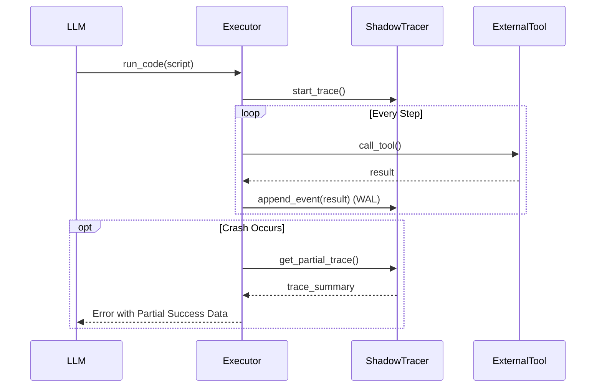

# 初步专利名称：一种智能体Skills自适应流转、跨状态迁移与统一状态保护方法

## 一、 发明名称建议
**中文**：一种智能体Skills自适应流转、跨状态迁移与统一状态保护方法
**检索关键词 (Keywords)**：
*   **中文**：智能体语义注意力 (Semantic Attention)、智能体技能流转 (Agent Skills Lifecycle)、智能体跨状态迁移 (Cross-State Migration)、智能体执行轨迹镜像 (Execution Trace Mirroring)、智能体动态上下文重构 (Dynamic Context Reconstruction)
*   **English**：Agent Skill Semantic Attention, Agent Skill Lifecycle, Agent Skill Cross-State Migration, Agent Skill Execution Trace Mirroring, Agent Skill Dynamic Context Reconstruction

---

## 二、 背景技术痛点 (Technical Problems)

1.  **单向加载导致的上下文无限膨胀**：现有技术（如 Anthropic Skills）多为单向加载，工具一旦注入便持续占用窗口。随着任务推进，无效工具堆积产生“指令噪音”，导致模型推理精度下降并增加 Token 成本。（对应创新点 1）
2.  **状态易失与冷启动成本**：常规卸载操作会直接丢弃中间状态，导致再次调用同一能力时需重复执行昂贵的 I/O 和计算。（对应创新点 2）
3.  **脚本化执行的原子性缺陷与黑盒问题**：现有 Agent 在执行复杂脚本时缺乏细粒度的状态保护，一旦发生运行时异常，整个阶段的成果全部丢失且难以回溯。（对应创新点 3）

---

## 三、 核心技术创新点 (Core Innovations)

### 创新点 1：基于语义注意力的skills自适应流转架构 (Adaptive Semantic Lifecycle)
**技术描述**：构建 **加载(Load) <-> 卸载(Unload)** 的完整闭环。引入**语义注意力衰减算法**，实时监控用户 Intent 与已加载工具的特征重叠度。当检测到任务域发生实质性转移（Semantic Decoupling）时，自动触发卸载流程，释放上下文空间。
*   **差异化**：现有技术（如 Anthropic）仅实现了“按需加载”的半程管理；本发明填补了“按需卸载”的空白，实现了**“加载-使用-回收”**的全生命周期自动化，彻底解决了长程任务中的上下文爆炸问题。

### 创新点 2：基于“状态摘要”的skills跨状态上下文迁移协议
**技术描述**：在卸载（ARCHIVE）阶段执行**信息结构化压缩**，将 LOADED 态的高维执行状态（如数据快照）压缩为低维的**持久化摘要（Persistent Summary）**并写回元数据。
*   **差异化**：实现了“带状态的卸载”。当该能力再次被“自适应流转架构”唤醒时，能够基于摘要实现**“状态热恢复”**，解决了卸载带来的失忆痛点。

### 创新点 3：基于“执行轨迹镜像与关键状态持久化”的PTC编排skills统一状态保护架构
**技术描述**：
1.  **执行轨迹镜像 (Execution Trace Mirroring)**：
    *   **针对 IO 密集型指令**：在 `call_tool` 执行层建立**透明拦截器**，实时将工具调用的 `{Step, Input, Output}` 写入独立于解释器的 **Trace Buffer**（如 WAL 日志）。
    *   **针对 CPU 密集型胶水代码**：引入**关键状态持久化 (Key State Persistence)** 机制。智能体通过调用伪工具 `save_checkpoint(key, value)` 将关键计算的中间变量（如聚合分析结果）**主动“落盘”** 到同一 Trace Buffer 中。
    *   **统一存储**：Trace Buffer 将“外部交互”与“内部计算”统一抽象为**有序事件流**，实现异构状态的原子性与时序一致性。
2.  **动态上下文重构 (Dynamic Context Reconstruction)**：当发生 Crash 或用户回溯时，系统通过 `Trace ID` 重放 Buffer 中的有效事件，**像数据库回滚一样**恢复之前的 Context，实现“非原子性错误恢复”。

*   **差异化**：相比单纯的工具缓存，本方案通过**“虚拟工具化”**手段解决了计算逻辑（胶水代码）中间状态无法低成本持久化的难题，构建了全栈级的容错闭环。

---

## 四、 详细设计与实现路线图 (Implementation Roadmap)

*注：以下设计旨在指导开发，不强制修改现有生产代码。*

## 四、 详细设计与实现路线图 (Implementation Roadmap)

*注：以下设计基于现有 `google_adk_helloworld` 架构进行增强，旨在指导开发，不强制修改现有生产代码。*

### 1. 自适应语义流转架构实现 (Innovation 1: Adaptive Semantic Lifecycle)

#### A. 设计直觉 (Intuition)
针对**单向加载导致的上下文无限膨胀**痛点，现有 Agent 像一个只进不出的仓库，随着时间推移堆满了不再使用的工具（垃圾），最终导致“内存溢出”（Context Window 耗尽）。本创新点为 Agent 引入了类似生物的**“新陈代谢”**机制：不仅能根据需求“吸入”（加载）新能力，更能根据语义相关度的衰减自动“呼出”（卸载）旧能力，维持机体的动态平衡。

#### B. 核心算法设计
在 `SkillManager` 中维护状态机，并在主循环植入 `SemanticMonitor`。


*   **衰减公式**：$R_t = \alpha \cdot \text{Sim}(Query, UserIntent) + (1-\alpha) \cdot R_{t-1}$
    *   当 $R_t$ 低于阈值时，触发 `Archive` 动作。

#### C. 代码实现规划
在 `adk_agent/main.py` 事件循环中：

```python
async def semantic_lifecycle_loop(agent, user_query: str):
    # 1. 发现 (Inhale): 向量检索 Top-K
    candidates = vector_registry.search(user_query)
    for skill in candidates:
        if skill.score > LOAD_THRESHOLD:
            await agent.load_skill(skill.id)
            
    # 2. 代谢 (Exhale): 检查活跃技能的相关度
    for active_skill in agent.active_skills:
        relevance = rapidfuzz.fuzz.ratio(user_query, active_skill.keywords)
        # 引入“惯性”机制，避免并在对话中频繁跳变的误杀
        active_skill.heat = update_heat(active_skill.heat, relevance)
        
        if active_skill.heat < UNLOAD_THRESHOLD:
            logger.info(f"Semantics drifted. Archiving {active_skill.id}")
            # 触发 Innovation 2 的摘要生成
            await agent.archive_skill(active_skill.id) 
```

#### D. 可行性分析
*   **业界空白**：目前 LangChain/Anthropic 均未提供标准化的“自动卸载”策略，通常依赖人工 Reset。
*   **实现成本**：RapidFuzz 计算开销极低，适合即时响应。

---

### 2. 跨状态上下文迁移协议实现 (Innovation 2: State Summary Migration)

#### A. 设计直觉 (Intuition)
针对**卸载即失忆（状态易失）与冷启动成本高**痛点，常规卸载会直接丢弃运行时的变量堆栈。本创新点建立**状态结构化压缩协议**，在卸载前执行“认知快照”，像“夹书签”一样将高维运行时状态压缩为低维自然语言摘要，使得下次加载能实现**“认知热启动”**，无需从头重复推理。

#### B. 协议流程设计
定义标准的 `Archive Protocol`，要求每个 Skill (如果支持) 实现 `dump_state` 和 `load_state` 接口。

1.  **触发阶段**：系统决定 Archive 某技能。
2.  **蒸馏阶段 (Distillation)**：
    *   **结构化数据**：自动序列化该 Skill 产生的变量。
    *   **非结构化数据**：调用 `Flash Model` (如 Gemini Flash) 生成一句话摘要：“用户刚才使用 WebSearch 搜索了 'Python 教程' 并在第 3 页找到了结果。”
3.  **持久化阶段**：将上述信息写入 `SkillEntry.memory_summary`。
4.  **复活阶段**：下次加载该 Skill 时，将 `memory_summary` 作为 System Prompt 的一部分注入：“你上次工作到了这里：...”。

#### C. 可行性分析
*   **Token 节省**：将几千 Token 的完整历史压缩为几十 Token 的摘要，压缩比高达 100:1。
*   **体验提升**：彻底消除了“多轮对话后忘记之前上下文”的顽疾。

---

### 3. 统一状态保护架构实现 (Innovation 3: Unified State Protection)

#### A. 设计直觉 (Intuition)
针对**脚本执行非原子性与中间结果易失**痛点，现有 Agent 一旦发生运行时异常（Crash），整个阶段的昂贵 IO 与计算成果都会丢失。本创新点引入**执行轨迹镜像 (WAL)** 机制，实时将 IO 交互与关键计算落盘，确保即使运行时崩溃，也能从日志中重组出**“部分成功”**的状态，实现断点续传与零计算浪费。

#### B. 架构设计
在 `core.executor` 层引入 `ShadowTracer`。



#### C. 代码实现规划 (`core/executor.py` 增强)

```python
# 核心装饰器：应用在所有 Tool 调用上
async def call_tool_bridge(tool_name, **kwargs):
    # 1. 记录调用意图 (Before Execution)
    step_id = shadow_tracer.record_intent(tool_name, kwargs)
    
    try:
        # 2. 执行真实逻辑
        result = await real_tool_execution(tool_name, **kwargs)
        
        # 3. 记录执行结果 (After Execution) - 持久化点
        shadow_tracer.commit_result(step_id, result)
        return result
        
    except Exception as e:
        # 4. 记录异常并触发熔断
        shadow_tracer.record_error(step_id, e)
        raise e # 交给外层 AST 注入的 try-except 处理
```

**AST 注入器 (Compiler Pass)**：
```python
# 在执行前，重写用户代码 AST
class SafetyTransformer(ast.NodeTransformer):
    def visit_Module(self, node):
        # 自动包裹 try...except Exception: shadow_tracer.report_crash()
        return wrap_with_global_try_catch(node)
```

#### D. 可行性分析
*   **技术成熟度**：Python `ast` 模块非常成熟，AOP (面向切面) 拦截是标准设计模式。
*   **价值最大化**：对于长时间运行的任务（如爬虫、数据分析），该机制能挽救 90% 的 Tokens 和时间成本。

---

## 五、 专利保护范围建议 (Claims)

1.  一种基于语义注意力的自适应智能体工具流转方法，其特征在于构建包含索引态、加载态和归档态的生命周期闭环，通过实时监测用户意图与工具特征的语义相关度，实现工具的自动化加载与卸载。
2.  一种在工具卸载过程中执行信息结构化压缩并生成持久化摘要的方法，及其在后继任务中实现状态热恢复的应用。
3.  一种基于旁路执行追踪缓冲区的统一状态保护方法，其特征在于通过拦截外部工具调用IO与显式持久化内部计算特征值，构建统一的有序事件追踪流，并在异常发生时实现异构状态的原子性恢复。
4.  一种基于抽象语法树 (AST) 的智能体代码意图静默热修复方法，用于自动补全异步调用关键字及注入异常捕获逻辑。

---

## 六、 总结与价值
本架构将 Agent 从**“被动响应式加载”**提升到了**“主动自适应调度”**的高度。
它不仅解决了 Token 昂贵的问题，更重要的是解决了**“智能体在大规模技能集下的认知过载”**问题，为构建真正“长生不老”且“博学多才”的自主智能体奠定了架构基础。
